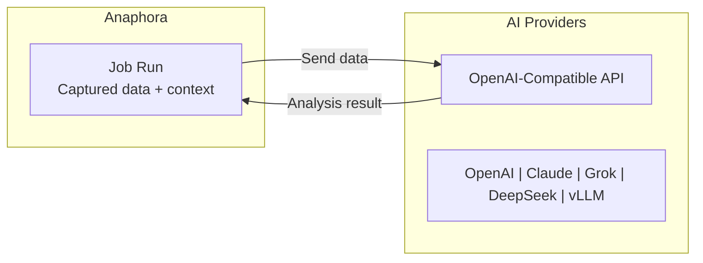

# AI Providers

Configure AI providers to enable intelligent analysis, content generation, and anomaly detection in your reports. Anaphora supports any provider implementing the OpenAI-compatible API specification.

## Overview

AI Providers add intelligence to your reports:

- **Content Analysis** — Summarize dashboard data, identify trends
- **Anomaly Detection** — Flag unusual patterns or values
- **Natural Language** — Generate human-readable insights
- **Contextual Alerts** — AI-enhanced notification content



## OpenAI-Compatible API

Anaphora works with any provider implementing the OpenAI API specification. This includes:

| Provider | Description | Self-Hosted |
|----------|-------------|-------------|
| **OpenAI** | GPT-5.2, GPT-5.1 models | No |
| **Anthropic** | Claude Opus 4.5, Sonnet 4.5, Haiku 4.5 | No |
| **xAI** | Grok 4, Grok 3 models | No |
| **Azure OpenAI** | Microsoft-hosted OpenAI models | No |
| **DeepSeek** | DeepSeek-V3.2, cost-effective reasoning | No |
| **vLLM** | Self-hosted open-source models | Yes |
| **Ollama** | Local model runner | Yes |
| **LM Studio** | Desktop model runner | Yes |

## Configuration

### Adding a Provider

1. Navigate to **Settings** > **AI Providers**
2. Click **Add Provider**
3. Configure the connection:

| Field | Description | Example |
|-------|-------------|---------|
| **Name** | Identifier for this provider | `Production GPT-5` |
| **API Endpoint** | OpenAI-compatible base URL | `https://api.openai.com/v1` |
| **API Key** | Authentication token | `sk-...` (stored encrypted) |
| **Default Model** | Model to use if not specified | `gpt-5.2` |

4. Test the connection
5. Save

### Multiple Providers

Configure multiple providers for different use cases:

```
Provider: DeepSeek-V3
├── Endpoint: https://api.deepseek.com/v1
├── Model: deepseek-v3.2
└── Use for: Complex analysis, reasoning tasks

Provider: vLLM-Qwen
├── Endpoint: http://vllm.internal:8000/v1
├── Model: Qwen3-32B-Instruct
└── Use for: High-volume processing, cost control

Provider: OpenAI-GPT5
├── Endpoint: https://api.openai.com/v1
├── Model: gpt-5.2
└── Use for: Critical reports, best quality

Provider: Anthropic-Claude
├── Endpoint: https://api.anthropic.com/v1
├── Model: claude-sonnet-4.5
└── Use for: Coding analysis, agentic tasks
```

### Multiple Models per Provider

Each provider can expose multiple models:

| Provider | Available Models |
|----------|-----------------|
| OpenAI | `gpt-5.2`, `gpt-5.2-codex`, `gpt-5.1` |
| Anthropic | `claude-opus-4.5`, `claude-sonnet-4.5`, `claude-haiku-4.5` |
| xAI | `grok-4`, `grok-4-heavy`, `grok-3`, `grok-3-mini` |
| DeepSeek | `deepseek-v3.2`, `deepseek-r1` |
| vLLM | Depends on deployed models (Qwen3, Llama 4, etc.) |

## Provider Types

### DeepSeek

Cost-effective models with strong reasoning capabilities. DeepSeek-V3.2 integrates thinking directly into tool-use.

**Configuration:**
```
Name: DeepSeek
Endpoint: https://api.deepseek.com/v1
API Key: sk-xxxxx
Default Model: deepseek-v3.2
```

**Available Models:**
- `deepseek-v3.2` — Latest flagship, thinking + tool-use integration
- `deepseek-v3.1` — Hybrid model combining V3 and R1 strengths
- `deepseek-r1` — Advanced reasoning, complex analysis

### vLLM (Self-Hosted)

Run open-source models on your infrastructure for data privacy and cost control.

**Configuration:**
```
Name: vLLM Internal
Endpoint: http://vllm-server.internal:8000/v1
API Key: (optional, depends on deployment)
Default Model: Qwen3-32B-Instruct
```

**Popular Models for vLLM:**
- `Qwen3-32B-Instruct` — Strong general purpose, 128K context
- `Qwen3-235B-A22B` — Massive MoE model (22B active params)
- `Llama-4-Maverick` — Meta's multimodal MoE (17B active, 400B total)
- `Llama-4-Scout` — 10M context window (17B active, 109B total)
- `Qwen3-Coder-480B` — State-of-the-art coding (35B active)

**Benefits:**
- Complete data privacy — data never leaves your infrastructure
- No per-token costs after initial setup
- Customizable model selection
- Low latency for internal networks

### OpenAI

Direct integration with OpenAI's API. GPT-5.2 is the current flagship with Instant, Thinking, and Pro variants.

**Configuration:**
```
Name: OpenAI
Endpoint: https://api.openai.com/v1
API Key: sk-proj-xxxxx
Default Model: gpt-5.2
```

**Available Models:**
- `gpt-5.2` — Latest flagship, best for coding and agentic tasks
- `gpt-5.2-codex` — Optimized for agentic coding workflows
- `gpt-5.1` — Previous generation (Instant and Thinking variants)

### Anthropic Claude

State-of-the-art models for coding, agents, and complex reasoning. Claude 4.5 series offers excellent cost-performance.

**Configuration:**
```
Name: Anthropic
Endpoint: https://api.anthropic.com/v1
API Key: sk-ant-xxxxx
Default Model: claude-sonnet-4.5
```

**Available Models:**
- `claude-opus-4.5` — Flagship, long-horizon autonomous tasks ($5/$25 per M tokens)
- `claude-sonnet-4.5` — Best balance of quality and cost ($3/$15 per M tokens)
- `claude-haiku-4.5` — Fast and efficient ($1/$5 per M tokens)

### xAI Grok

Strong reasoning models with real-time knowledge. Grok 4 is the latest flagship with 1M token context.

**Configuration:**
```
Name: xAI Grok
Endpoint: https://api.x.ai/v1
API Key: xai-xxxxx
Default Model: grok-4
```

**Available Models:**
- `grok-4` — Latest flagship, strong reasoning and tool use
- `grok-4-heavy` — Maximum capability variant
- `grok-3` — Previous generation, good cost-performance balance
- `grok-3-mini` — Fast responses, lower cost

### Azure OpenAI

Enterprise deployment through Microsoft Azure.

**Configuration:**
```
Name: Azure OpenAI
Endpoint: https://your-resource.openai.azure.com
API Key: xxxxx
Default Model: gpt-5 (deployment name)
```

## Space-Level Configuration

AI Providers are configured per Space for isolation:

| Space | AI Provider | Use Case |
|-------|-------------|----------|
| Production | OpenAI GPT-5.2 | Critical reports, highest quality |
| Development | vLLM Qwen3 | Testing, iteration |
| Client-Acme | DeepSeek V3.2 | Cost-effective analysis |
| Client-Beta | Claude Sonnet 4.5 | Balanced quality and cost |

### Provider Inheritance

- Each Space can have its own AI provider configuration
- Jobs within a Space use that Space's configured provider
- Spaces without providers cannot use AI features

## Using AI in Jobs

### Composer Integration

Add AI-generated content blocks in the Composer:

1. Add an **AI Analysis** block
2. Select the analysis type:
   - **Summary** — Condense captured data
   - **Trends** — Identify patterns over time
   - **Anomalies** — Highlight unusual values
   - **Custom** — Provide your own prompt

3. Configure the prompt (for custom analysis)
4. Preview the output

### Example: Dashboard Summary

```
Block: AI Analysis
Type: Summary
Prompt: "Summarize the key metrics from this dashboard,
        highlighting any values that exceed normal ranges."

Output: "System performance remains stable with 99.8% uptime.
        CPU utilization averaged 45% with a peak of 78% at 14:30 UTC.
        Memory usage is trending upward (+12% week-over-week) and
        may require attention if the trend continues."
```

### Example: Anomaly Detection

```
Block: AI Analysis
Type: Anomaly Detection
Context: Error rate visualization captured from Kibana

Output: "⚠️ Anomaly detected: Error rate spiked to 4.2% between
        09:15-09:45 UTC, significantly above the 0.5% baseline.
        This correlates with the deployment at 09:12 UTC visible
        in the deployment timeline panel."
```

## Best Practices

### Provider Selection

| Use Case | Recommended Provider |
|----------|---------------------|
| **Security-sensitive data** | Self-hosted vLLM (Qwen3, Llama 4) |
| **Cost-sensitive high volume** | DeepSeek V3.2 or vLLM |
| **Best quality analysis** | OpenAI GPT-5.2 or Claude Opus 4.5 |
| **Coding and agentic tasks** | Claude Sonnet 4.5 or GPT-5.2-Codex |
| **Compliance requirements** | Azure OpenAI or self-hosted |

### Prompt Engineering

For consistent results:

- Be specific about the desired output format
- Provide context about what the data represents
- Specify the audience (technical vs. executive)
- Include examples of good output when possible

### Cost Management

- Use appropriate models for each task (don't use Opus 4.5 for simple summaries — use Haiku 4.5)
- Set token limits for responses
- Monitor usage through provider dashboards
- Consider self-hosted options for high-volume use cases (Qwen3, Llama 4)

### Reliability

- Configure fallback providers for critical jobs
- Test AI features in development Spaces first
- Set reasonable timeout values
- Handle AI failures gracefully (jobs should complete even if AI fails)

## Troubleshooting

### Connection Issues

| Issue | Solution |
|-------|----------|
| Connection timeout | Check endpoint URL, verify network access |
| 401 Unauthorized | Verify API key is correct and active |
| 429 Rate Limited | Reduce request frequency, upgrade plan |
| Model not found | Check model name matches provider's offerings |

### Quality Issues

| Issue | Solution |
|-------|----------|
| Poor analysis quality | Improve prompts, try different model |
| Inconsistent outputs | Add more specific instructions |
| Missing context | Ensure captured data is included |
| Hallucinations | Use more constrained prompts |

## Next Steps

- [Spaces](./spaces) - Configure Space-level AI providers
- [Composer](../jobs/composer) - Add AI blocks to reports
- [Self Monitoring](./self-monitoring) - Monitor AI provider health
