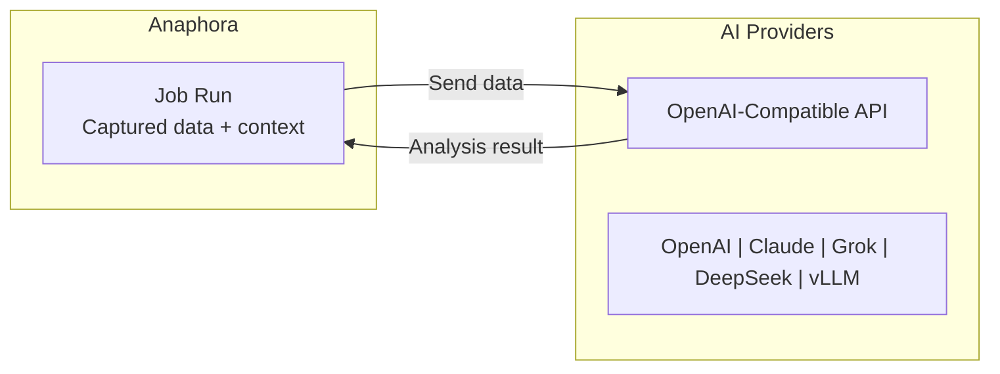
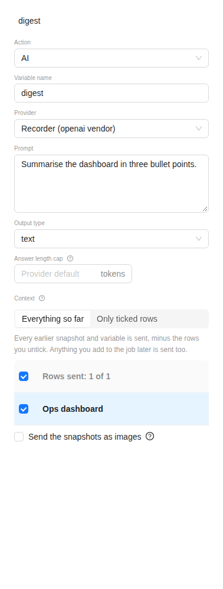
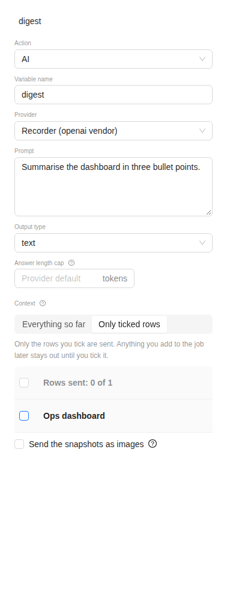
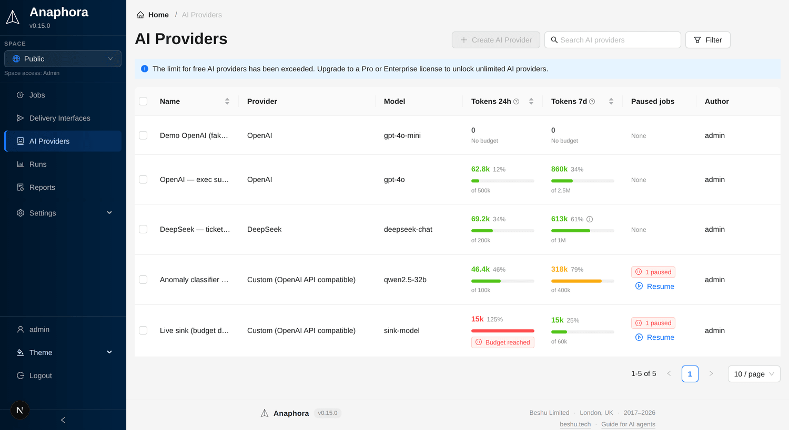
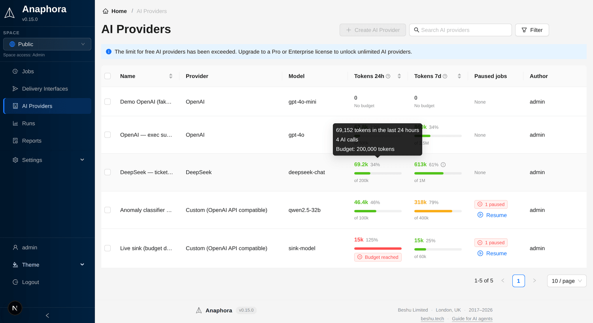
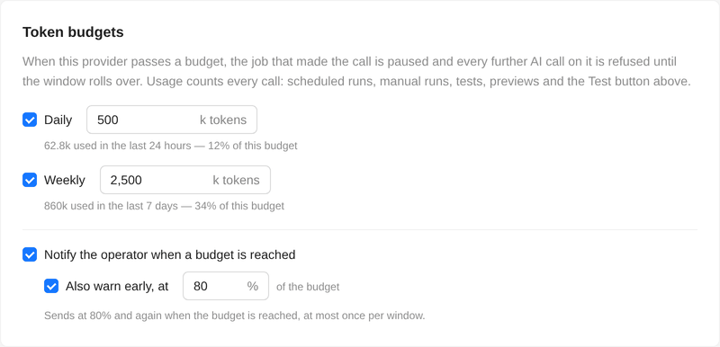
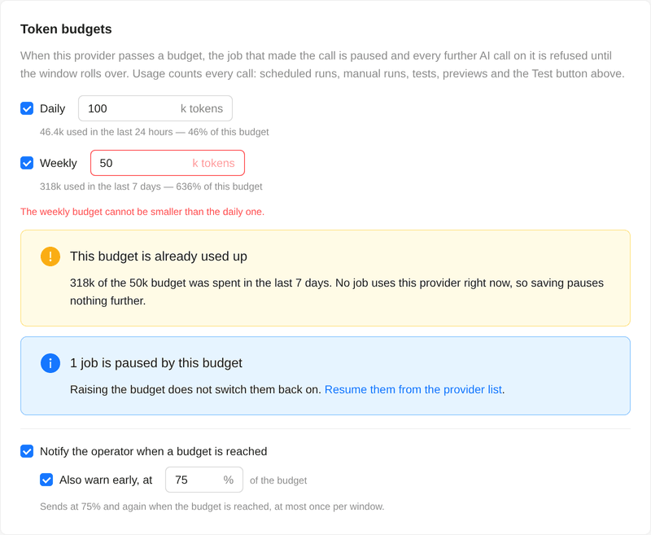
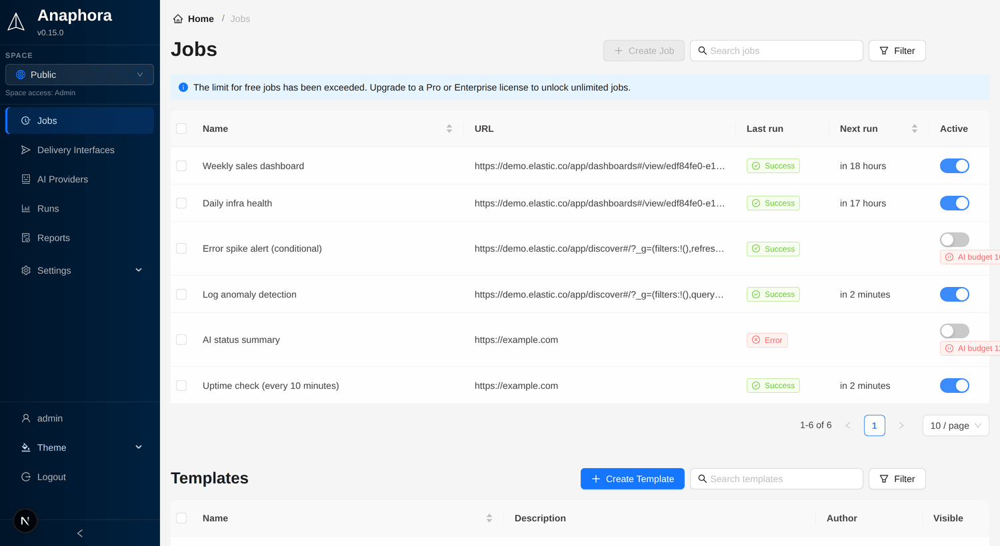
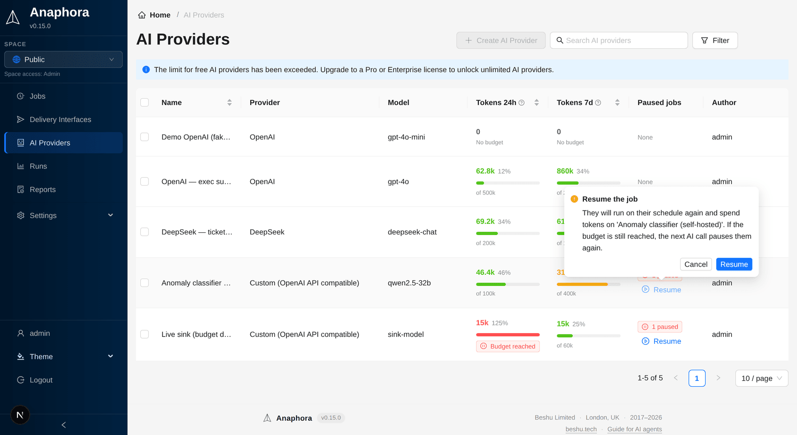
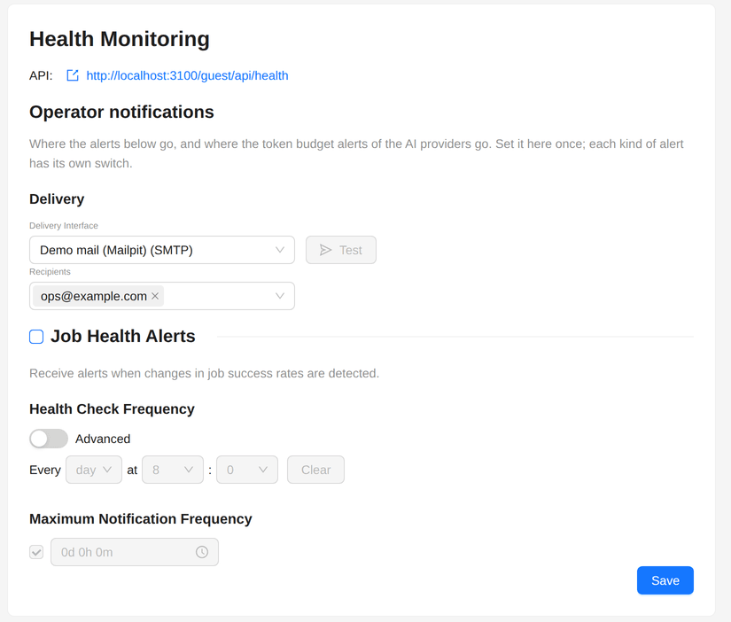

# AI Providers

Configure AI providers to enable intelligent analysis, content generation, and anomaly detection in your reports.
Anaphora supports any provider implementing the OpenAI-compatible API specification.

## Overview

AI Providers add intelligence to your reports:

- **Content Analysis** — Summarize dashboard data, identify trends
- **Anomaly Detection** — Flag unusual patterns or values
- **Natural Language** — Generate human-readable insights
- **Contextual Alerts** — AI-enhanced notification content


```mermaid
flowchart LR
    subgraph anaphora["Anaphora"]
        job["Job Run<br/>Captured data + context"]
    end

    subgraph providers["AI Providers"]
        api["OpenAI-Compatible API"]
        examples["OpenAI | Claude | Grok | DeepSeek | vLLM"]
    end

    job -- "Send data" --> api
    api -- "Analysis result" --> job
```

## Configuration

### Adding a Provider

1. In the sidebar, click **AI Providers**
2. Click **Create AI Provider**
3. Configure the connection:

| Field        | Description                                           | Example                        |
|--------------|-------------------------------------------------------|--------------------------------|
| **Name**     | Identifier for this provider                          | `Production GPT-5`             |
| **Provider** | Type of AI provider                                   | `OpenAI`, `DeepSeek`, `Custom (OpenAI API compatible)` |
| **Endpoint** | OpenAI-compatible base URL (Only for custom provider) | `https://api.openai.com/v1`    |
| **API key**  | Authentication token                                  | `sk-...` (stored encrypted)    |
| **Model**    | Model to use. Needs API key to fetch suggestions.     | `gpt-5.2`                      |

4. Click **Test**
5. Click **Save**

:::note Free edition
The Free edition allows one AI provider per space.
:::

### Provider from the Environment

The environment can own one provider: `AI_PROVIDER`, `AI_MODEL` and `AI_API_KEY`, plus `AI_ENDPOINT` for a custom
(OpenAI-compatible) service and `AI_NAME` for the name in the list. Anaphora creates the provider at the first start, in
the default space, and updates it at every start to match the environment. The token budgets you set in the UI stay.
See [Installation](../getting-started/installation.md#ai-provider-from-the-environment).

### Copying a Provider to Another Space

To copy or clone an AI provider into another space, you need admin access to the space it comes from.

### Provider Inheritance

- Each Space can have its own AI provider configuration
- Jobs within a Space use that Space's configured provider
- Spaces without providers cannot use AI features

## Using AI in Jobs

### Job Capture Integration

Use AI actions in the job actions:

1. Edit or create a job
2. Navigate to the **Capture** tab
3. Turn on the **Advanced** switch to use actions
4. Add an **AI** action
5. Configure:

| Field                        | Description                                                                    |
|------------------------------|--------------------------------------------------------------------------------|
| Variable name                | Name of the variable to store AI output                                        |
| Provider                     | Select the AI provider to use                                                  |
| Prompt                       | Define the prompt with instructions                                            |
| Output type                  | `text`, `number`, `html`                                                       |
| Answer length cap            | Maximum tokens in the answer. Empty leaves it to the provider                  |
| Context                      | **Everything so far** or **Only ticked rows**                                  |
| Send the snapshots as images | Send the snapshots to the model as images (only for providers that read images) |

### What an AI Action Sends

The **Context** section of an AI action decides which earlier snapshots and variables go to the model. Each snapshot
goes as its accessibility tree (the text structure of the page). The header of the table counts the rows that are sent.
The section has two modes:

| Mode                  | What is sent                                                                                                   |
|-----------------------|----------------------------------------------------------------------------------------------------------------|
| **Everything so far** | Every earlier snapshot and variable, minus the rows you untick. Anything you add to the job later is sent too. This is the default. |
| **Only ticked rows**  | Only the rows you tick. Anything you add to the job later stays out until you tick it.                          |

Switching modes moves no tick.





Under the table, **Send the snapshots as images** also sends the ticked snapshots as pictures. Only a provider whose
vendor reads images can take them: OpenAI does, DeepSeek and custom providers do not. For those, the box is disabled
and its tooltip says why. Each image costs tokens on every run.

**Answer length cap** limits the reply, in tokens. A number needs a few tokens; a report section may need a few hundred.

:::tip Send less, pay less
On a dashboard with many panels, "Everything so far" sends every panel to answer a question about one of them. Use
"Only ticked rows" to send only what the prompt needs.
:::

### Example: Dashboard Summary

```
Context: Dashboard snapshot showing system performance metrics
Type: Text
Prompt: "Summarize the key metrics from this dashboard,
        highlighting any values that exceed normal ranges."

Output: "System performance remains stable with 99.8% uptime.
        CPU utilization averaged 45% with a peak of 78% at 14:30 UTC.
        Memory usage is trending upward (+12% week-over-week) and
        may require attention if the trend continues."
```

### Example: Anomaly Detection

```
Context: Error rate visualization captured from Kibana
Type: Number
Prompt: "Identify any anomalies in the error rate data. Respond with 0 if none found. Return 1 if anomalies are detected."

Output: 0
```

Use the output to add a condition in your job workflow for alerting.

## Token Budgets

Every AI provider shows the tokens it spent in the **last 24 hours** and in the **last 7 days** (the **Tokens 24h** and
**Tokens 7d** columns). You can give each window a budget. The windows roll: "the last 24 hours" is not "since midnight".



Usage counts every call: scheduled runs, manual runs, retries, tests, previews and the **Test** button on the provider
form. Some OpenAI-compatible services answer without usage data. Those calls count as zero, and the tooltip of the
column says that the total is a lower bound.



### Setting a Budget

1. Open the AI provider.
2. In the **Token budgets** card, tick **Daily**, **Weekly**, or both.
3. Enter the budget in thousands of tokens (`k tokens`).
4. Save.

When you tick a window, Anaphora proposes double your current spend in that window, and at least 500k tokens for a
day or 2,000k tokens for a week. So a new budget does not pause everything on the next call. The hint under each field
shows the spend and its share of the budget.



A weekly budget below the daily one is refused, because it can never apply. You can save a budget that is already used
up. The card then says what will happen.



### When a Budget Is Reached

- The job that made the call is paused.
- Every further AI call on that provider is refused until the window rolls over or you raise the budget.
- A job that runs into a budget that another job used up is paused the same way.
- The token columns turn green, yellow and red as the budget fills. A provider that reached its budget shows
  **Budget reached**.
- On the Jobs list, a paused job shows that an AI budget paused it. So you can tell it apart from a job that someone
  switched off.



### Resuming Paused Jobs

Raising the budget does not switch the paused jobs back on. On the AI Providers list, the **Paused jobs** column counts
the jobs that the budget paused. Click **Resume** to switch those jobs back on, and only those.



### Budget Alerts

Tick **Notify the operator when a budget is reached** to send an alert over the channel of the health alerts. Tick
**Also warn early, at** to send a warning at a percentage of the budget too (80% by default). Each pause of a job sends
an alert that names the job. The early warning, and a "reached" alert with no job to pause (a test or a preview), go out
at most once per window.

Choose the channel under **Settings** > **Application** > **Health Monitoring**. You can set it without switching
health monitoring on. Without a channel, jobs are still paused, but nothing is sent.



## Next Steps

- [Spaces](./spaces) - Configure Space-level AI providers
- [Composer](../jobs/composer) - Add AI blocks to reports
- [Self Monitoring](./self-monitoring) - Monitor AI provider health
