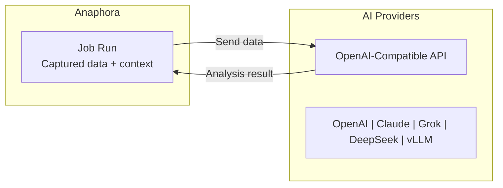

# AI Providers

Configure AI providers to enable intelligent analysis, content generation, and anomaly detection in your reports.
Anaphora supports any provider implementing the OpenAI-compatible API specification.

## Overview

AI Providers add intelligence to your reports:

- **Content Analysis** — Summarize dashboard data, identify trends
- **Anomaly Detection** — Flag unusual patterns or values
- **Natural Language** — Generate human-readable insights
- **Contextual Alerts** — AI-enhanced notification content


```mermaid
flowchart LR
    subgraph anaphora["Anaphora"]
        job["Job Run<br/>Captured data + context"]
    end

    subgraph providers["AI Providers"]
        api["OpenAI-Compatible API"]
        examples["OpenAI | Claude | Grok | DeepSeek | vLLM"]
    end

    job -- "Send data" --> api
    api -- "Analysis result" --> job
```

## Configuration

### Adding a Provider

1. In the sidebar, click **AI Providers**
2. Click **Create AI Provider**
3. Configure the connection:

| Field        | Description                                           | Example                        |
|--------------|-------------------------------------------------------|--------------------------------|
| **Name**     | Identifier for this provider                          | `Production GPT-5`             |
| **Provider** | Type of AI provider                                   | `OpenAI`, `DeepSeek`, `Custom (OpenAI API compatible)` |
| **Endpoint** | OpenAI-compatible base URL (Only for custom provider) | `https://api.openai.com/v1`    |
| **API key**  | Authentication token                                  | `sk-...` (stored encrypted)    |
| **Model**    | Model to use. Needs API key to fetch suggestions.     | `gpt-5.2`                      |

4. Click **Test**
5. Click **Save**

### Provider Inheritance

- Each Space can have its own AI provider configuration
- Jobs within a Space use that Space's configured provider
- Spaces without providers cannot use AI features

## Using AI in Jobs

### Job Capture Integration

Use AI actions in the job actions:

1. Edit or create a job
2. Navigate to the **Capture** tab
3. Turn on the **Advanced** switch to use actions
4. Add an **AI** action
5. Configure:

| Field                        | Description                                                                    |
|------------------------------|--------------------------------------------------------------------------------|
| Variable name                | Name of the variable to store AI output                                        |
| Provider                     | Select the AI provider to use                                                  |
| Prompt                       | Define the prompt with instructions                                            |
| Output type                  | `text`, `number`, `html`                                                       |
| Answer length cap            | Maximum tokens in the answer. Empty leaves it to the provider                  |
| Context                      | **Everything so far** or **Only ticked rows**                                  |
| Send the snapshots as images | Send the snapshots to the model as images (only for providers that read images) |

### Example: Dashboard Summary

```
Context: Dashboard snapshot showing system performance metrics
Type: Text
Prompt: "Summarize the key metrics from this dashboard,
        highlighting any values that exceed normal ranges."

Output: "System performance remains stable with 99.8% uptime.
        CPU utilization averaged 45% with a peak of 78% at 14:30 UTC.
        Memory usage is trending upward (+12% week-over-week) and
        may require attention if the trend continues."
```

### Example: Anomaly Detection

```
Context: Error rate visualization captured from Kibana
Type: Number
Prompt: "Identify any anomalies in the error rate data. Respond with 0 if none found. Return 1 if anomalies are detected."

Output: 0
```

Use the output to add a condition in your job workflow for alerting.

## Next Steps

- [Spaces](./spaces) - Configure Space-level AI providers
- [Composer](../jobs/composer) - Add AI blocks to reports
- [Self Monitoring](./self-monitoring) - Monitor AI provider health
