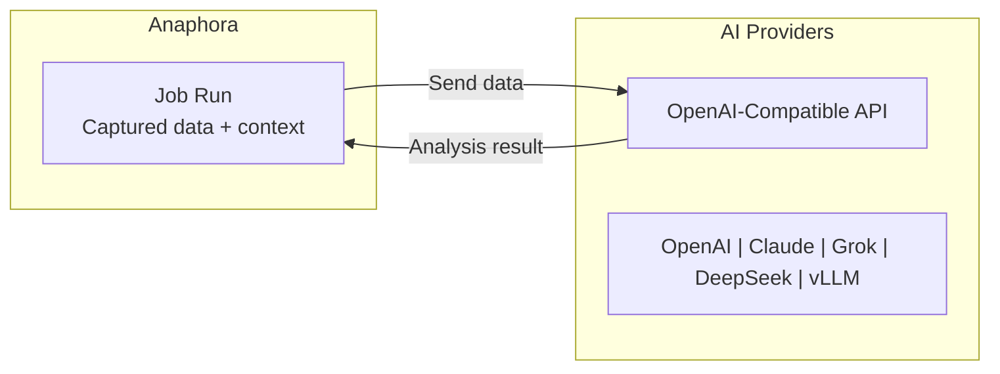
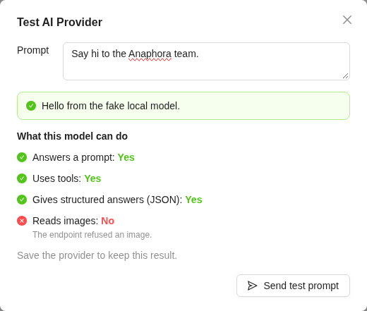
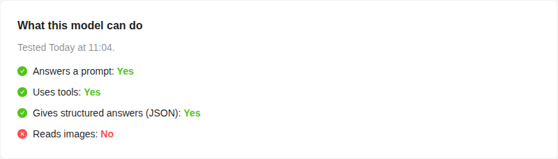
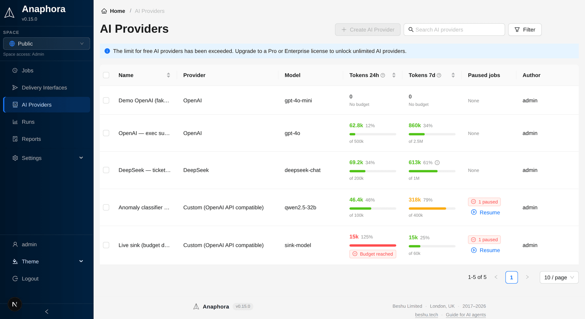
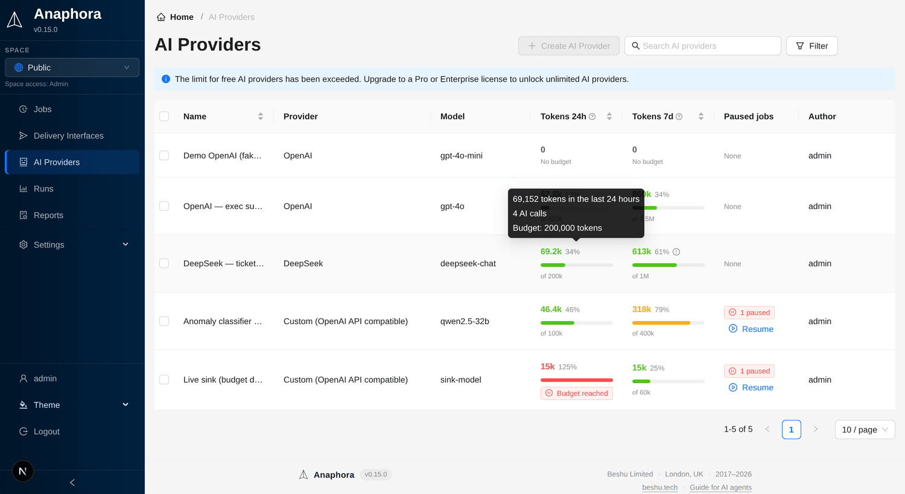
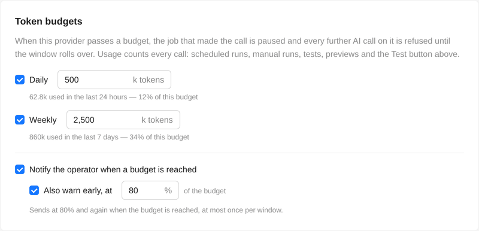
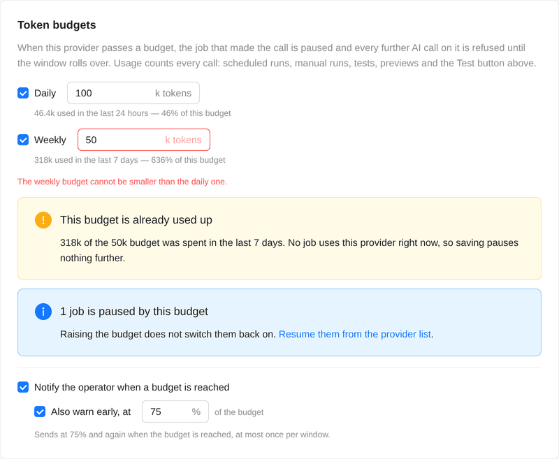
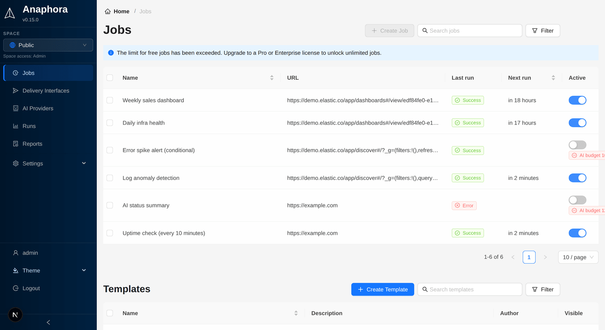
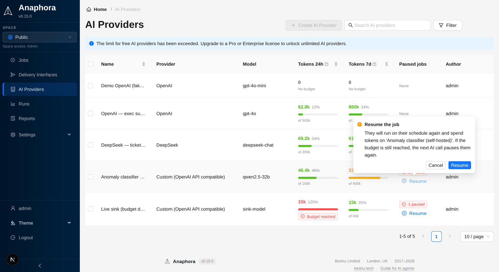
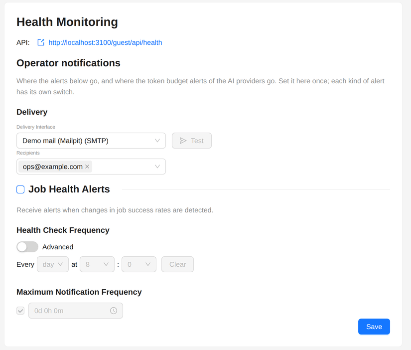

# AI providers

An AI provider lets a job analyze report data, write text, and detect anomalies. Anaphora supports any provider that
implements the OpenAI-compatible API specification.

## Overview

With an AI provider, a job can:

- Summarize dashboard data and identify trends
- Flag unusual patterns or values
- Generate human-readable insights
- Add AI-written content to notifications

```mermaid
flowchart LR
    subgraph anaphora["Anaphora"]
        job["Job Run<br/>Captured data + context"]
    end

    subgraph providers["AI Providers"]
        api["OpenAI-Compatible API"]
        examples["OpenAI | Claude | Grok | DeepSeek | vLLM"]
    end

    job -- "Send data" --> api
    api -- "Analysis result" --> job
```

## Configuration

### Adding a provider

1. In the sidebar, click **AI Providers**
2. Click **Create AI Provider**
3. Configure the connection:

| Field        | Description                                           | Example                        |
|--------------|-------------------------------------------------------|--------------------------------|
| **Name**     | Identifier for this provider                          | `Production GPT-5`             |
| **Provider** | Type of AI provider                                   | `OpenAI`, `DeepSeek`, `Custom (OpenAI API compatible)` |
| **Endpoint** | OpenAI-compatible base URL (only for a custom provider) | `https://api.openai.com/v1`    |
| **API key**  | Authentication token                                  | `sk-...` (stored encrypted)    |
| **Model**    | Model to use. Suggestions need the API key.           | `gpt-5.2`                      |

4. Click **Test**
5. Click **Save**

### What this model can do

**Test** sends your prompt and three small checks: a tool call, a JSON answer and an image. It uses the key, the
endpoint and the model of the form. The **Test AI Provider** window shows the answer, then **What this model can do**:

- **Answers a prompt**.
- **Uses tools**. An AI step with tools needs it: **Look at earlier runs**, **Do exact math**, **Remember between
  runs**, and **The AI chooses** mode.
- **Gives structured answers (JSON)**. When the answer is **No**, an AI step with several variables asks for JSON in its
  instructions, and reads the text.
- **Reads images**. When the answer is **No**, **Send the snapshots as images** is off in the AI steps of this provider.

Under a **No**, a short line says why, for example "The endpoint refused an image."

When the Test runs on the saved settings of the provider, it keeps the result: the window says "Saved with the
provider." Otherwise, click **Save** to keep it. The card **What this model can do** on the provider form shows the
result and when the test ran. AI steps read it. A change of the provider type, the model or the endpoint clears the
result: click **Test** again after the change. The tokens of the Test count on the budget of the provider.

:::note Free edition
The Free edition allows one AI provider per space.
:::

### Provider from the environment

The environment can own one provider: `AI_PROVIDER`, `AI_MODEL` and `AI_API_KEY`, plus `AI_ENDPOINT` for a custom
(OpenAI-compatible) service and `AI_NAME` for the name in the list. Anaphora creates the provider at the first start, in
the default space, and updates it at every start to match the environment. The token budgets you set in the UI do not change.
See [Installation](../getting-started/installation.md#ai-provider-from-the-environment).

### Copying a provider to another space

To copy or clone an AI provider into another space, you need admin access to the space it comes from.

### Provider inheritance

- Each Space can have its own AI provider configuration
- Jobs within a Space use that Space's configured provider
- Spaces without providers cannot use AI features

## Using AI in jobs

A job uses its AI provider through the **AI** step of an advanced capture flow. One call can fill several typed
variables, look at earlier runs, do exact math, and keep a notebook between runs. See
[The AI step](../jobs/ai-step.md): every setting, **Try it**, the assistant, and the traces on the Runs page.

### A number in a condition

A **Conditional block** can test a **number** variable of an AI step. With one variable, the answer of the model
must be a bare number, or hold exactly one number, for example `Severity: 7` or `7/10`. Any other answer fails the run
with the error `The AI answer is not a number`. This way, the job never takes a branch on an answer that nobody can
read. Ask the model for one number only, and set a small **Answer length cap**. With several variables, the model answers
one JSON object, and Anaphora checks each variable: a wrong value fails the step and names the variable. A **yes/no**
variable holds `1` or `0`, so compare it with `1`.

### The Kibana AI Triage template

The **Kibana AI Triage** template builds a job that asks an AI provider whether a human must look at the errors now.
Pick it under **Jobs → Create Job**. It needs an AI provider in the space. It is an advanced template, so the Free
edition does not have it. Every 15 minutes, the job:

1. Counts the HTTP 5xx errors of the last hour and of the hour before, in Kibana Discover.
2. Counts all the requests of the last hour.
3. Takes a snapshot of the overview dashboard.
4. Asks the AI provider for a severity from 0 to 10. The prompt gives the rules that an on-call engineer applies: more
   errors with more traffic is load, not a failure, and a source that sends nothing is a 7.
5. Stops when the severity is below 7. Nobody is notified.
6. At 7 and above, asks the AI provider for a short briefing, which goes in the report with the counts and the
   dashboard.

The job sends the report at most once every 3 hours. When the space has exactly one AI provider, the new job uses it.
With more than one, select the **Provider** in each AI action. With none, add an AI provider to the space first. The
template uses the public Kibana demo: change the URLs to your own Kibana.

The [AI Triage](../advanced-examples/ai-triage.md) example builds the same job with one AI step. It looks at the earlier
runs instead of capturing the hour before, and its notebook replaces the throttle.

## Token budgets

Every AI provider shows the tokens it spent in the last 24 hours and in the last 7 days (the **Tokens 24h** and
**Tokens 7d** columns). You can give each window a budget. The windows roll: "the last 24 hours" is not "since midnight".

Usage counts every call: scheduled runs, manual runs, retries, tests, previews, the **Test** button on the provider
form, the trials of AI steps (**Try it**) and the AI step assistant. Some OpenAI-compatible services answer without usage data. Those calls count as zero, and the tooltip of the
column says that the total is a lower bound.

### Setting a budget

1. Open the AI provider.
2. In the **Token budgets** card, tick **Daily**, **Weekly**, or both.
3. Enter the budget in thousands of tokens (`k tokens`).
4. Save.

When you tick a window, Anaphora proposes double your current spend in that window, and at least 500k tokens for a
day or 2,000k tokens for a week. This way, a new budget does not pause everything on the next call. The hint under each field
shows the spend and its share of the budget.

A weekly budget below the daily one is refused, because it can never apply. You can save a budget that is already used
up. The card then says what will happen.

### When a budget is reached

- The job that made the call is paused.
- Every further AI call on that provider is refused until the window rolls over or you raise the budget.
- A job that runs into a budget that another job used up is paused the same way.
- A test, a preview, a trial or the assistant pauses no job: the budget refuses its next call. The assistant says so in
  its panel, and the changes it made before stay.
- The token columns turn green, yellow and red as the budget fills. A provider that reached its budget shows
  **Budget reached**.
- On the Jobs list, a paused job shows that an AI budget paused it, so you can tell it apart from a job that someone
  switched off.

### Resuming paused jobs

Raising the budget does not switch the paused jobs back on. On the AI Providers list, the **Paused jobs** column counts
the jobs that the budget paused. Click **Resume** to switch those jobs back on, and only those.

### Budget alerts

Tick **Notify the operator when a budget is reached** to send an alert over the channel of the health alerts. Tick
**Also warn early, at** to send a warning at a percentage of the budget too (80% by default). Each pause of a job sends
an alert that names the job. The early warning, and a "reached" alert with no job to pause (a test or a preview), go out
at most once per window.

Choose the channel under **Settings** > **Application** > **Health Monitoring**. You can set it without switching
health monitoring on. Without a channel, jobs are still paused, but nothing is sent.

## Next steps

- [Spaces](./spaces): configure Space-level AI providers
- [The AI step](../jobs/ai-step.md): use the provider in a capture flow
- [Composer](../jobs/composer): add AI blocks to reports
- [Self-monitoring](./self-monitoring): monitor AI provider health
