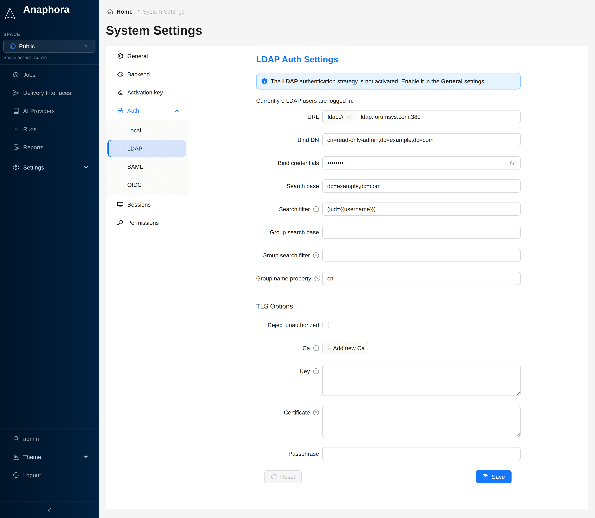

# LDAP / Active Directory

Connect Anaphora to your enterprise directory to manage users in one place. Anaphora supports Microsoft Active
Directory, OpenLDAP, and other LDAP-compliant directories.

## Overview

With LDAP, you manage users in the corporate directory and map AD groups to Anaphora roles. Anaphora does not store
passwords: the directory validates them. Anaphora creates each user at the first login.

## Configuration

Go to **Settings** > **System** > **Auth** > **LDAP** to configure. To activate LDAP, add `ldap` to **Strategies** in
**Settings** > **System** > **General**.

| Field               | Description                    | Example                                | Required |
|---------------------|--------------------------------|----------------------------------------|----------|
| URL                 | LDAP server address            | `ldap://ldap.forumsys.com:389`         | Yes      |
| Bind DN             | Service account for binding    | `cn=read-only-admin,dc=example,dc=com` | Yes      |
| Bind credentials    | Service account password       | (stored securely)                      | Yes      |
| Search base         | Base DN for user search        | `dc=example,dc=com`                    | Yes      |
| Search filter       | LDAP filter for user lookup    | `(uid={{username}})`                   | Yes      |
| Group search base   | Base DN for group search       | `ou=groups,dc=example,dc=com`          | No       |
| Group search filter | LDAP filter for groups         | `(member={{cn}})`                      | No       |
| Group name property | Attribute for group name       | `cn` (default)                         | No       |
| Reject unauthorized | Enforce TLS certificate checks | `false` (unchecked, default)           | No       |
| Ca                  | Certificate authority          | PEM file contents, one or more         | No       |
| Key                 | Client private key             | PEM file contents                      | No       |
| Certificate         | Client certificate             | PEM file contents                      | No       |
| Passphrase          | Passphrase for the client key  |                                        | No       |

### Group to role mapping

Use the group search to get LDAP groups and map them to Anaphora roles.
In the **Group search filter**, use `` placeholders to reference attributes of the login user, for
example `{{username}}`, `{{dn}}`, `{{uid}}` or `{{cn}}`.
Use the **Group name property** to specify the attribute that becomes the role name.
Give these roles access to spaces in **Settings** > **System** > **Permissions**.

### SSL/TLS configuration

For secure connections use LDAPS (port 636):

| Protocol | Port | Security                      |
|----------|------|-------------------------------|
| LDAP     | 389  | Unencrypted (not recommended) |
| LDAPS    | 636  | SSL/TLS encrypted             |
| StartTLS | 389  | Upgraded to TLS               |

If your LDAP server requires TLS client authentication, fill in **Ca**, **Key** and **Certificate** under
**TLS Options**. Paste the contents of the certificate or key file.

## Active Directory specifics

### Service account

Create a dedicated service account for Anaphora:

1. Create user in AD: `anaphora-svc`
2. Set password to never expire (or manage rotation)
3. Grant "Read all user information" permission
4. The account does not need admin privileges

### Debug mode

Enable LDAP debug logging:

1. Go to **Settings** > **System** > **General**
2. Set **Log level** to `debug`
3. Reproduce the issue
4. Review logs for detailed LDAP communication

## Best practices

- Use a dedicated service account with minimal permissions
- Always use LDAPS for encrypted connections
- Test configuration changes in staging first
- Map groups to roles instead of assigning individual users
- Monitor the service account for lockouts or password expiration

## Next steps

- [SAML](./saml): add SAML SSO next to LDAP
- [Spaces](../spaces): configure space-based access control
