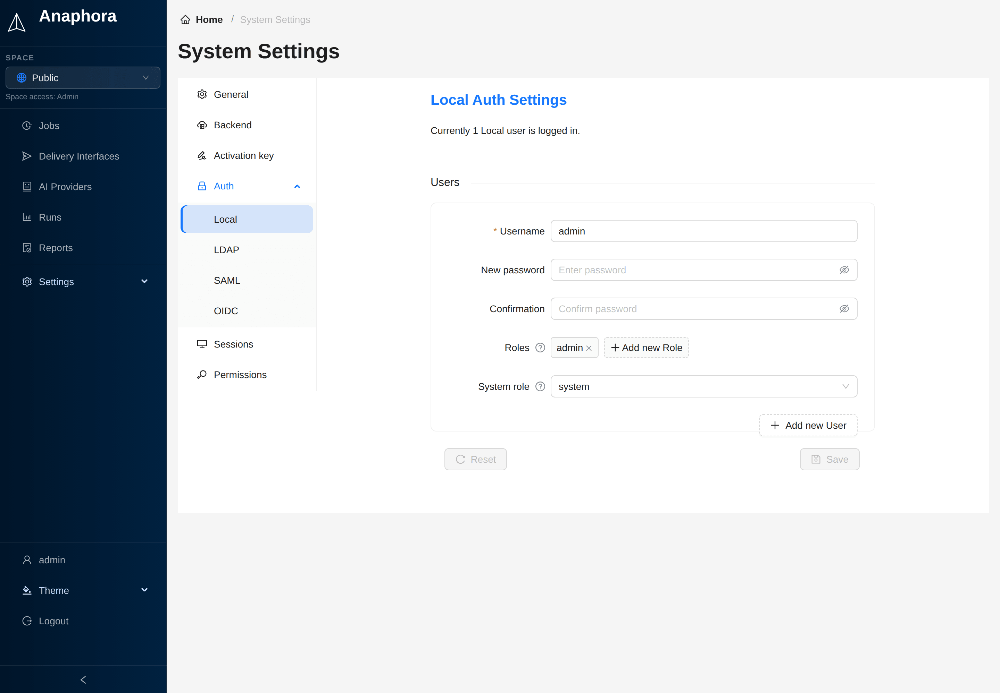

# Local Authentication

Default authentication using Anaphora's built-in user database. Ideal for small teams, testing environments, or
deployments without enterprise identity providers.

## Overview

Local authentication provides:

- **Built-in user database** — No external dependencies
- **User management UI** — Easy administration
- **Quick setup** — Works out of the box

## User Management

### Adding Users

1. Go to **Settings** > **System** > **Auth** > **Local**
2. Click **Add new User**
3. Enter the **Username**, the **Password** and the **Confirmation**
4. Click **Add new Role** to add roles
5. Select the **System role**: `user` or `system`
6. Click **Save**

### User Properties

| Field        | Description                                                                 | Required |
|--------------|-----------------------------------------------------------------------------|----------|
| Username     | Unique login identifier                                                     | Yes      |
| Password     | Initial password. For an existing user, the field is **New password**       | Yes      |
| Confirmation | The same password again                                                     | Yes      |
| Roles        | Roles that you assign to spaces to give permissions                         | No       |
| System role  | `user` or `system`. Default: `user`                                         | Yes      |

### System Role

The **System role** controls access to system-wide settings:

| Role       | Description                                                                    |
|------------|--------------------------------------------------------------------------------|
| **user**   | Normal user, cannot access system settings                                     |
| **system** | Can access and modify system settings. Gets Admin access to all spaces.        |

:::note
System settings include authentication configuration, space configuration, backup settings, and other global options.
Most users must have the `user` role. At least one local user must have the `system` role.
In the Free edition, all local users are system users, and the **Roles** and **System role** fields do not show.
:::

### Password Storage

Anaphora stores local passwords as salted scrypt hashes. A login attempt takes the same time whether the account exists
or not.

Accounts from older versions keep working. The log can say that some local users "still carry the legacy sha512 password
hash". Save their passwords again to store the new kind of hash.

### Managing Local Users

Only system users manage local users. Users cannot change their own accounts.
System users can change the password or add roles to existing users. The system user can also delete the local users.

:::warning
Deleting a user removes their access immediately. Jobs created by the user will remain.
:::

## When to Use Local Auth

| Scenario                    | Recommendation               |
|-----------------------------|------------------------------|
| Small team (under 10 users) | Local auth is sufficient     |
| Testing/development         | Local auth for simplicity    |
| No corporate IdP available  | Local auth as primary method |
| System user                 | Local is required            |
| Enterprise environment      | Consider LDAP, SAML, or OIDC |
| Compliance requirements     | Use enterprise SSO           |

## Next Steps

- [LDAP](./ldap) - Connect to Active Directory
- [SAML](./saml) - Enable Single Sign-On
- [OIDC](./oidc) - Use OpenID Connect providers
