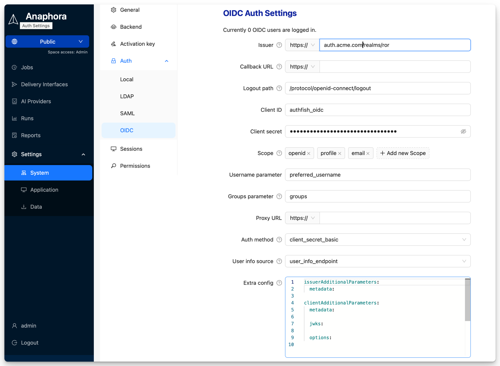

# OpenID Connect (OIDC)

Integrate with OAuth 2.0 / OpenID Connect providers for modern authentication. OIDC provides a simpler setup than SAML while offering similar enterprise features.


## Overview

OIDC integration provides:

- **Modern authentication** — Built on OAuth 2.0
- **Simple configuration** — Fewer settings than SAML
- **Automatic discovery** — Provider configuration via well-known endpoint
- **Token-based sessions** — Secure, stateless authentication

## Supported Providers

| Provider | Issuer URL | Notes |
|----------|------------|-------|
| **Google** | `https://accounts.google.com` | Google Workspace or personal |
| **Auth0** | `https://your-tenant.auth0.com` | Full-featured IdP |
| **Keycloak** | `https://keycloak.company.com/realms/your-realm` | Self-hosted option |
| **Okta** | `https://your-org.okta.com` | Enterprise IdP |
| **Azure AD** | `https://login.microsoftonline.com/{tenant}/v2.0` | Microsoft cloud |
| **OneLogin** | `https://your-domain.onelogin.com/oidc/2` | Enterprise SSO |
| **Ping Identity** | `https://auth.pingone.com/{env-id}/as` | Enterprise |
| **Custom** | Any OIDC-compliant issuer | Must support discovery |

## Configuration

### Step 1: Create OAuth Application

Create an OAuth/OIDC application in your identity provider.

#### Google

1. Go to [Google Cloud Console](https://console.cloud.google.com)
2. APIs & Services > Credentials > Create Credentials > OAuth Client ID
3. Application type: Web application
4. Authorized redirect URIs: `https://anaphora.company.com/oauth/callback`
5. Copy Client ID and Client Secret

#### Auth0

1. Applications > Create Application
2. Choose "Regular Web Application"
3. Settings tab:
   - Allowed Callback URLs: `https://anaphora.company.com/oauth/callback`
   - Allowed Logout URLs: `https://anaphora.company.com`
4. Copy Domain, Client ID, and Client Secret

#### Keycloak

1. Clients > Create Client
2. Client ID: `anaphora`
3. Client Protocol: openid-connect
4. Access Type: confidential
5. Valid Redirect URIs: `https://anaphora.company.com/oauth/callback`
6. Copy Client Secret from Credentials tab

#### Okta

1. Applications > Create App Integration
2. Sign-in method: OIDC
3. Application type: Web Application
4. Sign-in redirect URIs: `https://anaphora.company.com/oauth/callback`
5. Copy Client ID and Client Secret

#### Azure AD

1. App registrations > New registration
2. Redirect URI: Web > `https://anaphora.company.com/oauth/callback`
3. Certificates & secrets > New client secret
4. Copy Application (client) ID and secret value

### Step 2: Configure in Anaphora

1. Go to **Settings** > **Authentication** > **OIDC**
2. Enter the configuration:

| Field | Description | Example |
|-------|-------------|---------|
| Client ID | OAuth client identifier | `abc123def456` |
| Client Secret | OAuth client secret | (stored encrypted) |
| Issuer URL | OIDC discovery endpoint | `https://accounts.google.com` |
| Scopes | Requested permissions | `openid email profile` |

3. Click **Save**

### Callback URL

The **Callback URL** is where the IdP redirects users after authentication.

Default: `https://<anaphora-external-url>/auth/login-oidc/callback`

Register this URL in your IdP's allowed redirect URIs:

| Provider | Setting Location |
|----------|------------------|
| **Google** | Authorized redirect URIs |
| **Auth0** | Allowed Callback URLs |
| **Keycloak** | Client Settings → Valid Redirect URIs |
| **Okta** | Sign-in redirect URIs |
| **Azure AD** | Redirect URIs |

:::tip Keycloak
In Keycloak, go to **Clients** → your client → **Settings** → **Valid Redirect URIs** and add the callback URL.
:::

### Step 3: Configure Scopes

Request appropriate scopes based on what information you need.

Default: `openid`, `profile`, `email`

| Scope | Data Returned |
|-------|---------------|
| `openid` | Required for OIDC |
| `email` | User email address |
| `profile` | Name, picture, etc. |
| `groups` | Group memberships (provider-specific) |

:::caution Custom Scopes
Be careful with custom scopes. Adding non-existing scopes may cause authentication errors, such as redirect loops back to the login URL after authorization.
:::

## Claim Mapping

Map OIDC claims to Anaphora user fields.

### Standard Claims

| Anaphora Field | OIDC Claim | Description |
|----------------|------------|-------------|
| Username | `sub` or `preferred_username` | Unique identifier |
| Email | `email` | User email |
| Display Name | `name` | Full name |
| Picture | `picture` | Avatar URL |

### Group Claims

Group claim names vary by provider:

| Provider | Groups Claim |
|----------|--------------|
| Google | `groups` (requires Workspace) |
| Auth0 | `https://your-app/roles` (custom) |
| Keycloak | `groups` or `realm_access.roles` |
| Okta | `groups` |
| Azure AD | `groups` |

### Custom Claim Mapping

1. Go to **Settings** > **Authentication** > **OIDC** > **Claim Mapping**
2. Map claims to Anaphora fields:

```
Username Claim: preferred_username
Email Claim: email
Name Claim: name
Groups Claim: groups
```

## Group-Based Roles

Map IdP groups to Anaphora roles.

### Groups Parameter

The **Groups Parameter** specifies which claim contains group/role information. Default: `groups`

:::warning Important: Add Roles to ID Token
You must configure your IdP to include roles/groups in the ID token.

**Keycloak setup:**
1. Go to **Client Scopes** → **profile**
2. Select **Mappers** → **Add mapper** → **From predefined...**
3. Add the **groups** mapping
:::

### Role Mapping

1. Go to **Settings** > **Authentication** > **OIDC** > **Role Mapping**
2. Add mappings:

| IdP Group/Role | Anaphora Role |
|----------------|---------------|
| `anaphora-admins` | Admin |
| `anaphora-editors` | Editor |
| `anaphora-viewers` | Viewer |

### Auth0 Roles Example

In Auth0, use Rules or Actions to add roles to tokens:

```javascript
// Auth0 Action
exports.onExecutePostLogin = async (event, api) => {
  const roles = event.authorization?.roles || [];
  api.idToken.setCustomClaim('roles', roles);
};
```

Then map in Anaphora:
- Claim name: `roles`
- Mapping: `admin` → Admin, `editor` → Editor

## Advanced Settings

### Auth Method

The **Auth Method** specifies how credentials are sent to the token endpoint.

Default: `client_secret_basic`

| Method | Description |
|--------|-------------|
| `client_secret_basic` | Client ID and secret sent in Authorization header (URL-encoded). Standard method for most providers. |
| `client_secret_post` | Client ID and secret sent in request body (not encoded). Use when your provider cannot decode encoded values (e.g., LemonLDAP). |

### User Info Source

Configure where Anaphora obtains user profile information.

Default: `user_info_endpoint`

| Source | Description |
|--------|-------------|
| `user_info_endpoint` | Makes an additional call to the userInfo endpoint for the most up-to-date profile data. |
| `access_token` | Extracts profile information directly from the access token. |
| `id_token` | Extracts profile information directly from the ID token. |

### Extra Configuration

The **Extra Configuration** field accepts a YAML object with two optional sections:

| Section | Description |
|---------|-------------|
| `issuerAdditionalParameters` | Customize OIDC issuer discovery behavior |
| `clientAdditionalParameters` | Customize OIDC client configuration |

```yaml
issuerAdditionalParameters:
  metadata:
    jwks_uri: https://example.com/.well-known/jwks.json

clientAdditionalParameters:
  metadata:
    default_max_age: 0
```

See the documentation for available options:
- [Issuer parameters](https://github.com/panva/openid-client/tree/v5.x/docs#new-issuermetadata)
- [Client parameters](https://github.com/panva/openid-client/tree/v5.x/docs#client)

:::caution
Use extra configuration options with caution. Incorrect settings may break OIDC authentication.
:::

### Token Settings

| Setting | Description | Default |
|---------|-------------|---------|
| Token Validation | Validate token signature | Enabled |
| Audience Validation | Verify token audience | Enabled |
| Clock Skew Tolerance | Allowed time difference | 60 seconds |

### Session Settings

| Setting | Description |
|---------|-------------|
| Session Duration | Local session lifetime |
| Refresh Tokens | Use refresh tokens for extended sessions |
| Single Logout | Logout from IdP when logging out of Anaphora |

### Discovery Settings

| Setting | Description |
|---------|-------------|
| Discovery URL | Auto-populated from Issuer URL |
| JWKS URI | JSON Web Key Set endpoint |
| Authorization Endpoint | OAuth authorize URL |
| Token Endpoint | OAuth token URL |
| UserInfo Endpoint | User information URL |

## Testing

### Test OIDC Configuration

1. Click **Test OIDC Login**
2. You'll be redirected to your IdP
3. Authenticate with IdP credentials
4. Verify redirect back to Anaphora
5. Check user information was received

### Debug Mode

Enable debugging to see token details:

1. Enable **Debug Mode** in OIDC settings
2. Attempt login
3. Review ID token claims in debug output
4. Verify groups/roles are present

## Troubleshooting

| Issue | Solution |
|-------|----------|
| Invalid redirect URI | Ensure callback URL matches exactly in both systems |
| Invalid client | Verify Client ID and Secret |
| Discovery failed | Check Issuer URL, ensure /.well-known/openid-configuration is accessible |
| Groups not received | Verify scopes include groups, check IdP configuration |
| Token expired | Check clock synchronization, adjust skew tolerance |

### Common Errors

**"invalid_client"**
- Client ID or Secret is incorrect
- Client Secret may have expired (regenerate)

**"redirect_uri_mismatch"**
- Callback URL in Anaphora doesn't match IdP configuration
- Check for trailing slashes, http vs https

**"invalid_scope"**
- Requested scope not allowed by IdP
- Remove unsupported scopes

## Provider-Specific Notes

### Google Workspace

To get group memberships:
1. Enable Directory API in Google Cloud Console
2. Configure domain-wide delegation
3. Add `https://www.googleapis.com/auth/admin.directory.group.readonly` scope

### Azure AD

For group claims:
1. App registration > Token configuration > Add groups claim
2. Choose "Groups assigned to the application" for large directories

### Keycloak

Groups are included by default. Configure client mappers for custom claims.

## Best Practices

- Use HTTPS for all endpoints
- Store Client Secret securely (Anaphora encrypts it)
- Request minimal scopes needed
- Map groups to roles for scalable access management
- Monitor token expiration and refresh behavior

## Next Steps

- [SAML](./saml) - Alternative: SAML 2.0 SSO
- [Spaces](../spaces) - Configure Space-based access
