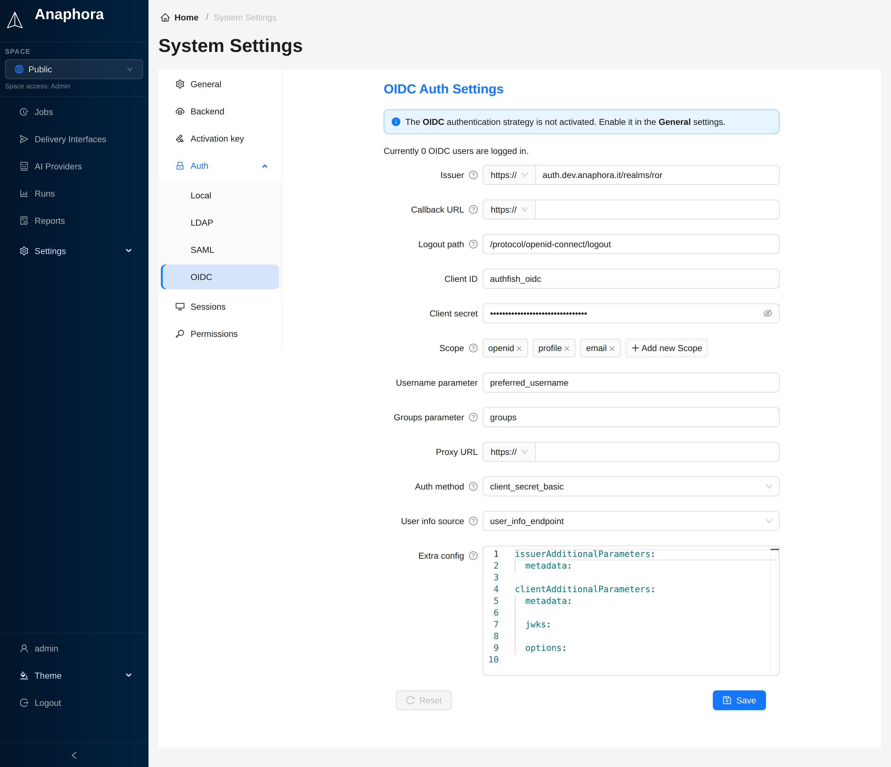

# OpenID Connect (OIDC)

Anaphora supports login through OAuth 2.0 / OpenID Connect providers. OIDC is simpler to set up than SAML and has similar enterprise features.


## Overview

OIDC is built on OAuth 2.0 and has fewer settings than SAML. Anaphora discovers the provider configuration
automatically through the well-known endpoint. Sessions are token-based, with secure, stateless authentication.

## Supported providers

| Provider | Issuer URL | Notes |
|----------|------------|-------|
| Google | `https://accounts.google.com` | Google Workspace or personal |
| Auth0 | `https://your-tenant.auth0.com` | Full-featured IdP |
| Keycloak | `https://keycloak.company.com/realms/your-realm` | Self-hosted option |
| Okta | `https://your-org.okta.com` | Enterprise IdP |
| Azure AD | `https://login.microsoftonline.com/{tenant}/v2.0` | Microsoft cloud |
| OneLogin | `https://your-domain.onelogin.com/oidc/2` | Enterprise SSO |
| Ping Identity | `https://auth.pingone.com/{env-id}/as` | Enterprise |
| Custom | Any OIDC-compliant issuer | Must support discovery |

## Configuration

### Step 1: Create an OAuth application

Create an OAuth/OIDC application in your identity provider.

#### Google

1. Go to [Google Cloud Console](https://console.cloud.google.com)
2. APIs & Services > Credentials > Create Credentials > OAuth Client ID
3. Application type: Web application
4. Authorized redirect URIs: `https://anaphora.company.com/auth/login-oidc/callback`
5. Copy Client ID and Client Secret

#### Auth0

1. Applications > Create Application
2. Choose "Regular Web Application"
3. Settings tab:
   - Allowed Callback URLs: `https://anaphora.company.com/auth/login-oidc/callback`
   - Allowed Logout URLs: `https://anaphora.company.com/auth/login`
4. Copy Domain, Client ID, and Client Secret

#### Keycloak

1. Clients > Create Client
2. Client ID: `anaphora`
3. Client Protocol: openid-connect
4. Access Type: confidential
5. Valid Redirect URIs: `https://anaphora.company.com/auth/login-oidc/callback`
6. Copy Client Secret from Credentials tab

#### Okta

1. Applications > Create App Integration
2. Sign-in method: OIDC
3. Application type: Web Application
4. Sign-in redirect URIs: `https://anaphora.company.com/auth/login-oidc/callback`
5. Copy Client ID and Client Secret

#### Azure AD

1. App registrations > New registration
2. Redirect URI: Web > `https://anaphora.company.com/auth/login-oidc/callback`
3. Certificates & secrets > New client secret
4. Copy Application (client) ID and secret value

### Step 2: Configure Anaphora

1. Go to **Settings** > **System** > **Auth** > **OIDC**
2. Enter the configuration:

| Field | Description | Example |
|-------|-------------|---------|
| Issuer | URL of the provider. Other paths are relative to it. Required | `https://accounts.google.com` |
| Callback URL | Full callback URL. Empty uses the default (see below) | `https://anaphora.company.com/auth/login-oidc/callback` |
| Logout path | Path of the provider logout endpoint. Default: `/protocol/openid-connect/logout` | `/protocol/openid-connect/logout` |
| Client ID | OAuth client identifier. Required | `abc123def456` |
| Client secret | OAuth client secret (stored encrypted). Required | |
| Scope | Requested scopes. Default: `openid`, `profile`, `email` | `openid email profile` |
| Username parameter | Claim for the username. Default: `preferred_username` | `preferred_username` |
| Groups parameter | Claim for the groups/roles. Default: `groups` | `groups` |
| Proxy URL | Proxy for the requests to the provider | `http://proxy.company.com:3128` |
| Auth method | Token endpoint auth method (see below) | `client_secret_basic` |
| User info source | Source of the user profile (see below) | `user_info_endpoint` |
| Extra config | YAML object with more options (see below) | |

3. Click **Save**
4. To activate OIDC, add `oidc` to **Strategies** in **Settings** > **System** > **General**

:::note Settings from the environment
You can also set OIDC with the environment variables `OIDC_ISSUER`, `OIDC_CLIENT_ID` and `OIDC_CLIENT_SECRET`
(required), and `OIDC_INTERNAL_ISSUER`, `OIDC_SCOPES`, `OIDC_USERNAME_CLAIM` and `OIDC_GROUPS_CLAIM` (optional). Then the
environment owns the OIDC settings, and the settings page cannot change them. The client secret is never written to
the database. See the Anaphora Quick Start guide.
:::

### Callback URL

The IdP redirects users to the **Callback URL** after authentication.

Default: `https://<anaphora-external-url>/auth/login-oidc/callback`

Add this URL to the allowed redirect URIs of your IdP:

| Provider | Setting location |
|----------|------------------|
| Google | Authorized redirect URIs |
| Auth0 | Allowed Callback URLs |
| Keycloak | Client Settings > Valid Redirect URIs |
| Okta | Sign-in redirect URIs |
| Azure AD | Redirect URIs |

:::tip Keycloak
In Keycloak, go to **Clients** > your client > **Settings** > **Valid Redirect URIs** and add the callback URL.
:::

### Step 3: Configure scopes

Set the **Scope** field to the scopes you need.

Default: `openid`, `profile`, `email`

| Scope | Data returned |
|-------|---------------|
| `openid` | Required for OIDC |
| `email` | User email address |
| `profile` | Name, picture, etc. |
| `groups` | Group memberships (provider-specific) |

:::caution Custom scopes
Be careful with custom scopes. A scope that does not exist can cause authentication errors, such as redirect loops back to the login URL after authorization.
:::

## Configure from the environment

Instead of the settings page, you can configure OIDC with environment variables. This is an Enterprise feature.

| Variable               | Required | Default                | Description                                                                         |
|------------------------|----------|------------------------|-------------------------------------------------------------------------------------|
| `OIDC_ISSUER`          | Yes      |                        | The issuer URL, as the browser reaches it                                           |
| `OIDC_CLIENT_ID`       | Yes      |                        | The client ID                                                                       |
| `OIDC_CLIENT_SECRET`   | Yes      |                        | The client secret                                                                   |
| `OIDC_INTERNAL_ISSUER` | No       |                        | The issuer URL as the Anaphora container reaches it, when the two are not the same |
| `OIDC_SCOPES`          | No       | `openid profile email` | The scopes to request, separated by spaces                                          |
| `OIDC_USERNAME_CLAIM`  | No       | `preferred_username`   | The claim that names the user                                                       |
| `OIDC_GROUPS_CLAIM`    | No       | `groups`               | The claim that lists the user's roles                                               |

- The three required variables switch OIDC on. A partial set logs a warning and leaves OIDC off.
- The identity provider must allow the callback `<PUBLIC_URL>/auth/login-oidc/callback`.
- The identity provider must send the user's roles (`admin`, `user`, `superuser`) in the claim that
  `OIDC_GROUPS_CLAIM` names.
- The environment owns these settings. The settings page cannot change them, and the client secret stays in memory. It
  is never written to the database.
- A new installation starts with OIDC in its list of sign-in methods. On an existing installation, switch OIDC on under
  **Settings**, in the list of sign-in methods.
- Anaphora reads the variables at every start.

The other settings use fixed values: `client_secret_basic` as auth method, the userInfo endpoint as user info source,
and `<OIDC_ISSUER>/protocol/openid-connect/logout` as logout address. The logout address is the Keycloak form.

:::tip Keycloak in the same Docker network
When the browser reaches Keycloak at a public URL and the Anaphora container reaches it at an internal URL, set
`OIDC_ISSUER` to the public URL and `OIDC_INTERNAL_ISSUER` to the internal one, for example
`http://keycloak:8080/realms/your-realm`. Anaphora uses the internal URL for discovery and for the calls from the
server. Keycloak must publish the browser endpoints under the public URL (`KC_HOSTNAME_BACKCHANNEL_DYNAMIC=true`).
:::

## Claim mapping

Map OIDC claims to the Anaphora user fields.

### Standard claims

| Anaphora field | OIDC claim | Description |
|----------------|------------|-------------|
| Username | `preferred_username` (set in **Username parameter**) | Unique identifier |
| Email | `email` | User email |
| Display name | `name` | Full name |

### Group claims

The group claim name is different for each provider:

| Provider | Groups claim |
|----------|--------------|
| Google | `groups` (requires Workspace) |
| Auth0 | `https://your-app/roles` (custom) |
| Keycloak | `groups` or `realm_access.roles` |
| Okta | `groups` |
| Azure AD | `groups` |

### Custom claim mapping

1. Go to **Settings** > **System** > **Auth** > **OIDC**
2. Set the claim names:

```
Username parameter: preferred_username
Groups parameter: groups
```

## Group-based roles

Map IdP groups to Anaphora roles.

### Groups parameter

The **Groups parameter** is the claim that contains the group or role information. Default: `groups`.
The claim must be a list. Anaphora ignores a claim with a single string value.

:::warning Important: Add Roles to ID Token
You must configure your IdP to include roles/groups in the ID token.

In Keycloak:
1. Go to **Client Scopes** > **profile**
2. Select **Mappers** > **Add mapper** > **From predefined...**
3. Add the **groups** mapping
:::

### Role mapping

Each IdP group becomes an Anaphora role with the same name.

1. Go to **Settings** > **System** > **Permissions**
2. In a space, add a permission for the role, and set its access:

| IdP group/role | Access |
|----------------|--------|
| `anaphora-admins` | Admin |
| `anaphora-editors` | Read Write |
| `anaphora-viewers` | Read Only |

### Auth0 roles example

In Auth0, use Rules or Actions to add roles to tokens:

```javascript
// Auth0 Action
exports.onExecutePostLogin = async (event, api) => {
  const roles = event.authorization?.roles || [];
  api.idToken.setCustomClaim('roles', roles);
};
```

Then, in Anaphora:
- Set **Groups parameter** to `roles`
- In **Settings** > **System** > **Permissions**, give `admin` the Admin access and `editor` the Read Write access

## Advanced settings

### Auth method

The **Auth method** sets how Anaphora sends the credentials to the token endpoint.

Default: `client_secret_basic`

| Method | Description |
|--------|-------------|
| `client_secret_basic` | Sends the client ID and secret in the Authorization header (URL-encoded). The standard method for most providers. |
| `client_secret_post` | Sends the client ID and secret in the request body (not encoded). Use it when your provider cannot decode encoded values (for example, LemonLDAP). |

### User info source

The **User info source** sets where Anaphora gets the user profile information.

Default: `user_info_endpoint`

| Source | Description |
|--------|-------------|
| `user_info_endpoint` | Makes one more call to the userInfo endpoint to get the latest profile data. |
| `access_token` | Reads the profile information from the access token. |
| `id_token` | Reads the profile information from the ID token. |

### Extra configuration

The **Extra config** field accepts a YAML object with two optional sections:

| Section | Description |
|---------|-------------|
| `issuerAdditionalParameters` | Change the OIDC issuer discovery |
| `clientAdditionalParameters` | Change the OIDC client configuration |

```yaml
issuerAdditionalParameters:
  metadata:
    jwks_uri: https://example.com/.well-known/jwks.json

clientAdditionalParameters:
  metadata:
    default_max_age: 0
```

For the available options, see:
- [Issuer parameters](https://github.com/panva/openid-client/tree/v5.x/docs#new-issuermetadata)
- [Client parameters](https://github.com/panva/openid-client/tree/v5.x/docs#client)

:::caution
Use extra configuration options with caution. Incorrect settings may break OIDC authentication.
:::

### Session settings

| Setting | Where | Description |
|---------|-------|-------------|
| **Max age hours** | **Settings** > **System** > **Backend** | How long an Anaphora session lasts. Default: `60` |
| **Logout path** | **Settings** > **System** > **Auth** > **OIDC** | Logout from the IdP when you log out of Anaphora |

For Keycloak, also add `https://<anaphora-external-url>/auth/login` to **Valid post logout redirect URIs**.

### Discovery settings

Anaphora reads the provider endpoints from `<Issuer>/.well-known/openid-configuration`. There are no separate fields
for them. To change an endpoint, for example `jwks_uri`, use `issuerAdditionalParameters.metadata` in **Extra config**.

## Testing

### Test OIDC configuration

1. Log out, then click **Continue with OIDC** on the login page
2. Anaphora sends you to your IdP
3. Log in with IdP credentials
4. Make sure that the IdP sends you back to Anaphora
5. Make sure that the user gets the correct spaces

### Debug mode

At each OIDC login, the Anaphora log shows the user profile at the `info` log level:

1. Make sure that **Log level** in **Settings** > **System** > **General** is `info`, `debug` or `trace`
2. Try to log in
3. Find the line `OIDC login from ...` in the Anaphora log
4. Make sure that the groups/roles are present

## Troubleshooting

| Issue | Solution |
|-------|----------|
| Invalid redirect URI | Make sure that the callback URL is the same in both systems |
| Invalid client | Check the Client ID and Secret |
| Discovery failed | Check **Issuer**, make sure that /.well-known/openid-configuration is accessible |
| Groups not received | Check **Scope**, **Groups parameter** and the IdP configuration |
| Token expired | Check clock synchronization (NTP) |

### Common errors

**"invalid_client"**
- The Client ID or Secret is incorrect
- The Client Secret can be expired (make a new one)

**"redirect_uri_mismatch"**
- The Callback URL in Anaphora is not the same as in the IdP configuration
- Check for trailing slashes, and for http instead of https

**"invalid_scope"**
- The IdP does not allow a requested scope
- Remove the unsupported scopes

## Provider-specific notes

### Google Workspace

To get group memberships:
1. Enable the Directory API in Google Cloud Console
2. Configure domain-wide delegation
3. Add the `https://www.googleapis.com/auth/admin.directory.group.readonly` scope

### Azure AD

For group claims:
1. App registration > Token configuration > Add groups claim
2. Choose "Groups assigned to the application" for large directories

### Keycloak

Keycloak includes groups by default. Configure client mappers for custom claims.

## Best practices

- Use HTTPS for all endpoints
- Store Client Secret securely (Anaphora encrypts it)
- Request only the scopes you need
- Map groups to roles for scalable access management
- Monitor token expiration and refresh behavior

## Next steps

- [SAML](./saml): SAML 2.0 SSO, an alternative to OIDC
- [Spaces](../spaces): configure space-based access
