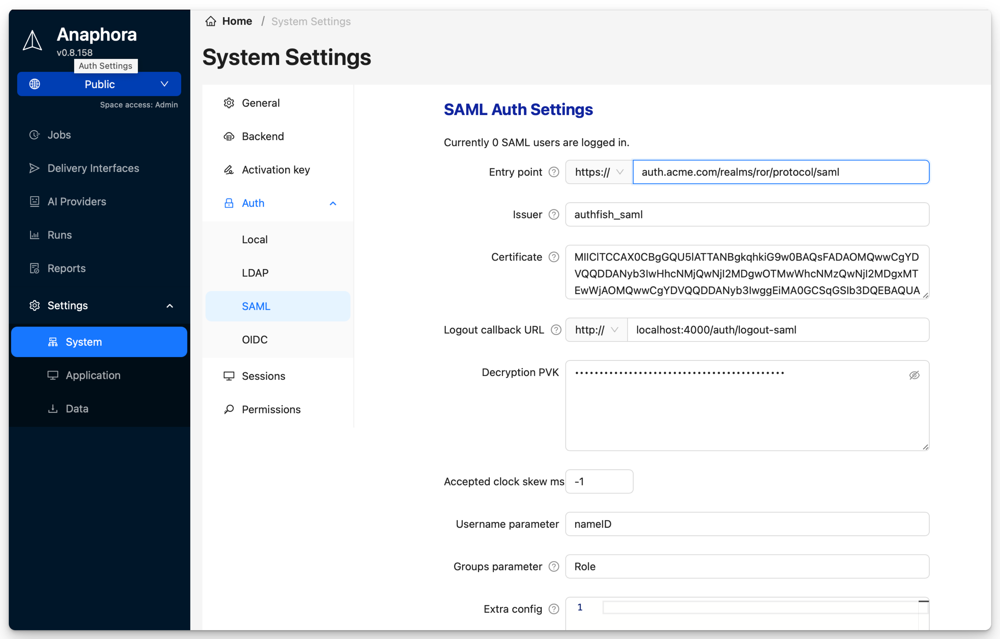

# SAML / Single Sign-On

Integrate with SAML 2.0 identity providers for enterprise single sign-on. Users authenticate through your corporate IdP and are automatically provisioned in Anaphora.

## Overview

SAML SSO provides:

- **Single Sign-On** — One login for all applications
- **Centralized access control** — Manage users in your IdP
- **Automatic provisioning** — Users created on first login
- **Group-based roles** — Map IdP groups to Anaphora roles

## Supported Identity Providers

| Provider | Status | Notes |
|----------|--------|-------|
| **Okta** | Tested | Full support |
| **Azure AD** | Tested | Full support |
| **OneLogin** | Tested | Full support |
| **Google Workspace** | Tested | SAML app required |
| **PingFederate** | Compatible | Standard SAML 2.0 |
| **ADFS** | Compatible | Standard SAML 2.0 |
| **Keycloak** | Compatible | Standard SAML 2.0 |
| **Custom IdP** | Compatible | Any SAML 2.0 compliant |

## Configuration Steps

### Step 1: Download SP Metadata

1. Go to **Settings** > **Authentication** > **SAML**
2. Click **Download SP Metadata**
3. Save the XML file — you'll upload this to your IdP

The metadata contains:
- Entity ID (SP identifier)
- Assertion Consumer Service URL
- Signing certificate

### Step 2: Configure Your IdP

Create a new SAML application in your identity provider.

#### Okta

1. Admin Console > Applications > Create App Integration
2. Select SAML 2.0
3. Upload Anaphora SP metadata or enter manually:
   - Single Sign On URL: `https://anaphora.company.com/saml/acs`
   - Audience URI: `https://anaphora.company.com/saml/metadata`
4. Configure attribute statements (see below)
5. Assign users/groups

#### Azure AD

1. Azure Portal > Enterprise Applications > New Application
2. Create your own application > Non-gallery
3. Single sign-on > SAML
4. Upload metadata file or enter:
   - Identifier: `https://anaphora.company.com/saml/metadata`
   - Reply URL: `https://anaphora.company.com/saml/acs`
5. Configure claims mapping
6. Assign users/groups

#### OneLogin

1. Applications > Add App > SAML Custom Connector
2. Configuration tab:
   - ACS URL: `https://anaphora.company.com/saml/acs`
   - Audience: `https://anaphora.company.com/saml/metadata`
3. Parameters tab: Add attribute mappings
4. Access tab: Assign roles

### Step 3: Enter IdP Metadata

Back in Anaphora:

1. Go to **Settings** > **Authentication** > **SAML**
2. Choose one method:
   - **Metadata URL**: Enter your IdP's metadata URL (recommended)
   - **Metadata XML**: Upload/paste the IdP metadata file
3. Click **Save**

### Step 4: Map Attributes

Configure how IdP claims map to Anaphora user fields.

## Attribute Mapping

### Required Claims

| Anaphora Field | SAML Claim | Description |
|----------------|------------|-------------|
| Username | `NameID` | Unique user identifier |
| Email | `email` or `mail` | User email address |

### Optional Claims

| Anaphora Field | SAML Claim | Description |
|----------------|------------|-------------|
| Display Name | `displayName` | Shown in UI |
| Groups | `groups` or `memberOf` | For role mapping |
| First Name | `firstName` | User's first name |
| Last Name | `lastName` | User's last name |

### Okta Attribute Statements

```
Name: email
Value: user.email

Name: firstName
Value: user.firstName

Name: lastName
Value: user.lastName

Name: groups
Value: (Group membership attribute)
```

### Azure AD Claims

```
Claim name: email
Source attribute: user.mail

Claim name: displayName
Source attribute: user.displayname

Claim name: groups
Source attribute: user.groups
```

## Group-Based Roles

Map IdP groups to Anaphora roles for automatic permission assignment.

### Groups Attribute Configuration

The **Groups Parameter** setting specifies which SAML attribute contains group/role information. Default: `Role`

:::warning Important: Single Role Attribute
You must enable **Single Role Attribute** (also called *Single Role Attribute Mapping* or *Roles as Claims* depending on your IdP) in your identity provider. Without this, group claims may not be sent correctly.

**Keycloak setup:**
1. Go to **Client Scopes** → **role_list**
2. Select **Mappers** → **role_list**
3. Enable **Single Role Attribute**
:::

### Role Mapping

1. Go to **Settings** > **Authentication** > **SAML** > **Role Mapping**
2. Add group mappings:

| IdP Group | Anaphora Role |
|-----------|---------------|
| `Anaphora-Admins` | Admin |
| `Anaphora-Editors` | Editor |
| `Anaphora-Viewers` | Viewer |

### Space Mapping

Map groups to Space memberships:

| IdP Group | Space | Role |
|-----------|-------|------|
| `Team-Alpha` | Alpha Reports | Editor |
| `Team-Beta` | Beta Reports | Editor |
| `All-Staff` | Company Dashboards | Viewer |

## Advanced Settings

### SAML Configuration Options

| Setting | Description | Default |
|---------|-------------|---------|
| Sign Requests | Sign authentication requests | Enabled |
| Require Signed Assertions | Require IdP to sign assertions | Enabled |
| Require Encrypted Assertions | Require assertion encryption | Disabled |
| Allow IdP-Initiated SSO | Allow login initiated from IdP | Enabled |

### Session Settings

| Setting | Description |
|---------|-------------|
| Session Duration | How long SSO session lasts |
| Single Logout (SLO) | Enable SAML Single Logout |
| Force Re-authentication | Require fresh IdP login |

## Testing

### Test SAML Configuration

1. Click **Test SAML Login**
2. You'll be redirected to your IdP
3. Authenticate with IdP credentials
4. Verify redirect back to Anaphora
5. Check user attributes were received correctly

### Debug SAML

Enable SAML debugging to see assertion details:

1. Go to **Settings** > **Authentication** > **SAML**
2. Enable **Debug Mode**
3. Attempt login
4. Review SAML assertion in debug output

## Troubleshooting

| Issue | Solution |
|-------|----------|
| Redirect loop | Check ACS URL matches exactly in both systems |
| Invalid signature | Verify IdP certificate is current in Anaphora |
| User not provisioned | Check attribute mapping, verify email claim exists |
| Groups not mapped | Verify groups claim is sent, check group name format |
| Clock skew error | Ensure server times are synchronized (NTP) |

### Common Errors

**"SAML Response validation failed"**
- Certificate mismatch: Re-download IdP metadata
- Clock skew: Check server time synchronization

**"NameID not found"**
- IdP not sending NameID
- Check IdP configuration for NameID format

**"Attribute 'email' required"**
- Email claim not mapped in IdP
- Add email attribute statement

## Best Practices

- Use metadata URL for automatic certificate rotation
- Enable signed assertions for security
- Map groups to roles rather than individual users
- Test thoroughly before enabling for all users
- Keep IdP metadata updated when certificates rotate

## Next Steps

- [OIDC](./oidc) - Alternative: OpenID Connect
- [Spaces](../spaces) - Configure Space-based access
