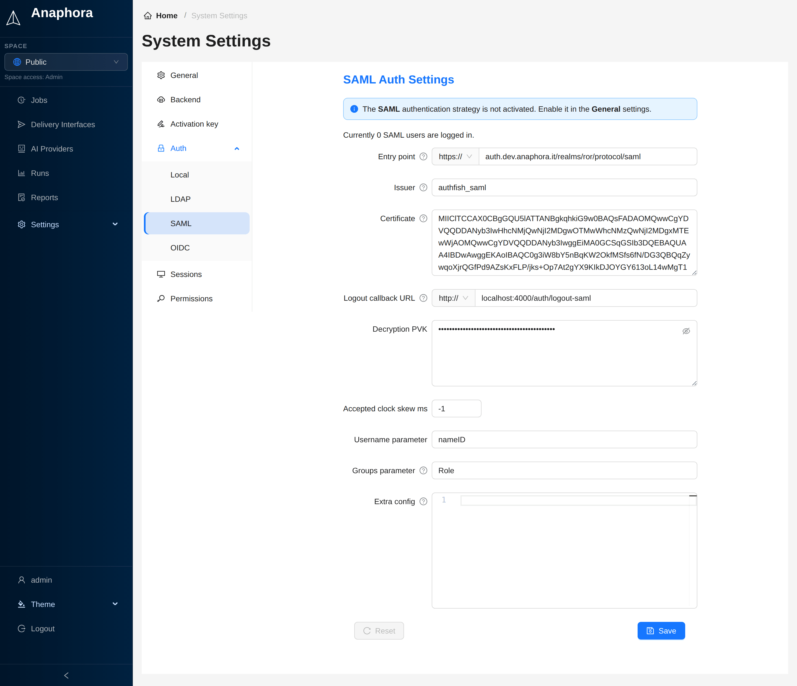

# SAML / Single Sign-On

Anaphora supports single sign-on through SAML 2.0 identity providers. Users log in through your corporate IdP, and Anaphora creates their accounts automatically.

## Overview

With SAML SSO, users have one login for all applications, and you manage them in your IdP. Anaphora creates each user
at the first login and maps IdP groups to Anaphora roles.

## Supported identity providers

| Provider | Status | Notes |
|----------|--------|-------|
| Okta | Tested | Full support |
| Azure AD | Tested | Full support |
| OneLogin | Tested | Full support |
| Google Workspace | Tested | SAML app required |
| PingFederate | Compatible | Standard SAML 2.0 |
| ADFS | Compatible | Standard SAML 2.0 |
| Keycloak | Compatible | Standard SAML 2.0 |
| Custom IdP | Compatible | Any SAML 2.0 compliant |

## Configuration steps

### Step 1: Collect the SP values

Anaphora does not supply an SP metadata file. Enter these values in your IdP by hand. `<anaphora-external-url>` is the
public URL of Anaphora (`NEXT_PUBLIC_SITE_URL`).

| Value                                         | URL or value                                           |
|-----------------------------------------------|--------------------------------------------------------|
| Assertion Consumer Service (ACS) URL          | `https://<anaphora-external-url>/auth/login-saml/callback` |
| Entity ID (SP identifier, Audience)           | The value of **Issuer** in Anaphora, for example `anaphora` |
| Single Logout URL                             | `https://<anaphora-external-url>/auth/logout-saml`      |

### Step 2: Configure your IdP

Create a new SAML application in your identity provider.

#### Okta

1. Admin Console > Applications > Create App Integration
2. Select SAML 2.0
3. Enter these values by hand:
   - Single Sign On URL: `https://anaphora.company.com/auth/login-saml/callback`
   - Audience URI: the value of **Issuer** in Anaphora
4. Configure attribute statements (see below)
5. Assign users/groups

#### Azure AD

1. Azure Portal > Enterprise Applications > New Application
2. Create your own application > Non-gallery
3. Single sign-on > SAML
4. Enter:
   - Identifier: the value of **Issuer** in Anaphora
   - Reply URL: `https://anaphora.company.com/auth/login-saml/callback`
5. Configure claims mapping
6. Assign users/groups

#### OneLogin

1. Applications > Add App > SAML Custom Connector
2. Configuration tab:
   - ACS URL: `https://anaphora.company.com/auth/login-saml/callback`
   - Audience: the value of **Issuer** in Anaphora
3. Parameters tab: Add attribute mappings
4. Access tab: Assign roles

### Step 3: Enter the IdP values

Back in Anaphora:

1. Go to **Settings** > **System** > **Auth** > **SAML**
2. Fill in the fields:

| Field                  | Description                                                              | Required |
|------------------------|--------------------------------------------------------------------------|----------|
| Entry point            | IdP entry point URL, for example `https://keycloak.server/realms/yourRealm/protocol/saml` | Yes      |
| Issuer                 | Issuer string for the IdP. For Keycloak, this is the Client ID           | Yes      |
| Certificate            | IdP signing certificate (see below)                                      | Yes      |
| Logout callback URL    | Full logout callback URL, for example `https://anaphora.company.com/auth/logout-saml` | Yes      |
| Decryption PVK         | Private key to decrypt assertions (stored encrypted)                     | Yes      |
| Accepted clock skew ms | Allowed clock difference in milliseconds. Default: `-1`                  | No       |
| Username parameter     | SAML attribute for the username. Default: `nameID`                       | No       |
| Groups parameter       | SAML attribute for the groups/roles. Default: `Role`                     | No       |
| Extra config           | YAML object with more SAML options (see below)                           | No       |

3. Click **Save**
4. To activate SAML, add `saml` to **Strategies** in **Settings** > **System** > **General**

### Signing certificate

The **Certificate** field holds the IdP signing certificate that validates SAML assertions. It is the X.509 certificate in the SAML metadata of your IdP, in `<ds:X509Certificate>`.

For Keycloak, the metadata URL is:
```
https://<keycloak-host>/realms/<your-realm>/protocol/saml/descriptor
```

The certificate is a long Base64-encoded string, for example:
```
MIICizCCAfQCCQCET8tKaMc0BMjANBgkqh...g=
```

:::tip
Anaphora does not read the IdP metadata. Copy the certificate from the metadata into **Certificate**.
:::

### Step 4: Map attributes

Configure how IdP claims map to the Anaphora user fields.

## Attribute mapping

### Required claims

| Anaphora Field | SAML Claim | Description |
|----------------|------------|-------------|
| Username | `nameID` (set in **Username parameter**) | Unique user identifier |

### Optional claims

| Anaphora Field | SAML Claim | Description |
|----------------|------------|-------------|
| Groups | `Role` (set in **Groups parameter**) | For role mapping |

Anaphora reads no other attributes.

### Okta attribute statements

```
Name: email
Value: user.email

Name: firstName
Value: user.firstName

Name: lastName
Value: user.lastName

Name: groups
Value: (Group membership attribute)
```

Set **Groups parameter** to the attribute name, in this example `groups`.

### Azure AD claims

```
Claim name: email
Source attribute: user.mail

Claim name: displayName
Source attribute: user.displayname

Claim name: groups
Source attribute: user.groups
```

## Group-based roles

Map IdP groups to Anaphora roles to assign permissions automatically.

### Groups attribute configuration

The **Groups parameter** setting is the SAML attribute that contains the group or role information. Default: `Role`

:::warning Important: Single Role Attribute
You must enable **Single Role Attribute** in your identity provider. Some IdPs call it *Single Role Attribute Mapping* or *Roles as Claims*. If it is not enabled, the IdP may not send the group claims correctly.

Anaphora reads the roles only when the attribute has more than one value. An attribute with one value gives no roles.

In Keycloak:
1. Go to **Client Scopes** > **role_list**
2. Select **Mappers** > **role_list**
3. Enable **Single Role Attribute**
:::

### Role mapping

Each IdP group becomes an Anaphora role with the same name.

1. Go to **Settings** > **System** > **Permissions**
2. In a space, add a permission for the role, and set its access:

| IdP Group | Access |
|-----------|--------|
| `Anaphora-Admins` | Admin |
| `Anaphora-Editors` | Read Write |
| `Anaphora-Viewers` | Read Only |

### Space mapping

Give each group access to one or more spaces:

| IdP Group | Space | Access |
|-----------|-------|--------|
| `Team-Alpha` | Alpha Reports | Read Write |
| `Team-Beta` | Beta Reports | Read Write |
| `All-Staff` | Company Dashboards | Read Only |

## Advanced settings

### SAML configuration options

Anaphora sets these node-saml options. Change them in **Extra config**.

| Option | Description | Default |
|--------|-------------|---------|
| `wantAssertionsSigned` | Require the IdP to sign assertions | `false` |
| `wantAuthnResponseSigned` | Require the IdP to sign the response | `false` |
| `audience` | Expected audience of the assertion. `false` turns the check off | `false` |

### Extra configuration

The **Extra config** field accepts a YAML object with more SAML strategy options. Use it to override or extend the default SAML configuration.

```yaml
wantAssertionsSigned: true
allowCreate: true
```

Common options:

| Option | Description |
|--------|-------------|
| `wantAssertionsSigned` | Require signed assertions |
| `allowCreate` | Allow IdP to create new identifiers |
| `forceAuthn` | Force re-authentication on each request |
| `passReqToCallback` | Pass request to verify callback |
| `disableRequestedAuthnContext` | Skip authentication context |

See the full list of available options in the [node-saml documentation](https://github.com/node-saml/node-saml/blob/4.x/README.md#config-parameter-details).

:::caution
Use extra configuration options with caution. Incorrect settings may break SAML authentication.
:::

### Session settings

| Setting | Where | Description |
|---------|-------|-------------|
| **Max age hours** | **Settings** > **System** > **Backend** | How long an Anaphora session lasts. Default: `60` |
| **Logout callback URL** | **Settings** > **System** > **Auth** > **SAML** | Where the IdP sends the SAML logout |
| `forceAuthn` | **Extra config** | Require a new IdP login each time |

## Testing

### Test SAML configuration

1. Log out, then click **Continue with SAML** on the login page
2. Anaphora sends you to your IdP
3. Log in with IdP credentials
4. Make sure that the IdP sends you back to Anaphora
5. Make sure that the user gets the correct spaces

### Debug SAML

Use a more detailed log level:

1. Go to **Settings** > **System** > **General**
2. Set **Log level** to `debug` or `trace`
3. Try to log in
4. Read the Anaphora log

## Troubleshooting

| Issue | Solution |
|-------|----------|
| Redirect loop | Check that the ACS URL is exactly the same in both systems |
| Invalid signature | Make sure the IdP certificate in Anaphora is current |
| User has no username | Check **Username parameter**, make sure the IdP sends that attribute |
| Groups not mapped | Make sure the IdP sends the attribute in **Groups parameter**, check group name format |
| Clock skew error | Make sure server clocks are synchronized (NTP), or set **Accepted clock skew ms** |

### Common errors

**"SAML Response validation failed"**
- Certificate mismatch: copy the current certificate from the IdP metadata into **Certificate**
- Clock skew: check server time synchronization

**"NameID not found"**
- The IdP does not send NameID
- Check IdP configuration for NameID format

## Best practices

- Update **Certificate** when the IdP rotates its signing certificate
- Set `wantAssertionsSigned: true` in **Extra config** for security
- Map groups to roles instead of individual users
- Test fully before you enable SAML for all users

## Next steps

- [OIDC](./oidc): OpenID Connect, an alternative to SAML
- [Spaces](../spaces): configure space-based access
