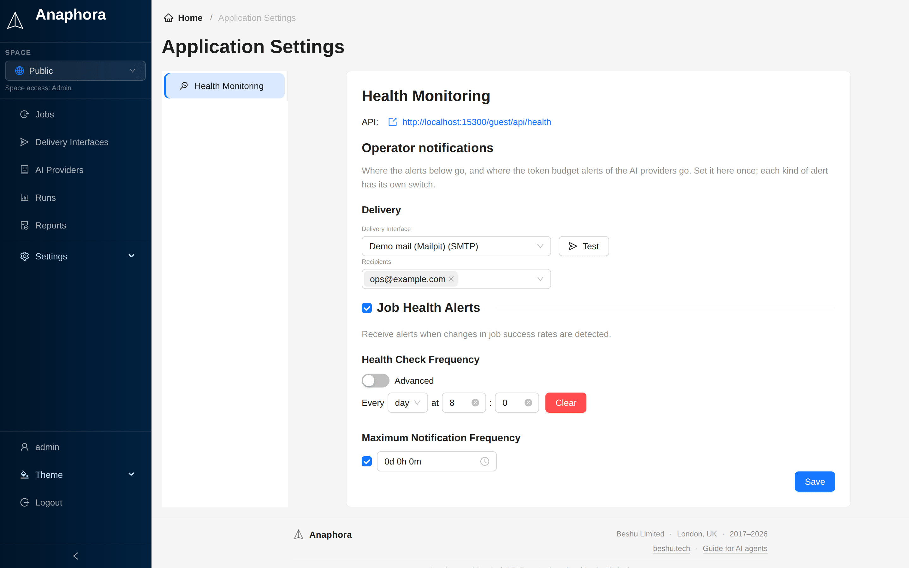

# Self-monitoring

Monitor the health of Anaphora and the success of its jobs and deliveries.


## Health monitoring

Access the monitoring settings at **Settings** > **Application** > **Health Monitoring**.

### Set up health alerts

Get alerts when Anaphora detects changes in job success rates.

1. Under **Operator notifications** > **Delivery**, select a **Delivery Interface**. For an SMTP or Mailgun interface,
   also add the **Recipients**. A webhook with **Define body in job instead** is not available.
2. Select **Job Health Alerts**.
3. Set **Health Check Frequency**: how often to check job health.
4. Set **Maximum Notification Frequency**: minimum time between alerts (optional).
5. Optionally, click **Test** to send the current health status.
6. Click **Save**.

:::info
The same delivery settings also receive the token budget alerts of the AI providers.
:::

## Health API

To get the health status of Anaphora through the API, call this endpoint:

```
GET /guest/api/health
```

What the answer contains depends on the credentials that you send:

| You send                                                    | You get                                                                                                   |
|-------------------------------------------------------------|-----------------------------------------------------------------------------------------------------------|
| Nothing                                                     | The worst colour (`status`), the `counts` per colour, and one `healthStatus` per job and delivery interface. No names. |
| An observer key: `Authorization: Bearer <key>`              | Every job and delivery interface by name, with its schedule, its recent runs and its delivery counts. No error texts. |
| The credentials of a system user: `Authorization: Basic …` | All of the above, and the delivery error texts of the last 24 hours.                                      |

The answer is always HTTP 200, except for an observer key that is revoked or mistyped: that gets HTTP 401, so your
monitor raises an alert. Anaphora keys start with `ana_`. A bearer token that does not, for example the token of a
proxy in front of Anaphora, gets the answer without names.

### Observer keys

Use an observer key for a monitoring tool (Centreon, Zabbix, Nagios, Prometheus blackbox exporter). The key reads the
health status only, and you can revoke it without changing a user's password.

1. Go to **Settings** > **Application** > **API Keys**.
2. Click **New key**. Give the key the name of the monitor that uses it, and click **Create**.
3. Copy the key. Anaphora shows it once and keeps only a hash of it.
4. To test the key, run the curl command that Anaphora shows under the key.
5. Configure the monitor to send the key in the `Authorization` header:

```bash
curl -fsS -H "Authorization: Bearer ana_obs_..." 'https://anaphora.example.com/guest/api/health'
```

With `-f`, curl fails with error 401 when the key is wrong, and does not print the answer without names.

To test a key later, use the command at the top of the **API Keys** page. It asks for the key, so the key does not go
into the command or the shell history. Paste the key and press Enter. The key stays hidden:

```bash
read -rs ANAPHORA_API_KEY && curl -fsS -H "Authorization: Bearer $ANAPHORA_API_KEY" 'https://anaphora.example.com/guest/api/health'
```

The list shows when each key was last used. To revoke a key, click **Revoke** next to it, and confirm. From then on, a
monitor that sends the key gets 401.

Send the key in the header only. Anaphora does not read a key from the query string, because query strings are written
to proxy logs.

### Response format

Without credentials:

```json
{
  "status": "yellow",
  "counts": {
    "jobs": { "red": 0, "yellow": 1, "green": 1, "gray": 0 },
    "deliveryInterfaces": { "red": 0, "yellow": 0, "green": 1, "gray": 1 }
  },
  "jobs": [{ "healthStatus": "yellow" }, { "healthStatus": "green" }],
  "deliveryInterfaces": [{ "healthStatus": "green" }, { "healthStatus": "gray" }]
}
```

With an observer key, the answer also names every job and delivery interface. A system user also gets the
`summary24Hours.errors` list of each delivery interface, which an observer key does not get:

```json
{
  "status": "green",
  "counts": {
    "jobs": { "red": 0, "yellow": 0, "green": 1, "gray": 0 },
    "deliveryInterfaces": { "red": 0, "yellow": 0, "green": 1, "gray": 0 }
  },
  "jobs": [
    {
      "id": "79cf54b6-df32-4b09-84f4-708ecc72b7bc",
      "name": "Kibana Dashboard Snapshot",
      "description": "Takes a snapshot of a dashboard",
      "cron": "5 4 * * *",
      "healthStatus": "green",
      "recentRuns": [
        {
          "runAt": "2026-01-15T04:05:00.041Z",
          "state": "success"
        },
        {
          "runAt": "2026-01-14T04:05:00.051Z",
          "state": "success"
        },
        {
          "runAt": "2026-01-13T04:05:00.034Z",
          "state": "success"
        },
        {
          "runAt": "2026-01-12T04:05:00.040Z",
          "state": "success"
        },
        {
          "runAt": "2026-01-11T04:05:00.034Z",
          "state": "success"
        }
      ]
    }
  ],
  "deliveryInterfaces": [
    {
      "id": "4d5fba03-561e-4503-bf4d-c41817133aca",
      "name": "My Delivery Interface",
      "type": "webhook",
      "healthStatus": "green",
      "summary24Hours": {
        "totalCount": 11,
        "errorCount": 0,
        "errors": []
      }
    }
  ]
}
```

### Health status values

| Status     | Meaning                    |
|------------|----------------------------|
| **green**  | All recent runs successful |
| **yellow** | Some recent failures       |
| **red**    | All recent runs failed     |
| **gray**   | No recent activity         |

### Run states

Each entry of `recentRuns` has a `state`:

| State       | Meaning                                                                            |
|-------------|------------------------------------------------------------------------------------|
| `success`   | The run succeeded and its report was delivered                                     |
| `partial`   | The report reached some delivery interfaces or recipients, but not all            |
| `failed`    | The capture failed, or the report reached nobody (for example a withheld report)  |

A job is green when its last five runs are all `success`, and red when they are all `failed`. A `partial` run makes the
job yellow, not red: one address that refuses the mail keeps the job yellow.

### AI budget alerts

The delivery interface of the health alerts also carries the [AI token budget](./ai-providers.md#budget-alerts) alerts.
You can set it without switching health monitoring on.

## Next steps

- [Backup](./backup): configure backups
