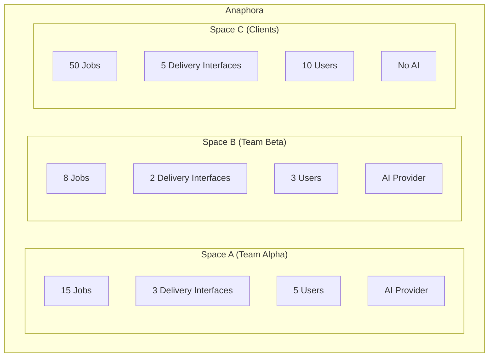

# Spaces

Spaces provide multi-tenant workspace isolation in Anaphora. They act as "share-nothing" containers that completely separate resources between teams, projects, or tenants.


## Overview

A Space is an isolated container that includes:

- Jobs and schedules
- Generated reports and run history
- Delivery interface configurations
- AI provider configurations
- User assignments and permissions



:::info
Users can belong to multiple Spaces with different roles.
:::

## Share-Nothing Architecture

Spaces enforce complete isolation:

| Isolated | Not Shared |
|----------|------------|
| Jobs | Jobs cannot access other Spaces' resources |
| Delivery Interfaces | Each Space configures its own |
| AI Providers | Per-Space AI configuration |
| Reports | Only visible within the Space |
| Run History | Isolated execution logs |
| Templates | Report templates per Space |

### Copying Between Spaces

While resources cannot be shared, they can be copied:

1. Export job configuration from Space A
2. Import into Space B
3. Reconfigure Space-specific settings (delivery, credentials)

## Creating Spaces

1. Navigate to **Settings** > **Spaces**
2. Click **Create Space**
3. Enter name and description
4. Configure default settings
5. Save

### Space Settings

| Setting | Description |
|---------|-------------|
| **Name** | Unique identifier for the Space |
| **Description** | Purpose/team using this Space |
| **Default Space** | Set as default for new users |
| **Retention Override** | Custom housekeeping rules |

## User Assignment

Assign users to Spaces with specific roles:

### Assignment Process

1. Open Space settings
2. Go to **Members** tab
3. Click **Add Member**
4. Select user or group
5. Assign role (Admin, Editor, Viewer)
6. Save

### Multi-Space Users

Users can belong to multiple Spaces:

```
User: alice@company.com
├── Space: Engineering → Role: Admin
├── Space: Marketing → Role: Viewer
└── Space: DevOps → Role: Editor
```

### Group-Based Assignment

Assign entire groups to Spaces:

```
Group: Engineering Team
└── Space: Engineering → Role: Editor

All members of "Engineering Team" get Editor access to Engineering Space
```

## Switching Spaces

Users with access to multiple Spaces see a Space selector in the navigation.

### Current Space Indicator

- Shows active Space name in header
- All operations apply to current Space
- Jobs, reports, settings are Space-specific

### Quick Switch

- Click Space selector
- Choose from available Spaces
- View updates immediately

## Use Cases

### Team Separation

| Space | Purpose |
|-------|---------|
| Engineering | Technical dashboards, system metrics |
| Marketing | Campaign dashboards, analytics |
| Executive | Summary reports, KPIs |
| DevOps | Infrastructure monitoring, alerts |

### Client Isolation (MSP)

For managed service providers:

| Space | Client |
|-------|--------|
| Client-Acme | Acme Corp reports |
| Client-Beta | Beta Inc reports |
| Client-Gamma | Gamma Ltd reports |

Each client's data is completely isolated.

### Environment Separation

| Space | Environment |
|-------|-------------|
| Production | Live dashboards, real alerts |
| Staging | Test jobs, validation |
| Development | Experimental configurations |

## Space-Level Settings

Each Space can override global settings:

### Retention Policies

Configure per-Space housekeeping:

| Setting | Global | Space Override |
|---------|--------|----------------|
| Report retention | 90 days | 365 days (compliance) |
| Run history | 30 days | 7 days (dev Space) |

### Default Configurations

Set Space-specific defaults:

- Default delivery interface
- Default templates
- Default capture settings

## Administration

### Space Admins

Space Admins can:

- Manage jobs within their Space
- Configure Space-specific delivery interfaces
- View all reports in the Space
- Manage Space membership

Space Admins cannot:

- Access other Spaces (unless assigned)
- Modify global settings
- Create new Spaces

### System Admins

System Admins can:

- Create and delete Spaces
- Access all Spaces
- Manage global settings
- Override Space configurations

## Best Practices

### Naming Conventions

Use clear, consistent naming:

```
Good: Engineering, Marketing, Client-Acme
Bad: Space1, Test, Temp
```

### Permission Principle

Assign minimal required permissions:

- Most users: Viewer (report access only)
- Job creators: Editor
- Team leads: Space Admin
- IT/Operations: System Admin

### Regular Review

- Audit Space membership quarterly
- Remove inactive users
- Review job configurations
- Check retention policies

### Documentation

Document each Space's purpose:

- What team/project uses it
- What dashboards are captured
- Who receives reports
- Retention requirements

## Next Steps

- [Self Monitoring](./self-monitoring) - Monitor system health
- [Backup](./backup) - Configure backup and recovery
