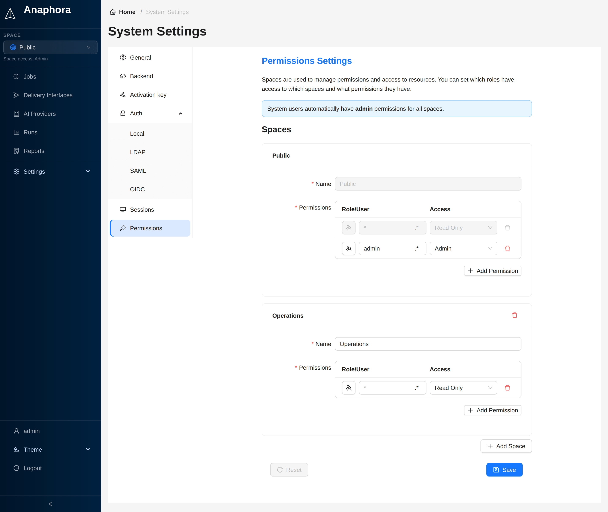
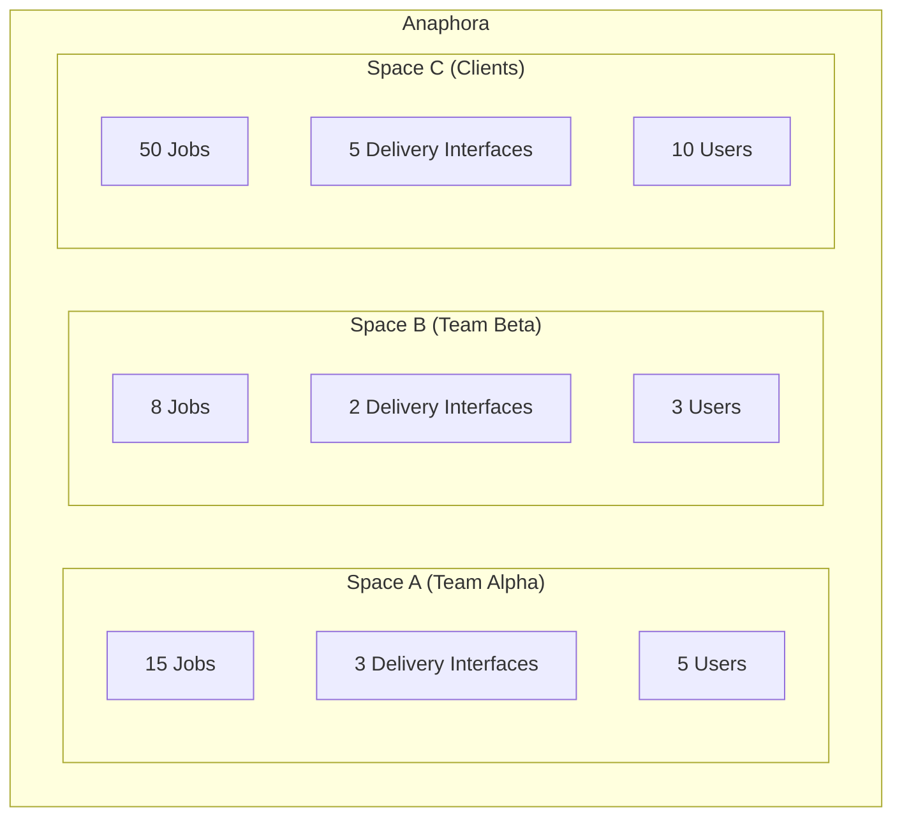
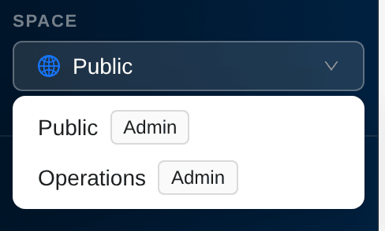

# Spaces

Spaces isolate workspaces for multi-tenancy in Anaphora. Each Space is a "share-nothing" container that completely
separates its resources from those of other teams, projects or tenants.



## Overview

A Space is an isolated container that holds:

- Jobs and schedules
- Generated reports and run history
- Delivery interface configurations
- AI provider configurations
- User assignments and permissions


```mermaid
flowchart TB
    subgraph anaphora["Anaphora"]
        subgraph spaceA["Space A (Team Alpha)"]
            a1["15 Jobs"]
            a2["3 Delivery Interfaces"]
            a3["5 Users"]
        end
        subgraph spaceB["Space B (Team Beta)"]
            b1["8 Jobs"]
            b2["2 Delivery Interfaces"]
            b3["3 Users"]
        end
        subgraph spaceC["Space C (Clients)"]
            c1["50 Jobs"]
            c2["5 Delivery Interfaces"]
            c3["10 Users"]
        end
    end
```

:::info
Users can belong to multiple Spaces with different roles.
:::

### Copying between Spaces

Resources cannot be shared between Spaces, but you can copy them:

1. In the jobs list, select the jobs to copy to another Space
2. Click **Copy to other space**
3. Choose the target Space
4. If applicable, select what to do with each associated delivery interface, for example **Copy delivery interface**
   or **Exclude from copy**

The same process applies to delivery interfaces.

To copy, you need these permissions in the Space the resource comes from:

| Resource                                  | Permission needed |
|-------------------------------------------|-------------------|
| Job                                       | ReadWrite         |
| Delivery interface, AI provider, template | Admin             |

## Creating Spaces

1. Go to **Settings** > **System** > **Permissions**
2. Click **Add Space**
3. Enter the **Name** of the Space
4. Click **Save**

### Assignment process

1. In the Space, click **Add Permission**
2. Select user or role, and enter the name in **Role/User**
3. Select the **Access** (**Admin**, **Read Write**, **Read Only**)
4. Click **Save**

:::info
System users automatically have admin permissions for all spaces.
:::

:::tip User Roles
You can assign roles to users, and then assign the roles to Spaces. This way, you do not need to assign each user
individually.
:::

### Multi-Space users

Users can belong to multiple Spaces, by direct assignment or through roles:

```
User: alice@company.com
├── Space: Engineering → Access: Admin
└── Space: Marketing → Access: Read Only
Role: DevOps Team
└── Space: DevOps → Access: Read Write
```

## Switching Spaces

To switch between Spaces, use the Space selector in the sidebar.



All resources you create or manage are scoped to the selected Space.

## Use cases

### Team separation

| Space       | Purpose                              |
|-------------|--------------------------------------|
| Engineering | Technical dashboards, system metrics |
| Marketing   | Campaign dashboards, analytics       |
| Executive   | Summary reports, KPIs                |
| DevOps      | Infrastructure monitoring, alerts    |

### Client isolation (MSP)

For managed service providers:

| Space        | Client            |
|--------------|-------------------|
| Client-Acme  | Acme Corp reports |
| Client-Beta  | Beta Inc reports  |
| Client-Gamma | Gamma Ltd reports |

Each client's data is completely isolated.

### Environment separation

| Space       | Environment                  |
|-------------|------------------------------|
| Production  | Live dashboards, real alerts |
| Staging     | Test jobs, validation        |
| Development | Experimental configurations  |

## Administration

Only system administrators can create and manage Spaces. Space admins can only manage resources within their assigned
Spaces.

See [Authentication](authentication/index.md) for details on user roles and permissions.

## Best practices

### Permission principle

Assign the minimum permissions that each user needs:

- Most users: Space Read Only
- Job creators: Space Read Write
- Team leads: Space Admin
- IT/Operations: System Admin

## Next steps

- [Self-monitoring](./self-monitoring): monitor system health
- [Backup](./backup): configure backup and recovery
