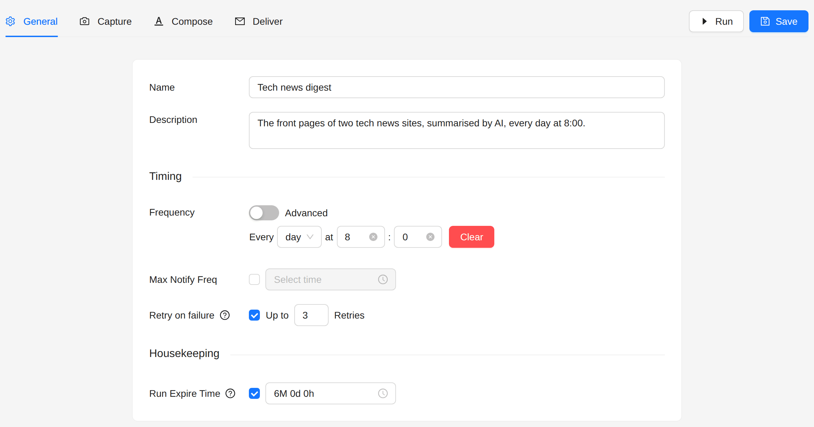
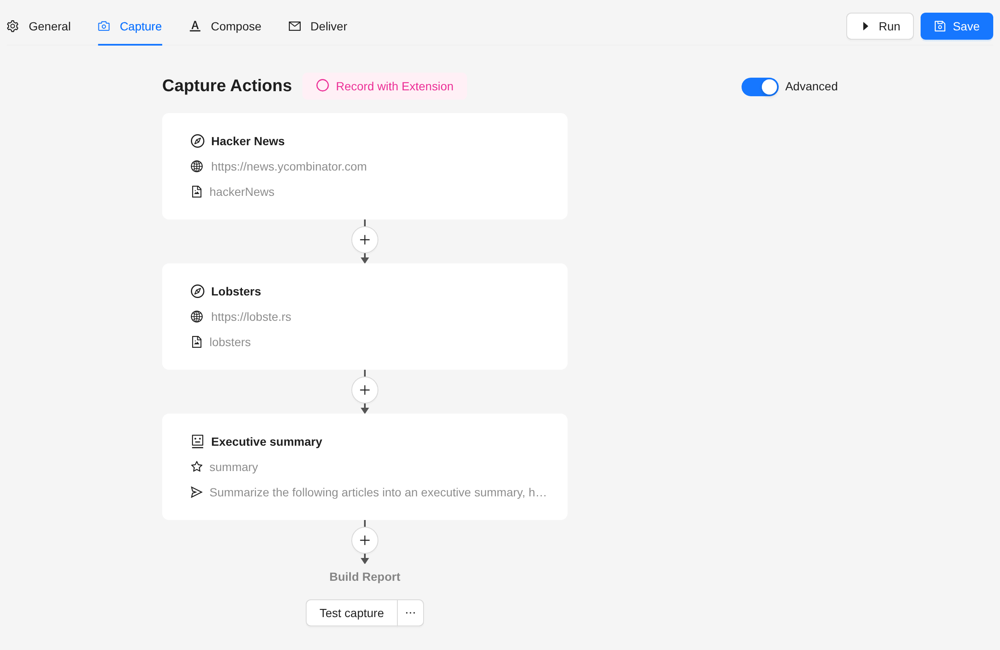
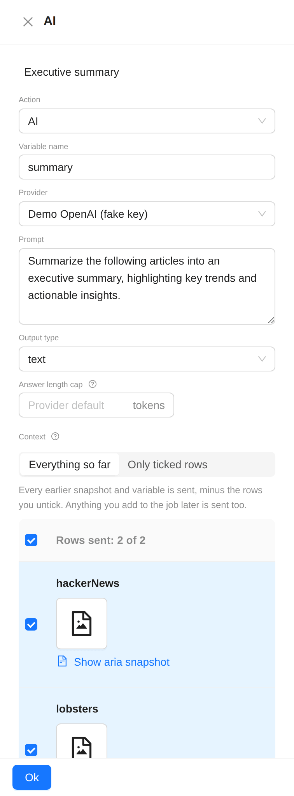
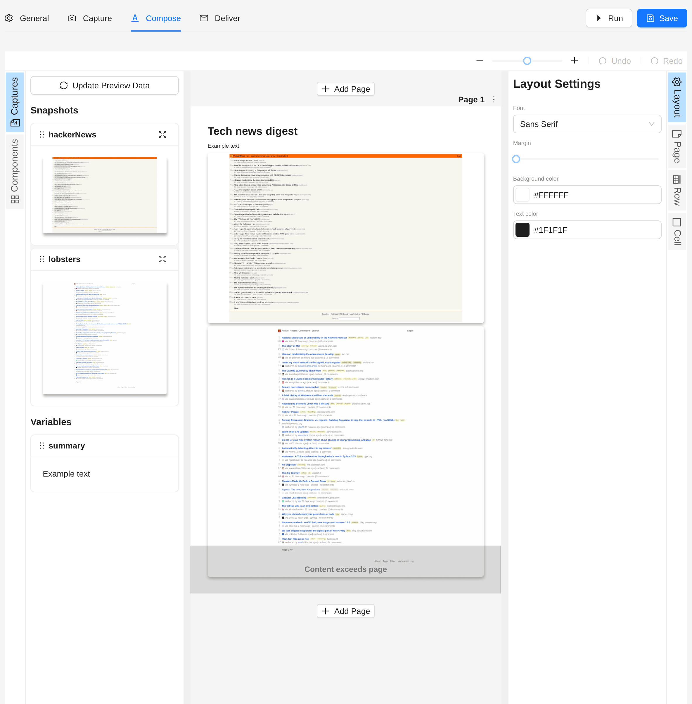
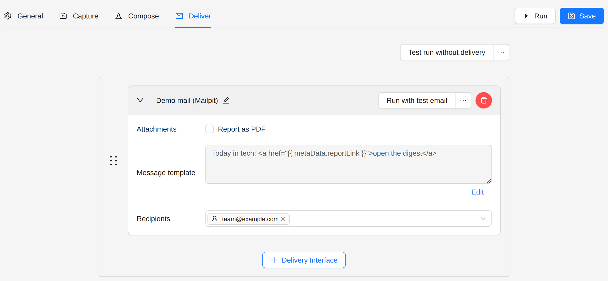

# AI News Collation

Capture several pages, have AI summarise them, and send the summary with the pages.

## Goal

Every morning at 8:00, send the team a digest of two tech news front pages: an executive summary written by AI, and
the pages themselves below it.

## Use cases

- Industry news digests
- Competitive intelligence reports
- Summaries of research papers
- Summaries of social media monitoring

## Before you start

The **AI** action needs an AI provider. Add one under **AI Providers** in the sidebar, with the API key of your
provider.

## Steps

### 1. Create the job

1. Open **Jobs** in the sidebar.
2. Click **Create Job**, then **Create New**.

### 2. General

- **Frequency**: every **day** at **8:00**.



### 3. Capture

Switch on **Advanced**. Add a **Navigate** action for each source, then an **AI** action below them:



1. **Navigate**, one for each source:
   - **Connector**: **Web**.
   - **URL**: the page, for example `https://news.ycombinator.com`.
   - Tick **Take snapshot**.
2. **AI**:
   - **Variable name**: `summary`. The answer goes into this variable.
   - **Provider**: your AI provider.
   - **Prompt**: what to do with the pages, for example:
     ```
     Summarize the following articles into an executive summary, highlighting key trends and actionable insights.
     ```
   - **Output type**: **text**.
   - **Context**: **Everything so far** sends every earlier snapshot and variable, minus the rows you untick.
     **Only ticked rows** sends only the rows you tick. Each snapshot row has **Show aria snapshot**, to see the
     page text that the AI gets.
   - **Answer length cap**: a limit in tokens, or empty for the default of the provider.

   

### 4. Compose

Put the summary in a text block, above the snapshots:

```liquid
<h1>Tech news digest</h1>
{{ summary }}
```



### 5. Deliver

Choose a delivery interface and the recipients.



## Next steps

- [Mixed Sources Report](./mixed-sources-report): put Kibana, Grafana and other pages in one report.
