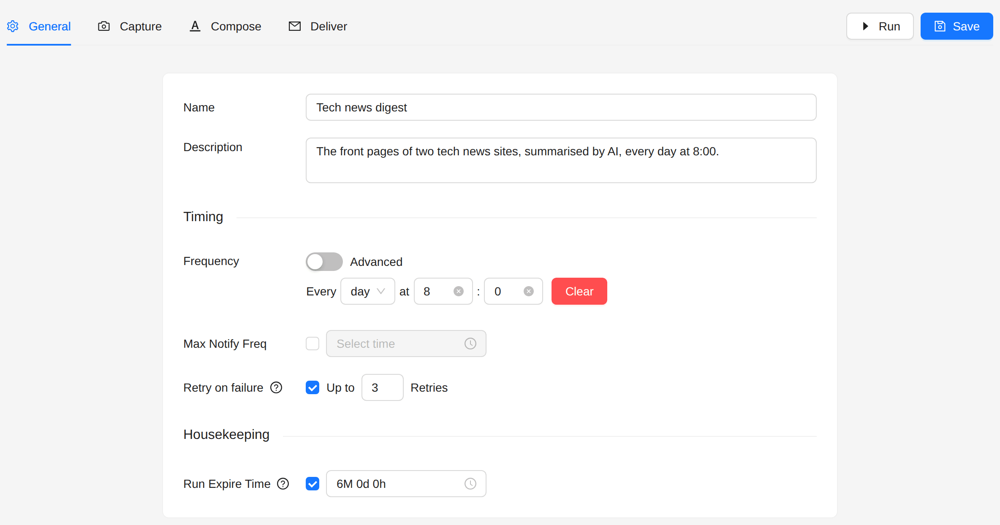
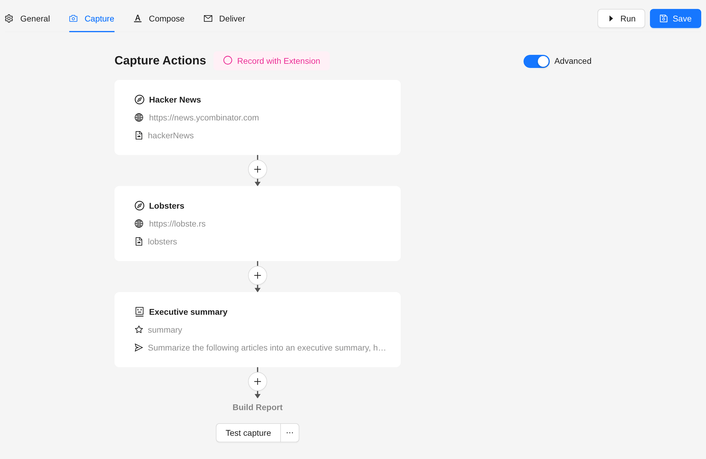
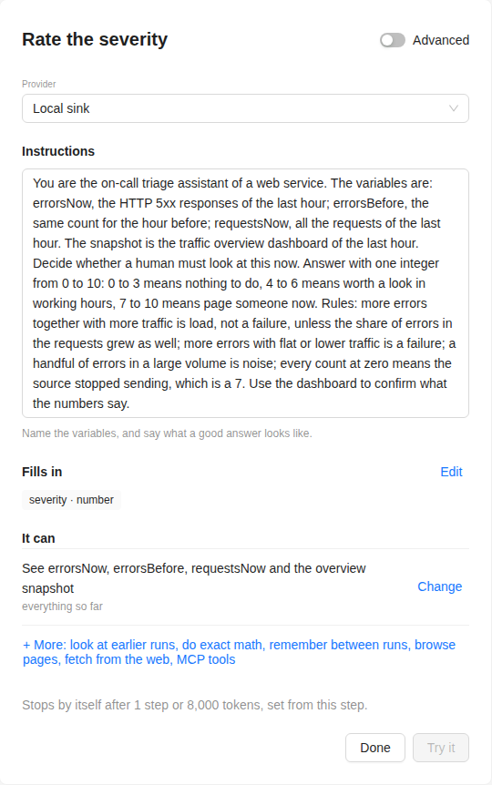
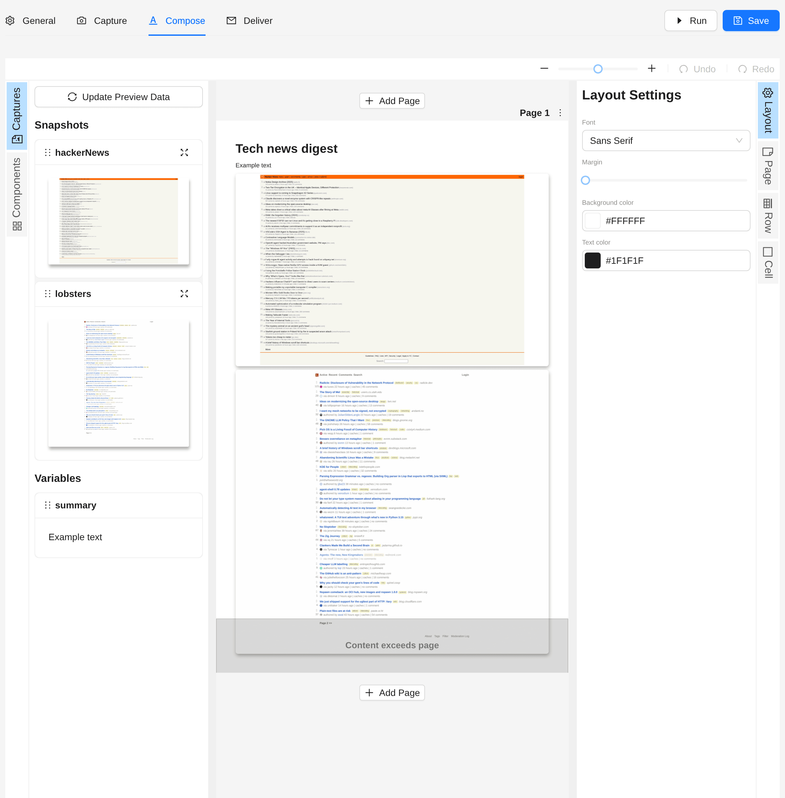
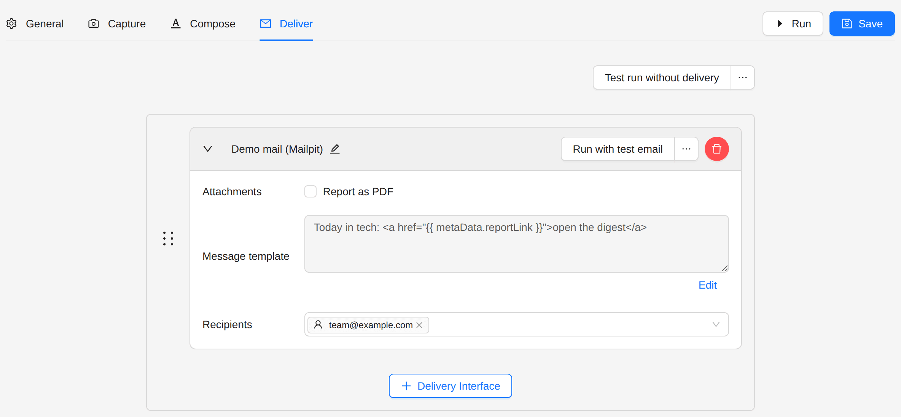

# AI News Collation

Capture several pages, have AI summarise them, and send the summary with the pages.

## Goal

Every morning at 8:00, send the team a digest of two tech news front pages: an executive summary written by AI, and
the pages themselves below it.

## Use cases

- Industry news digests
- Competitive intelligence reports
- Summaries of research papers
- Summaries of social media monitoring

## Before you start

The **AI** step needs an AI provider. Add one under **AI Providers** in the sidebar, with the API key of your
provider.

## Steps

### 1. Create the job

1. Open **Jobs** in the sidebar.
2. Click **Create Job**, then **Create New**.

### 2. General

- **Frequency**: every **day** at **8:00**.



### 3. Capture

Switch on **Advanced**. Add a **Navigate** action for each source, then an **AI** step below them:



1. **Navigate**, one for each source:
   - **Connector**: **Web**.
   - **URL**: the page, for example `https://news.ycombinator.com`.
   - Tick **Take snapshot**.
2. **AI**: the step opens in its own page. Click **Set it up by hand instead**, then fill in the simple view:
   - **Provider**: your AI provider.
   - **Instructions**: what to do with the pages, for example:
     ```
     Summarize the following articles into an executive summary, highlighting key trends and actionable insights.
     ```
   - **Fills in**: click **Edit**, enter the **Name** `summary`, and choose the **Type** **text**. The answer goes into
     this variable. One variable is enough for this job.
   - **It can**: the first line names what the step sees. Here it is both snapshots, "everything so far", which is
     what this job needs.
   - Click **Done** to go back to the flow.

   

   [The AI step](../jobs/ai-step.md) describes every setting, and how to try the step before you save the job.

### 4. Compose

Put the summary in a text block, above the snapshots:

```liquid
<h1>Tech news digest</h1>
{{ summary }}
```



### 5. Deliver

Choose a delivery interface and the recipients.



## Next steps

- [AI Triage](./ai-triage): one AI step that rates the errors, looks at earlier runs and remembers the open
  incidents.
- [Mixed Sources Report](./mixed-sources-report): put Kibana, Grafana and other pages in one report.
