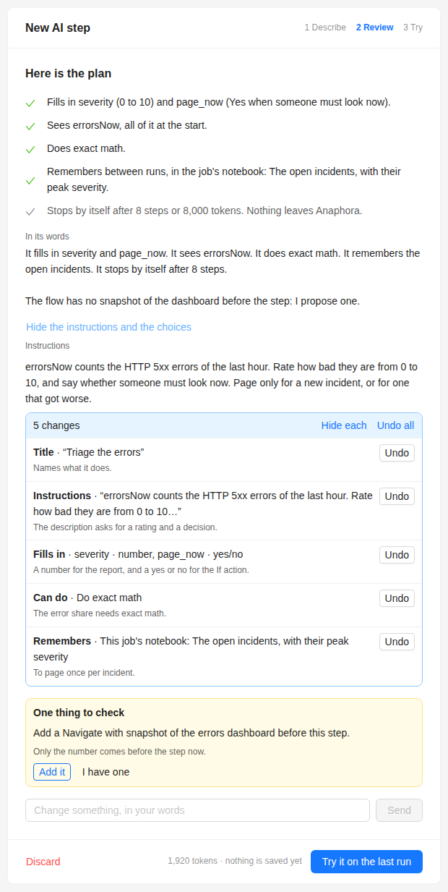

# AI Triage

Let one AI step decide whether a human must look at the errors now, and page once per incident.

## Goal

Every 15 minutes, count the HTTP 5xx errors and the requests of the last hour in Kibana, and take a snapshot of the
overview dashboard. One AI step rates the severity from 0 to 10, compares with the earlier runs, and keeps the open
incidents in its notebook. It pages someone for a new incident, or for an open one that got worse, and writes the
briefing for the report.

The **Kibana AI Triage** template does this with two AI actions, two more capture actions for the hour before, and a
3-hour throttle: see [The Kibana AI Triage template](../administration/ai-providers.md#the-kibana-ai-triage-template).
This version needs one AI step:

- One call fills four variables, so the dashboard goes to the AI once.
- **Look at earlier runs** replaces the capture of the hour before.
- The notebook replaces the throttle. A second, worse incident still pages someone.

## Before you start

- An AI provider whose model uses tools. The **Test** of the provider tells you: see
  [What this model can do](../administration/ai-providers.md#what-this-model-can-do).
- The flow has more than three capture actions, so the Free edition cannot save it.

## Steps

### 1. Create the job

1. Open **Jobs** in the sidebar.
2. Click **Create Job**, then **Create New**.

### 2. General

- **Frequency**: every 15 minutes (**Advanced**: `*/15 * * * *`).
- **Max Notify Freq**: leave it off. The notebook decides when to page.

### 3. Capture

Switch on **Advanced**, and build this flow:

1. **Navigate**: the errors of the last hour in Kibana Discover. **Connector** **Kibana**, the URL of a search such as
   `response >= 500`, and the last hour as time range.
2. **Capture value**: **Variable name** `errorsNow`, **Capture template** **Kibana discover hits**.
3. **Navigate**: all the requests of the last hour, in Discover.
4. **Capture value**: **Variable name** `requestsNow`, **Capture template** **Kibana discover hits**.
5. **Navigate**: the overview dashboard of the last hour. Tick **Take snapshot**.
6. **AI**: click **Set it up by hand instead**, then switch on **Advanced**.
   - **Instructions**:
     ```
     You are the on-call triage assistant of a web service. errorsNow counts the HTTP 5xx responses of the last
     hour, requestsNow all the requests of the last hour. The snapshot is the traffic overview dashboard. More errors
     with more traffic is load, not a failure, unless the share of errors grew too. More errors with flat or lower
     traffic is a failure. A handful of errors in a large volume is noise. Every count at zero means the source
     stopped sending, which is a 7. Compare with the earlier runs and with the open incidents in your notebook.
     Page only for a new incident, or for an open one that got worse.
     ```
   - **Fills in**: click **Add variable** for each row.

     | Name           | Type       | What it means                                                                                      |
     |----------------|------------|----------------------------------------------------------------------------------------------------|
     | `severity`     | **number** | 0 to 10. 0-3 nothing to do, 4-6 a look in working hours, 7-10 page someone now.                    |
     | `page_now`     | **yes/no** | Yes when someone must be paged now: a new incident at 7 or more, or an open one that got worse.   |
     | `incident_key` | **text**   | A short name of the incident, for example `checkout-5xx`. Empty when there is no incident.         |
     | `briefing`     | **HTML**   | At most four short sentences: what is wrong, the numbers, what the dashboard shows, what to check. |

   - **Can do**: switch on **Look at earlier runs**, with the **Variables it reads** `errorsNow`, `requestsNow` and
     `severity`, and `8` runs (two hours at this frequency). Switch on **Do exact math** too, for the share of errors.
   - **Remembers**: **This job's notebook**. **What to keep**:
     ```
     The open incidents: the incident_key, when each started, its peak severity, and when someone was paged.
     Remove an incident when the errors are back to normal.
     ```
   - **Guardrails**: leave them empty. The grey line under **It can** shows the limits that apply.
7. **Conditional block**: **Variable** `page_now`, **Condition operation** **not equals**, **Condition value** `1`.
   Inside it, add a **Break**: when the answer is no, the run stops and nobody is paged.

In the AI step, click **Try it**. When the job has no run yet, click **Run a Test capture of the actions before it**
first. The trial shows the four values and the reasons of the AI, and saves nothing. See [Try it](../jobs/ai-step.md#try-it).

:::tip Describe it instead
On the first screen of a new AI step, write what you want, for example "Look at the error count. Decide if someone must
be paged now. Only page for a new incident, or for one that got worse." The assistant proposes a plan. Check it against
the settings above, and add what it lacks.


:::

### 4. Compose

Add a text block, then the dashboard snapshot:

```liquid
<h1>Severity {{ severity }}/10: {{ incident_key }}</h1>
{{ briefing }}
<p>{{ errorsNow }} HTTP 5xx responses in the last hour, out of {{ requestsNow }} requests.</p>
```

### 5. Deliver

Choose a delivery interface and the on-call recipients.

## How it behaves

- A run with no new or worse incident stops at the **Break**. Nobody is notified, and the notebook keeps what the AI
  wrote.
- A new incident, or one that got worse, sends the report.
- The **AI** column of the **Runs** page shows what each run cost. Click it to read why the AI decided so. See
  [Runs](../jobs/ai-step.md#runs).

## Next steps

- [The AI step](../jobs/ai-step.md): every setting of the step.
- [AI News Collation](./ai-news-collation): a summary of several pages with one AI step.
