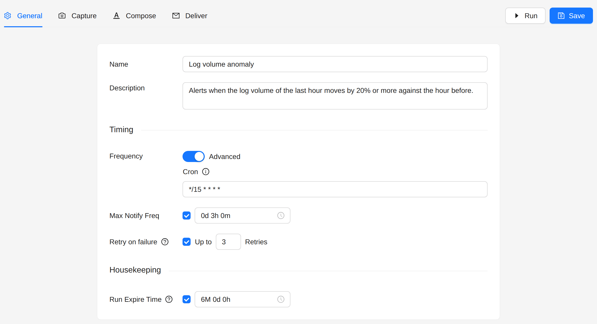
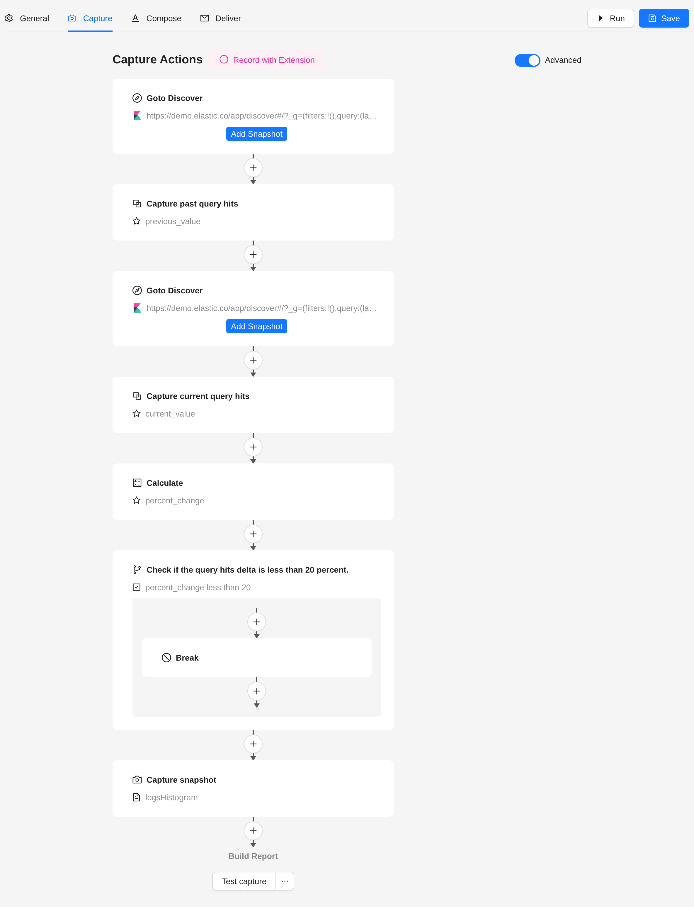
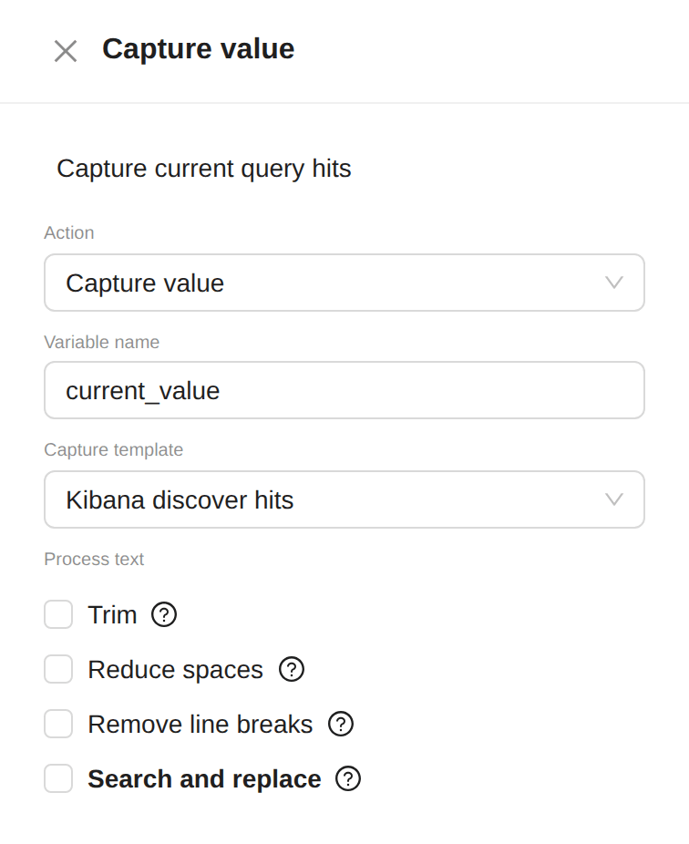
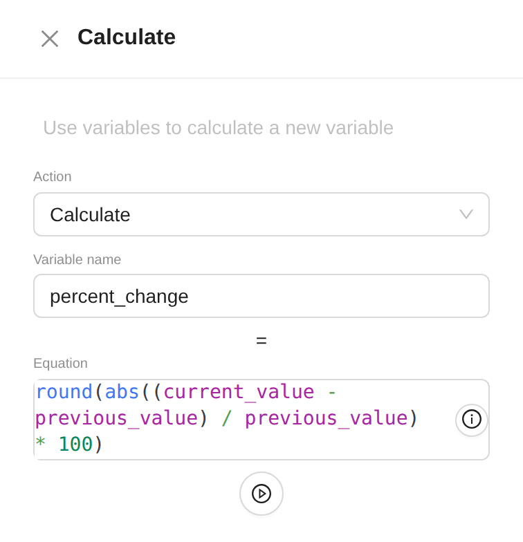
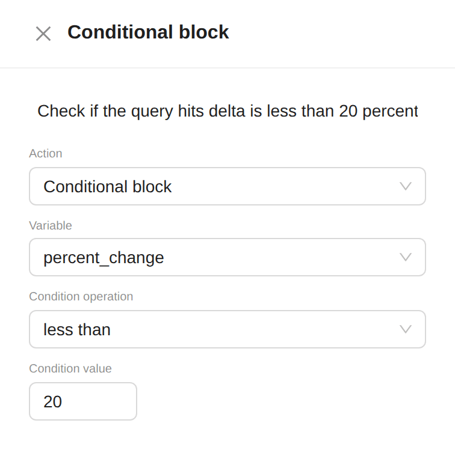
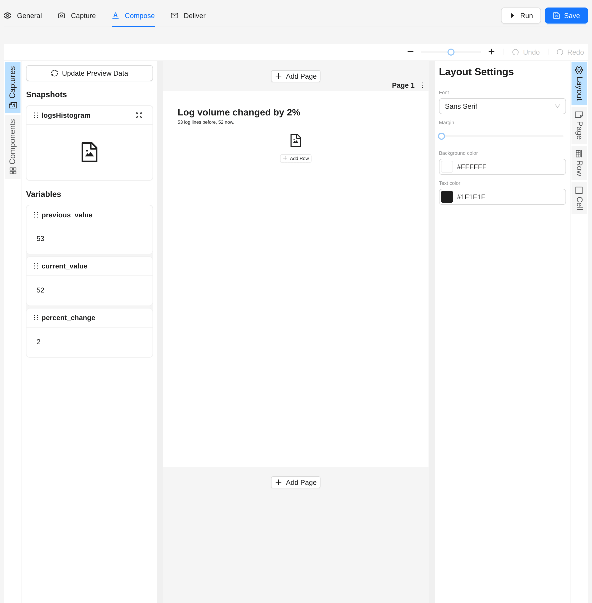
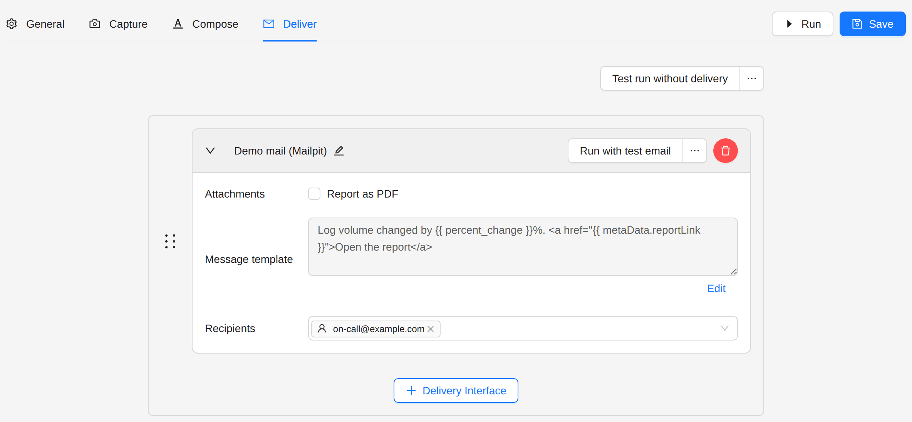
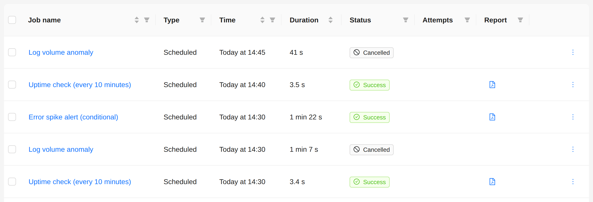

# Kibana Anomaly Alert

Compare the current data with an earlier period, and send an alert when the change is large.

:::tip Kibana Anomaly Detection template
The **Kibana Anomaly Detection** template builds this flow for the public Kibana demo. Pick it under
**Jobs → Create Job** and change the URLs and the threshold.
:::

## Goal

Every 15 minutes, compare the number of log lines of the last hour with the hour before. When the volume moves by 20%
or more, up or down, send an alert with both counts and the logs histogram. Send it at most once every 3 hours.

## Use cases

- Traffic that drops or spikes against the previous hour
- Error rates that climb against their usual level
- Sources that suddenly stop sending logs

## Steps

### 1. Create the job

1. Open **Jobs** in the sidebar.
2. Click **Create Job**, then **Create New**.

### 2. General

- **Frequency**: every 15 minutes (**Advanced**: `*/15 * * * *`).
- **Max Notify Freq**: **3 hours**.



### 3. Capture

Switch on **Advanced**. The flow reads two counts, computes the change, and stops when the change is small:



1. **Navigate**: the Discover search of the earlier period.
   - **Connector**: **Kibana**, with the **Auth type** your Kibana needs.
   - **Time select**: from **2 hours ago** to **1 hour ago**.
2. **Capture value**: the earlier count.
   - **Variable name**: `previous_value`.
   - **Capture template**: **Kibana discover hits**.

   

3. **Navigate**: the same search for the current period, from **1 hour ago** to **Now**.
4. **Capture value**: the current count, in `current_value`, with **Kibana discover hits**.
5. **Calculate**: the change in percent.
   - **Variable name**: `percent_change`.
   - **Equation**: `round(abs((current_value - previous_value) / previous_value) * 100)`.

   

6. **Conditional block**: stops the flow when the change is small.
   - **Variable**: `percent_change`.
   - **Condition operation**: **less than**.
   - **Condition value**: `20`.
   - Inside the block, add a **Break** action.

   

7. Below the block, capture what the alert shows, for example a snapshot of the logs histogram.

:::note
When the earlier count is 0, the change is `Infinity`, or `NaN` when both counts are 0. Neither is less than 20, so
the alert goes out. To stay quiet when the earlier period is empty, add a second conditional block before the
**Calculate**: `previous_value` **less than** `1`, with a **Break** inside.
:::

### 4. Compose

The variables of the flow can go in any text block:

```liquid
<h1>Log volume changed by {{ percent_change }}%</h1>
<p>{{ previous_value }} log lines before, {{ current_value }} now.</p>
```



### 5. Deliver

Choose a delivery interface and the recipients. Put the change in the message:

```
Log volume changed by {{ percent_change }}%. <a href="{{ metaData.reportLink }}">Open the report</a>
```



## Result

A run where the change stays below 20% stops at the **Break**. The Runs page shows it as **Cancelled**, and nobody gets
a message:



## Next steps

- [AI News Collation](./ai-news-collation): summarise captured pages with AI.
