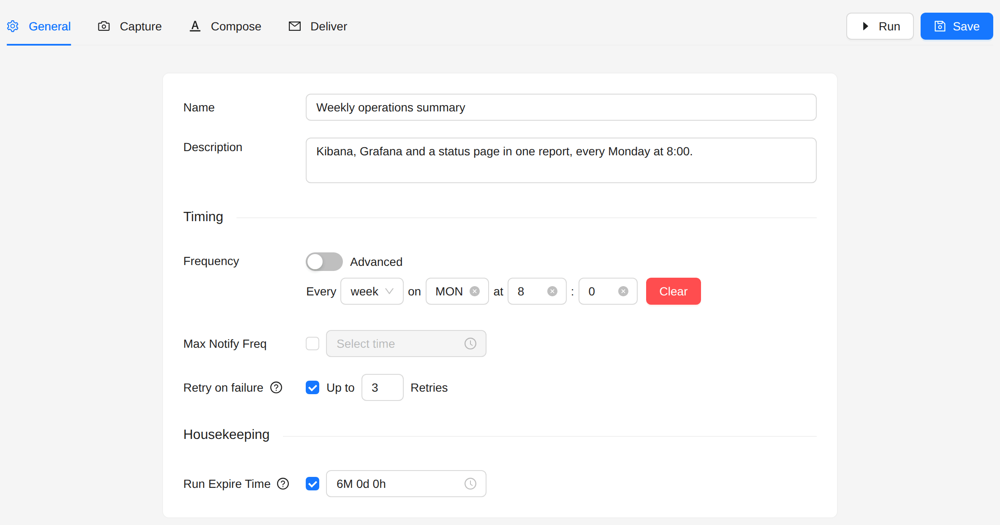
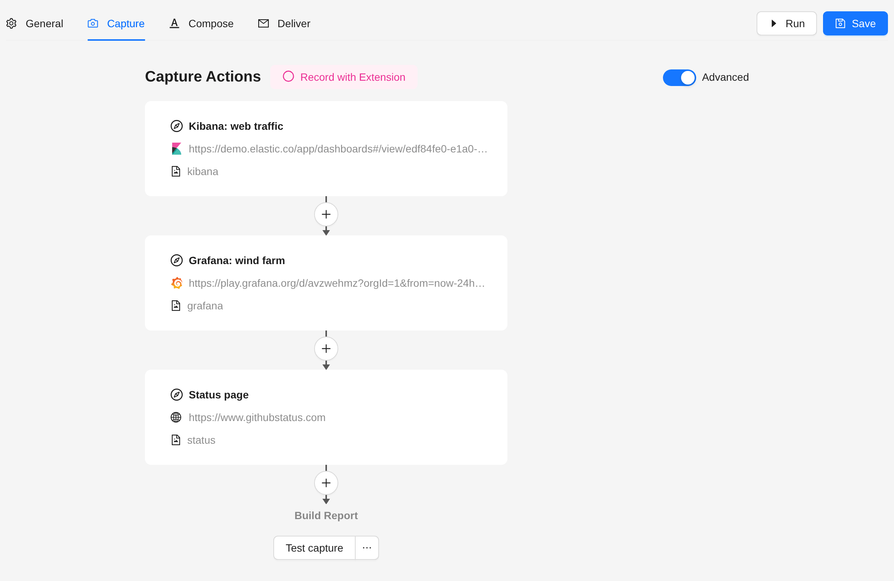
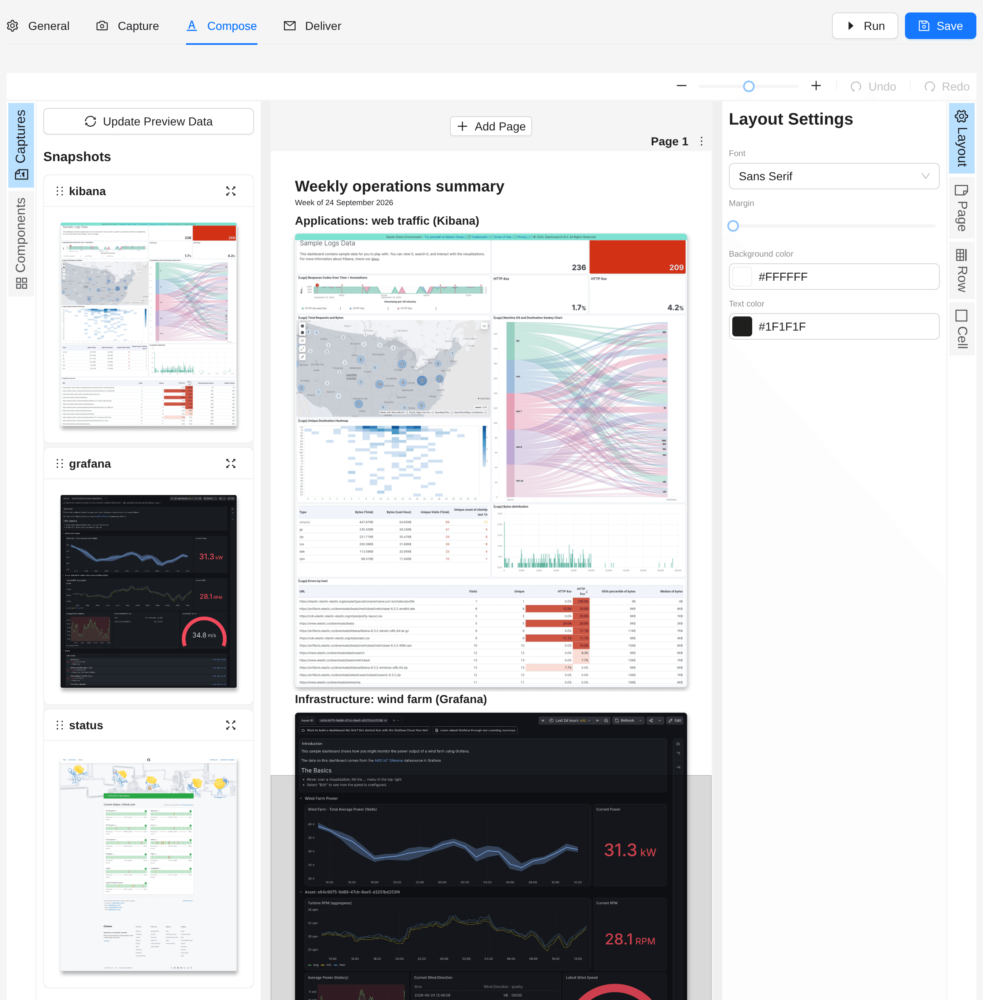
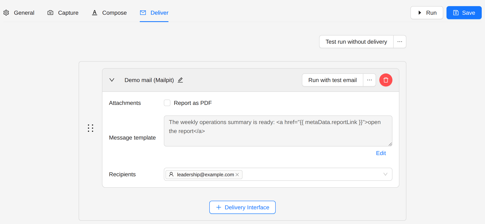
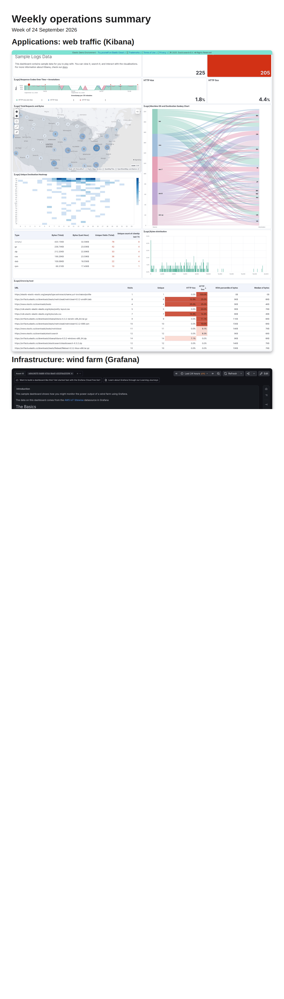

# Mixed Sources Report

Put Kibana, Grafana and any web page into one report.

## Goal

Every Monday at 8:00, send leadership one weekly summary with:

- the application traffic, from a Kibana dashboard;
- the infrastructure health, from a Grafana dashboard;
- the state of an outside service, from its public status page.

## Use cases

- Executive summaries that pull from more than one monitoring tool
- Incident reports that cross platforms
- One operational view for teams that use different tools

## Steps

### 1. Create the job

1. Open **Jobs** in the sidebar.
2. Click **Create Job**, then **Create New**.

### 2. General

- **Frequency**: every **week** on **Monday** at **8:00** (**Advanced**: `0 8 * * 1`).



### 3. Capture

Switch on **Advanced**. Each source is a **Navigate** action with **Take snapshot** ticked. Give each snapshot a name,
so you can tell them apart in Compose:



1. **Kibana: web traffic**
   - **Connector**: **Kibana**.
   - **URL**: the dashboard, for example `https://kibana.example.com/app/dashboards#/view/application-metrics`.
   - **Auth type**: the method your Kibana needs, for example **ReadonlyREST**.
2. **Grafana: wind farm**
   - **Connector**: **Grafana**.
   - **URL**: the dashboard, with its time range, for example
     `https://grafana.example.com/d/xyz789/infrastructure-health?orgId=1&from=now-7d&to=now`.
   - **Auth type**: **Grafana**, with its credentials.
3. **Status page**
   - **Connector**: **Web**, for any page that is not Kibana or Grafana.
   - **URL**: for example `https://www.githubstatus.com`.
   - **Auth type**: **None**.

Each **Navigate** has its own connector and credentials, so one job can read from several Kibana and Grafana instances.

### 4. Compose

Put a heading above each snapshot, so the reader knows where each part comes from:

```liquid
<h1>Weekly operations summary</h1>
<p>Week of {{ metaData.createdAt | date: "%d %B %Y" }}</p>
```



### 5. Deliver

Choose a delivery interface and the recipients.



## Result

One PDF with the three sources, one after the other:



## Next steps

- [Kibana Anomaly Alert](./kibana-anomaly-alert): compare the current data with an earlier period.
