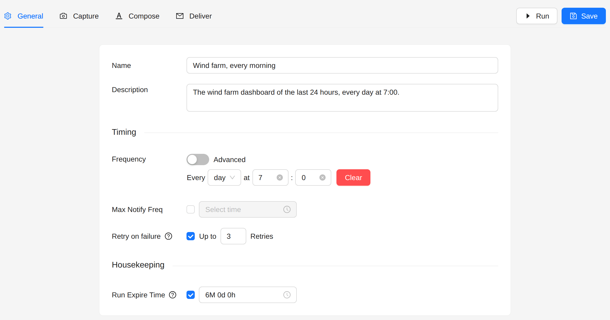
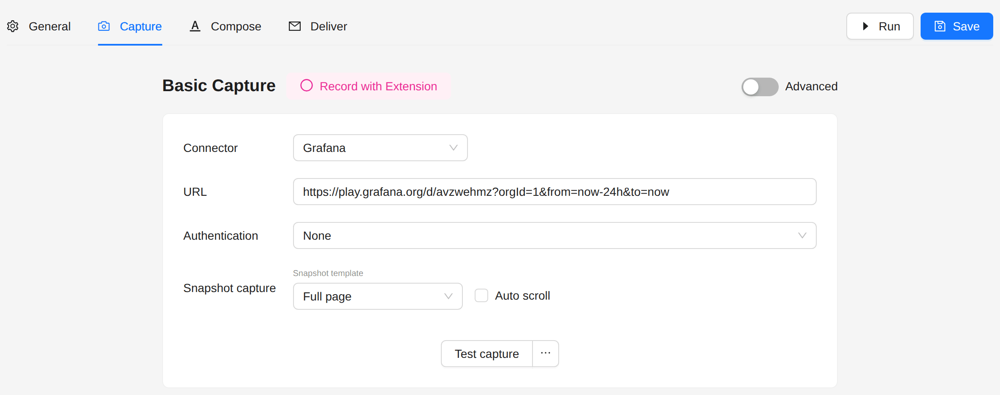
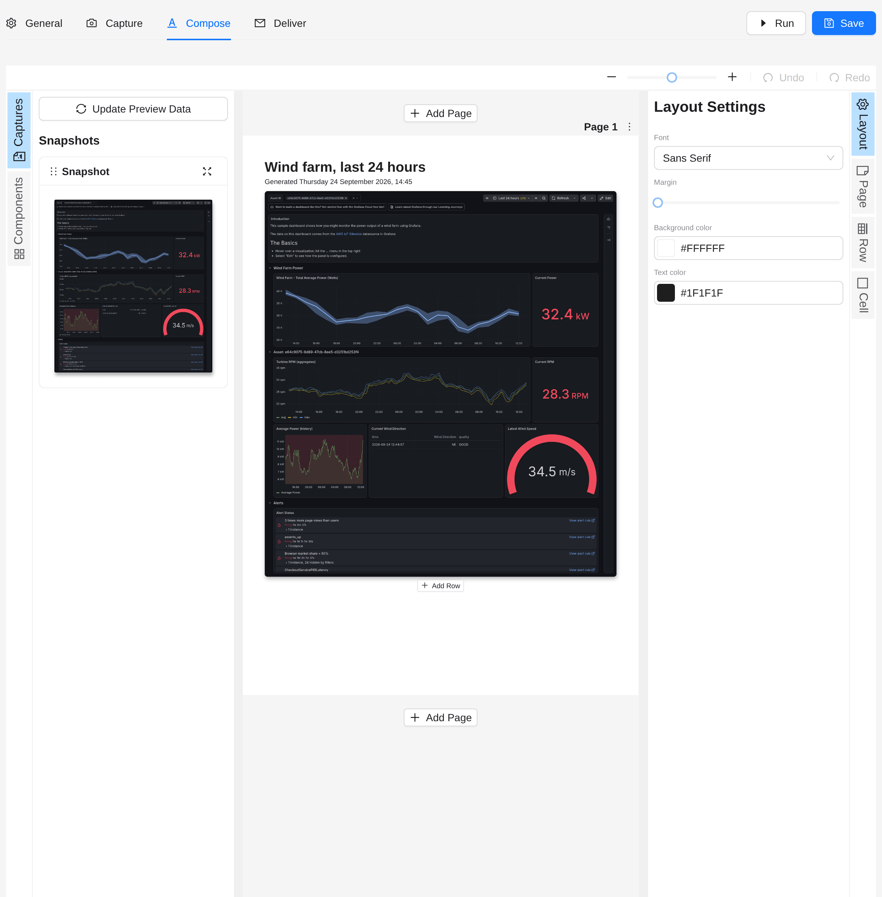
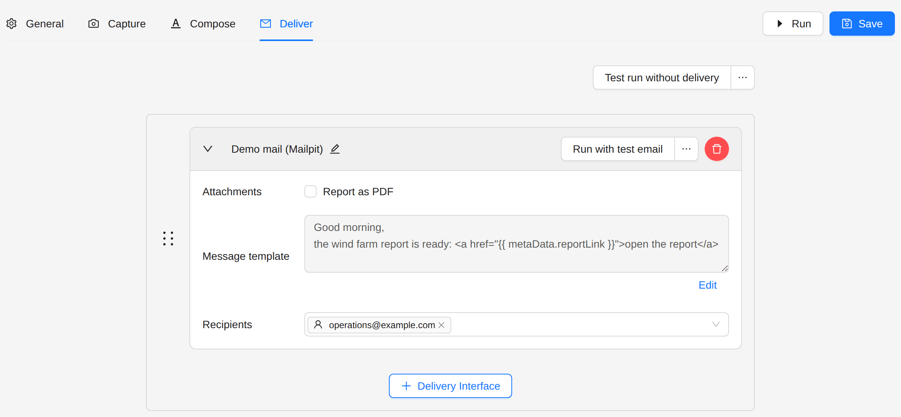
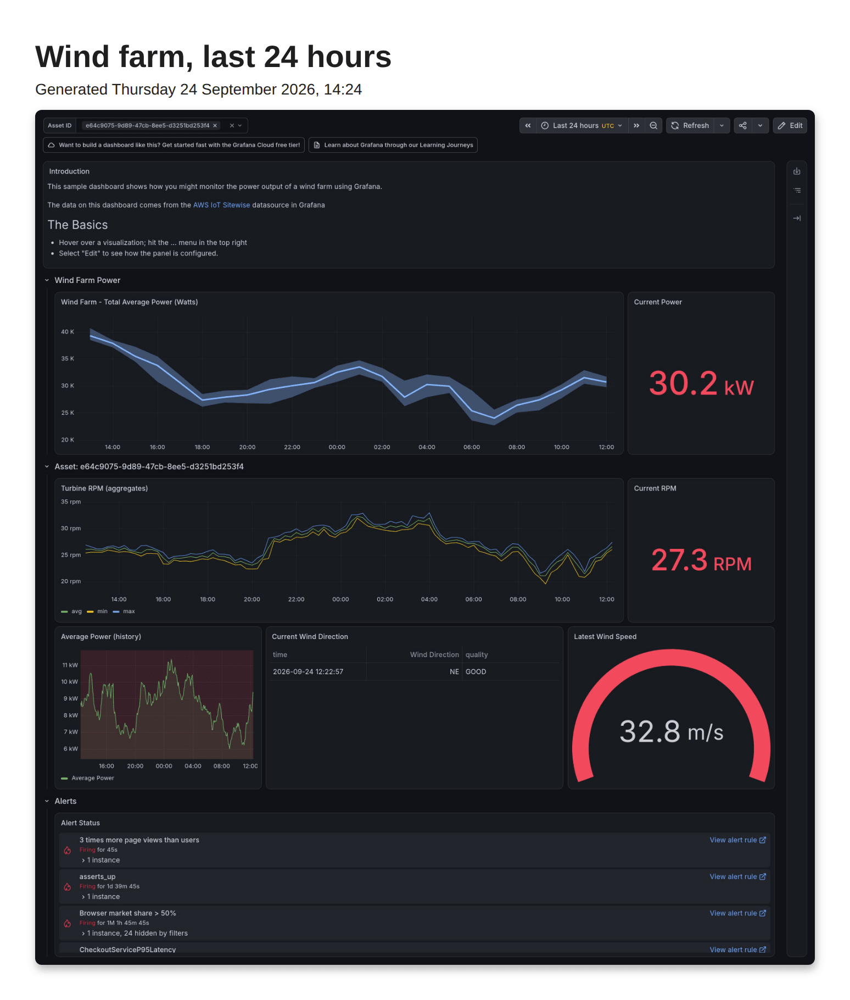

# Grafana Dashboard Report

Capture a Grafana dashboard on a schedule and send it as a PDF report.

## Goal

Every morning at 7:00, send the operations team the wind farm dashboard of the last 24 hours. The example uses the
public **Demo Wind Farm** dashboard at `play.grafana.org`.

## Steps

### 1. Create the job

1. Open **Jobs** in the sidebar.
2. Click **Create Job**, then **Create New**.

### 2. General

- **Frequency**: every **day** at **7:00**.



### 3. Capture

1. **Connector**: **Grafana**.
2. **URL**: the address of the dashboard. Put the time range in the URL with `from` and `to`, as Grafana does:
   ```
   https://grafana.example.com/d/your-dashboard-uid?orgId=1&from=now-24h&to=now
   ```
   Add `var-…` parameters to set the dashboard variables.
3. **Authentication**: **Grafana** fills the Grafana login form with the credentials you give. **Basic** sends HTTP
   Basic credentials, for a Grafana behind a proxy. The public demo needs **None**.
4. **Snapshot template**: **Full page** takes the whole dashboard, with every panel. **Visualizations** takes one
   image per panel, to place each panel on its own in the report.



Anaphora waits until every panel loads, including the panels below the fold. A panel that shows "No data" or an
error is a result, and does not hold the capture.

### 4. Compose

Place the snapshot, and a title above it:



### 5. Deliver

Choose a delivery interface (email, Slack, a webhook or S3) and the recipients.



### 6. Run and save

Click **Run** to build and send the report once, then **Save**.

## Result



## Next steps

- [Mixed Sources Report](../advanced-examples/mixed-sources-report): put Kibana, Grafana and other pages in one report.
