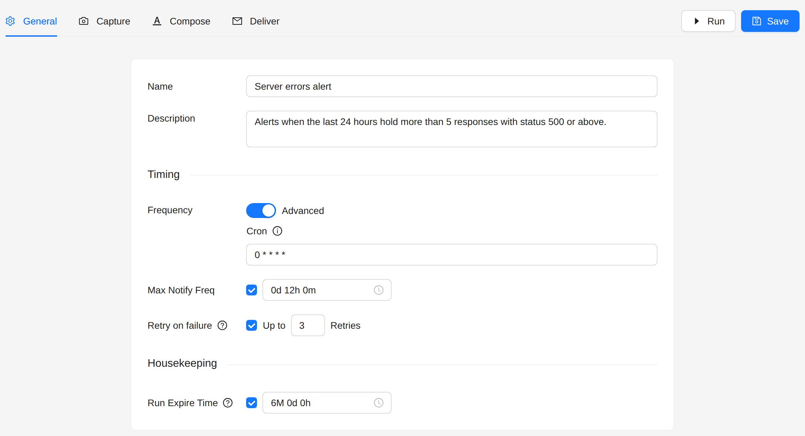
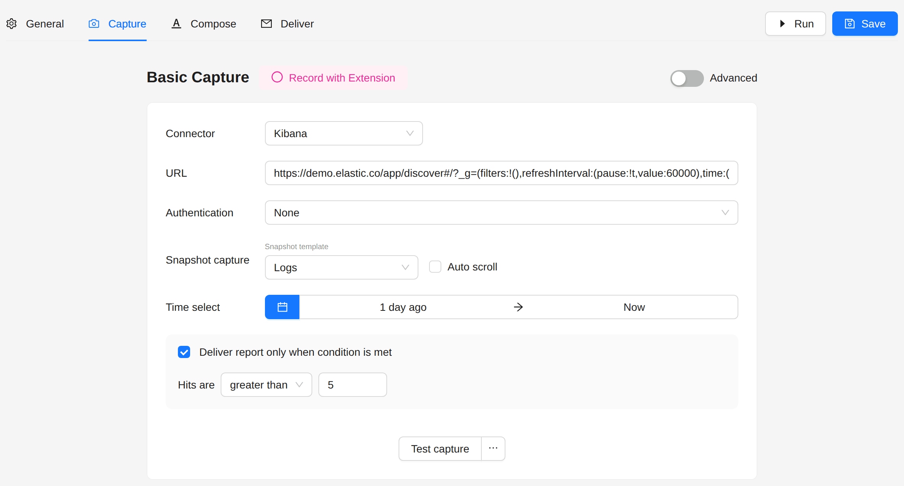
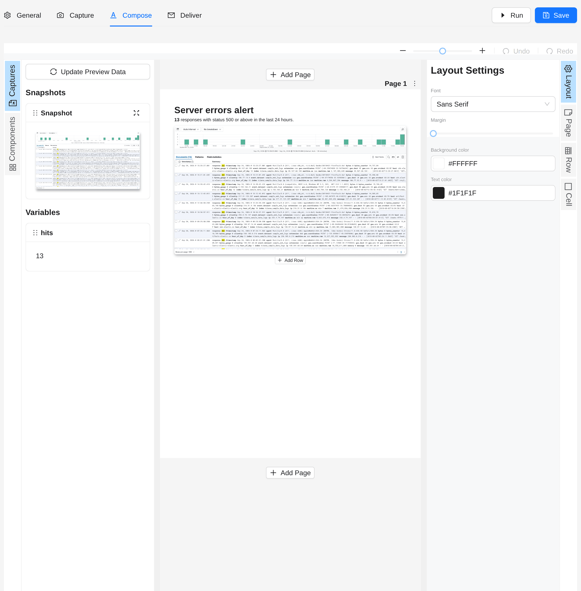
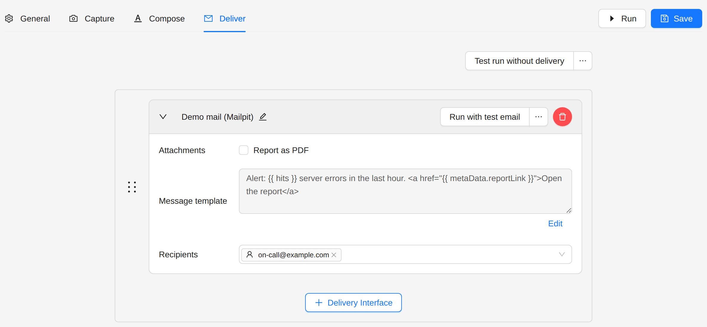
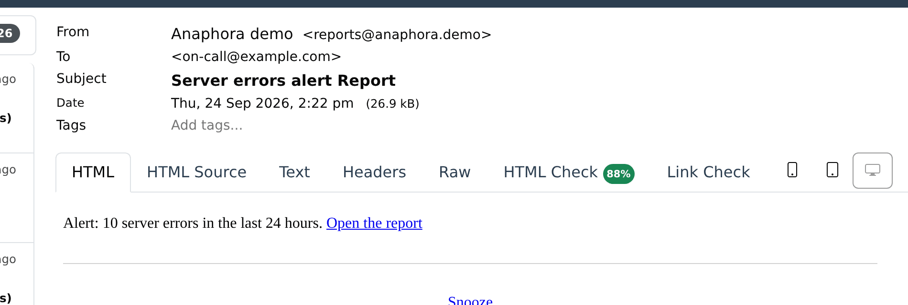
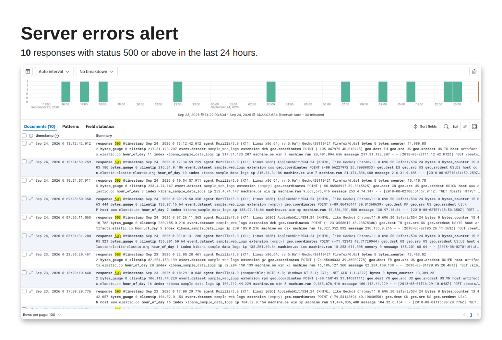

# Kibana Alert

Send a report only when your Kibana data crosses a threshold.

## Goal

Every hour, count the server errors (HTTP status 500 or above) of the last 24 hours. When there are more than 5, send
an alert with the count and the list of errors. Send it at most once every 12 hours.

## Concept

In Anaphora, an alert is a report with a condition:

1. Anaphora opens a Kibana Discover search and reads its hit count.
2. It compares the count with your threshold.
3. It builds and sends the report only when the condition holds. Otherwise the run stops, and nobody gets a message.

## Steps

### 1. Create the job

1. Open **Jobs** in the sidebar.
2. Click **Create Job**, then **Create New**.

### 2. General

- **Frequency**: switch on **Advanced** and type `0 * * * *` (every hour).
- **Max Notify Freq**: tick it and set **12 hours**.



:::tip Why a maximum notification frequency?
The job still runs every hour. When the errors continue, you get one alert in 12 hours, not one every hour.
:::

### 3. Capture

1. **Connector**: **Kibana**.
2. **URL**: a Discover search that finds the documents to count, with its query in the URL. For example, the
   server errors of the web logs sample:
   ```
   https://kibana.example.com/app/discover#/?_a=(query:(language:kuery,query:'response >= 500'))
   ```
3. **Authentication**: the method your Kibana needs, for example **ReadonlyREST**, with its credentials.
4. **Time select**: from **1 day ago** to **Now**.
5. Tick **Deliver report only when condition is met**, then set **Hits are** **greater than** `5`.



### 4. Compose

Add a text block. The hit count is in the `hits` variable:

```liquid
<h1>Server errors alert</h1>
<p><strong>{{ hits }}</strong> responses with status 500 or above in the last 24 hours.</p>
```

Add the snapshot below it, so the report shows the errors themselves.



### 5. Deliver

Choose a delivery interface and the recipients, and put the count in the message:

```
Alert: {{ hits }} server errors in the last 24 hours. <a href="{{ metaData.reportLink }}">Open the report</a>
```



### 6. Run and save

Click **Run** to try the job once. If the condition does not hold now, the run stops without a message and the Runs page
shows it as **Cancelled**. Click **Save**.

## Result

When the errors cross the threshold, the on-call team gets the alert:



The report holds the count and the matching documents:



## Next steps

- [Kibana Conditional Report](./kibana-conditional-report): check a search, then capture a dashboard when the
  condition holds.
- [Kibana Anomaly Alert](../advanced-examples/kibana-anomaly-alert.md): compare the current data with an earlier
  period.
