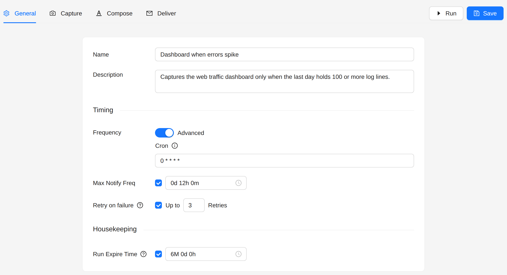
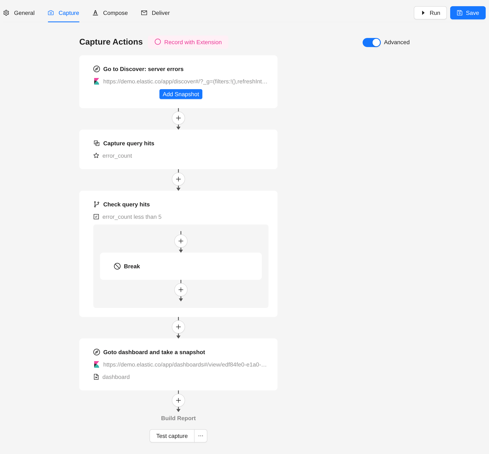
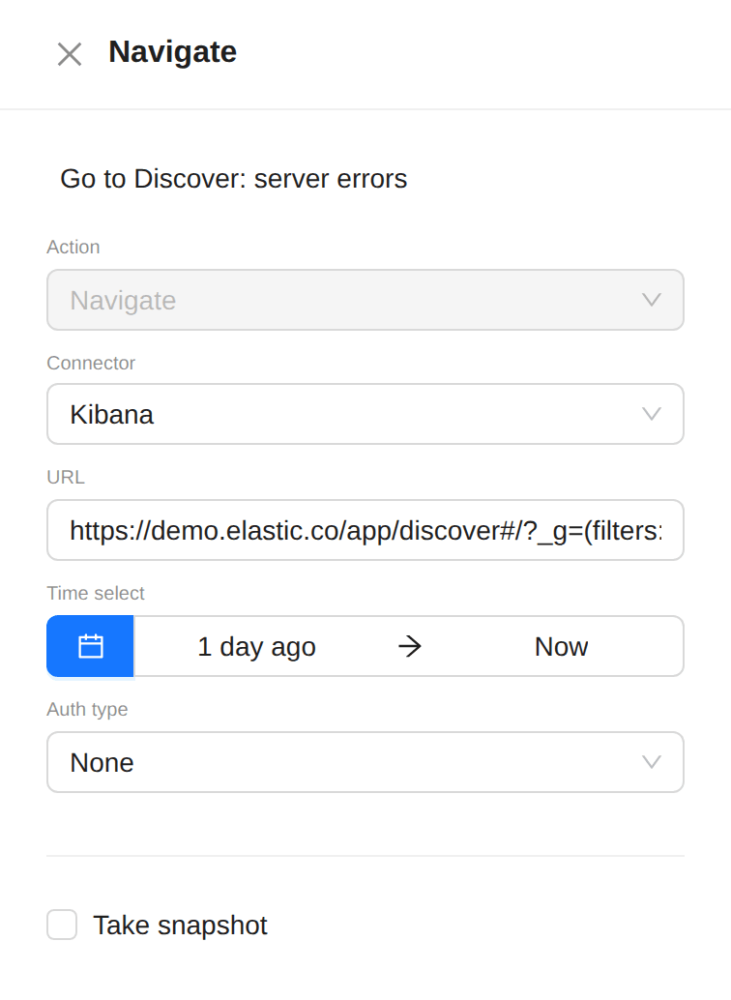
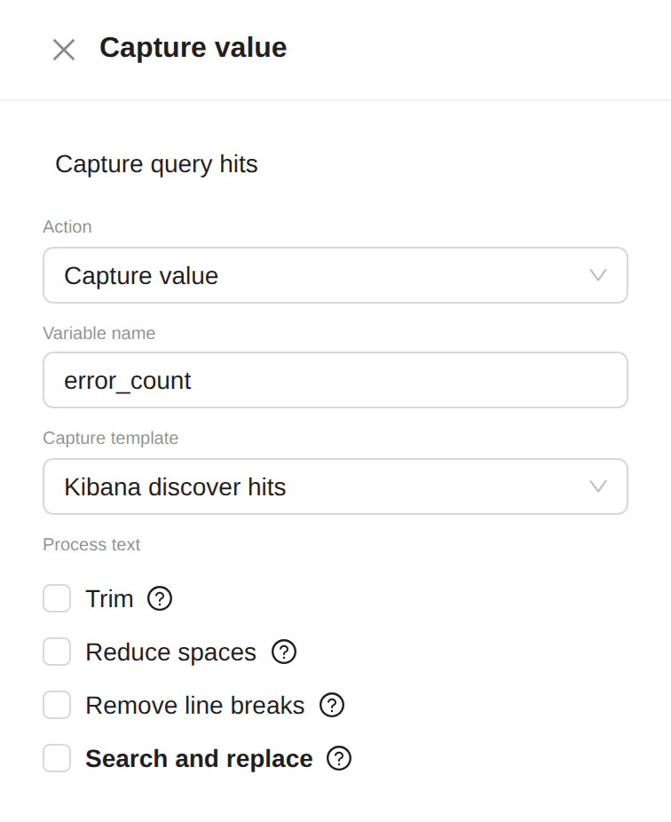
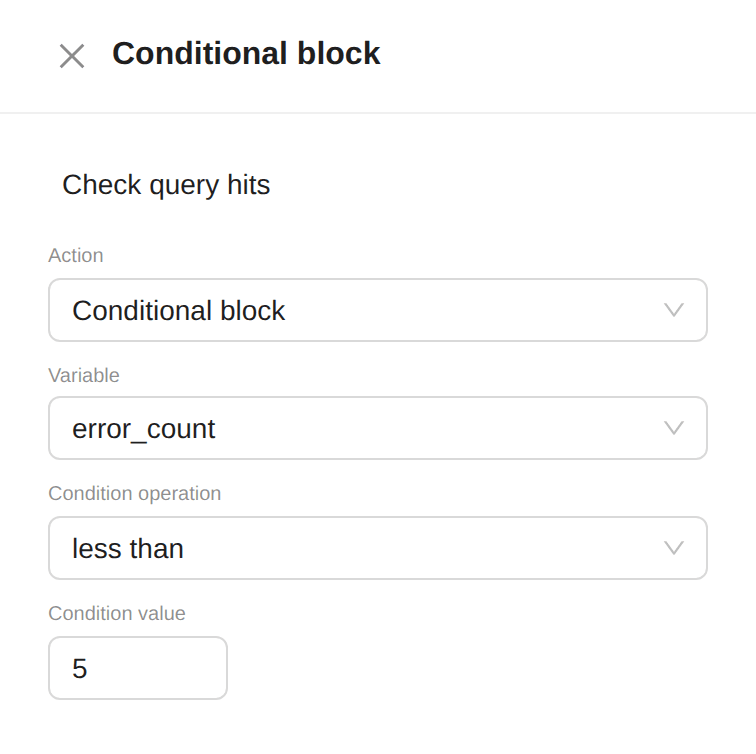
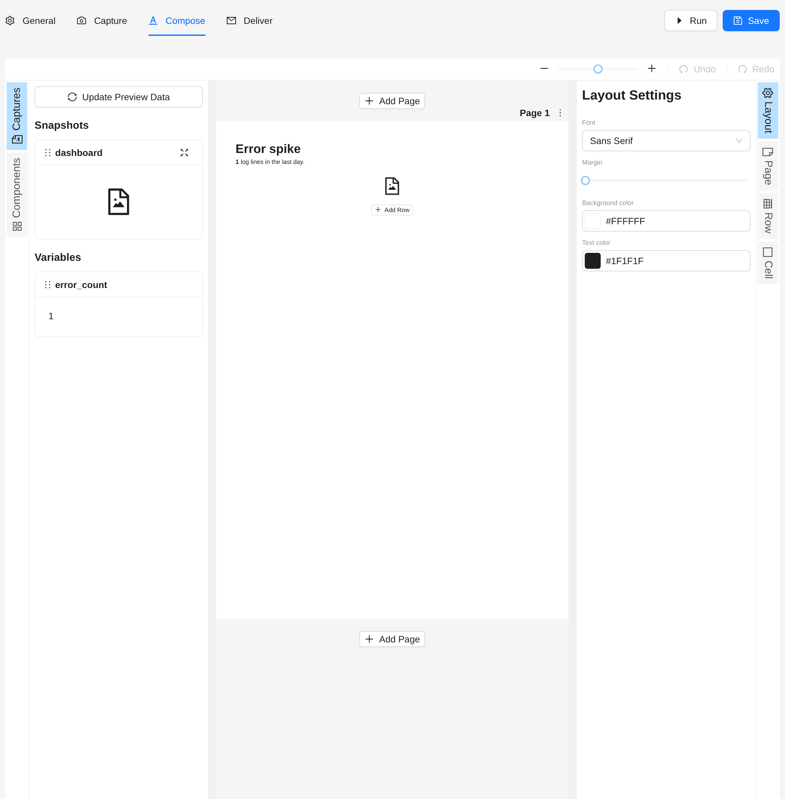
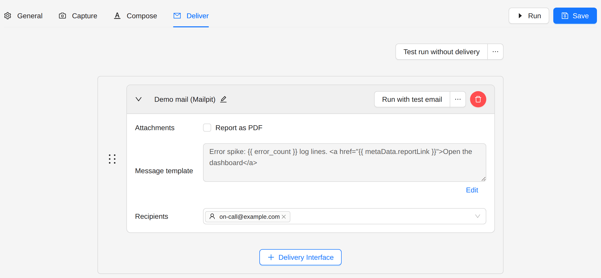
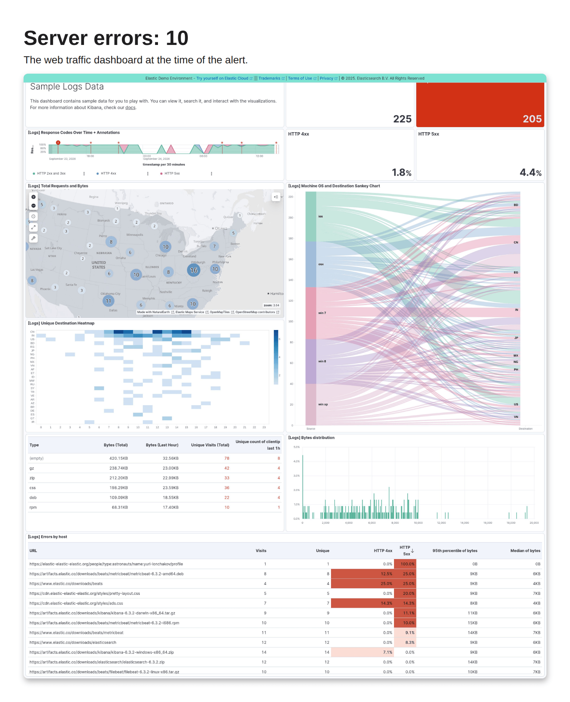

# Kibana Conditional Report

Check a Kibana search first, and capture and send a dashboard only when the result calls for it.

:::tip Conditional Kibana Dashboard Snapshot template
The **Conditional Kibana Dashboard Snapshot** template builds this flow for the public Kibana demo. Pick it under
**Jobs → Create Job** and change the URLs and the threshold.
:::

## Goal

Every hour, count the server errors of the last 24 hours. When there are 5 or more, capture the web traffic dashboard
and send it, at most once every 12 hours.

## Steps

### 1. Create the job

1. Open **Jobs** in the sidebar.
2. Click **Create Job**, then **Create New**.

### 2. General

- **Frequency**: every hour (**Advanced**: `0 * * * *`).
- **Max Notify Freq**: **12 hours**.



### 3. Capture

Switch on **Advanced**. The capture becomes a flow of actions, run from top to bottom. Click an action to edit it, and
the **+** between two actions to add one.



1. **Navigate** (the first action): the Discover search to check.
   - **Connector**: **Kibana**.
   - **URL**: the search, for example `response >= 500` on your web logs.
   - **Auth type**: the method your Kibana needs, for example **ReadonlyREST**.

   

2. **Capture value**: reads the hit count into a variable.
   - **Variable name**: `error_count`.
   - **Capture template**: **Kibana discover hits**. It reads the count as a whole number.

   

3. **Conditional block**: stops the flow when there is nothing to report.
   - **Variable**: `error_count`.
   - **Condition operation**: **less than**.
   - **Condition value**: `5`.
   - Inside the block, add a **Break** action. When the count is below 5, the run stops here and sends nothing.

   

4. **Navigate** again, below the block: the dashboard to capture. Choose **Kibana**, enter the dashboard URL, and tick
   **Take snapshot**.

### 4. Compose

Add the dashboard snapshot, and a text block with the count:

```liquid
<h1>Server errors: {{ error_count }}</h1>
<p>The web traffic dashboard at the time of the alert.</p>
```



### 5. Deliver

Choose a delivery interface and the recipients.



## Result

When there are 5 errors or more, the report holds the count and the dashboard:



## Next steps

- [Grafana Dashboard Report](./grafana-dashboard-report): add Grafana to your reports.
- [Kibana Anomaly Alert](../advanced-examples/kibana-anomaly-alert.md): compare the current data with an earlier
  period.
