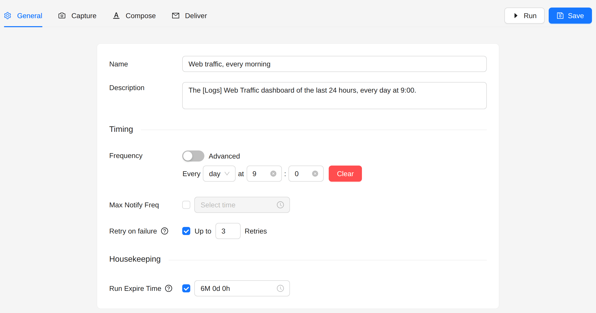
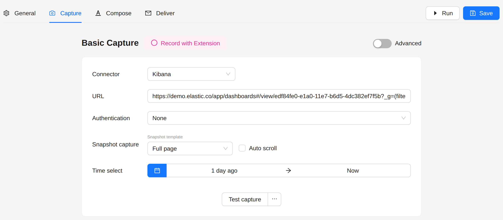
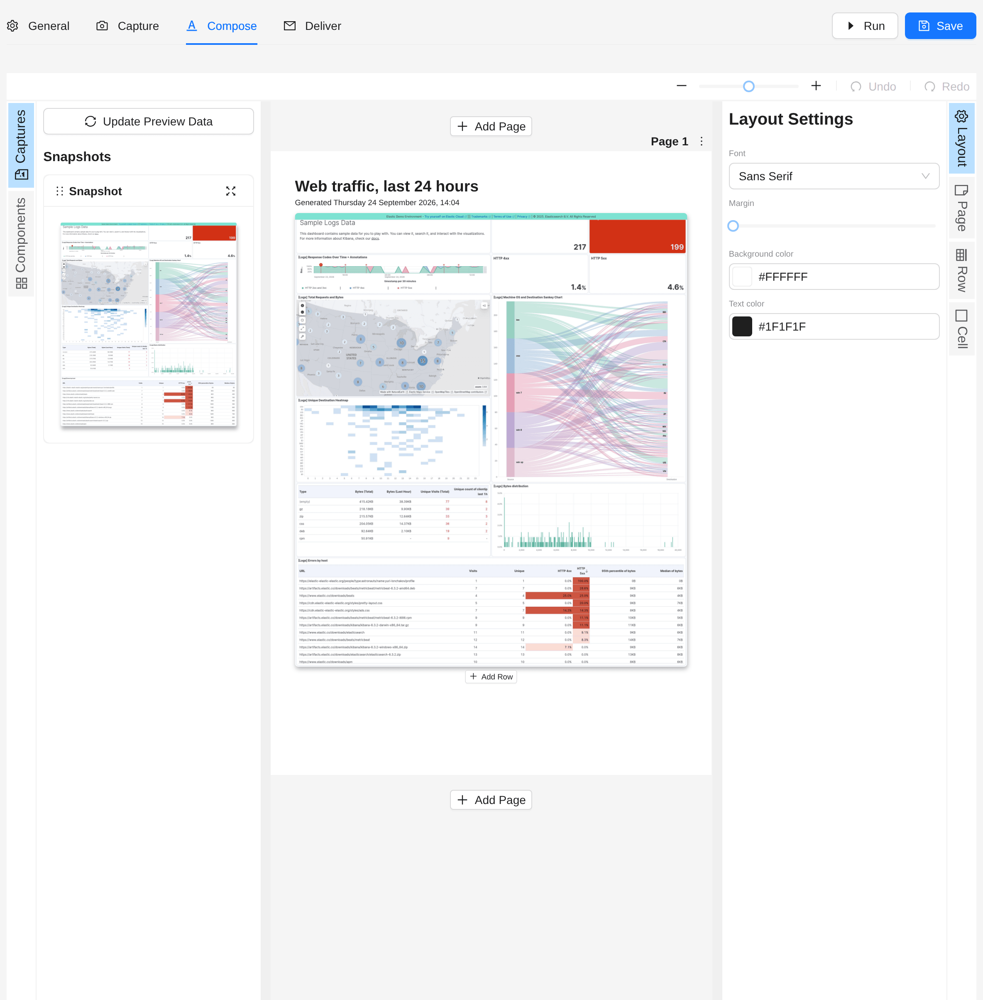
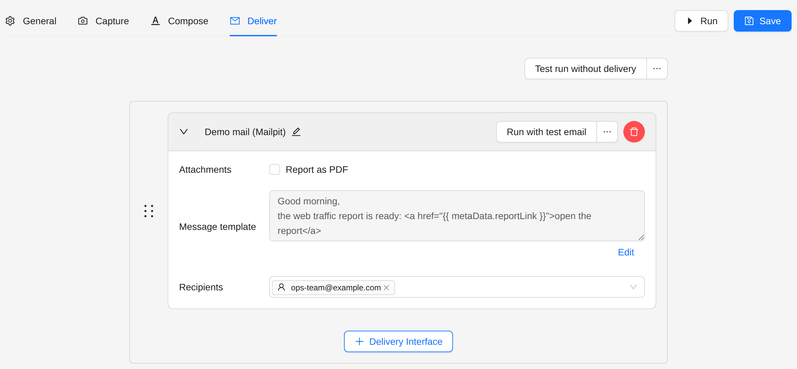
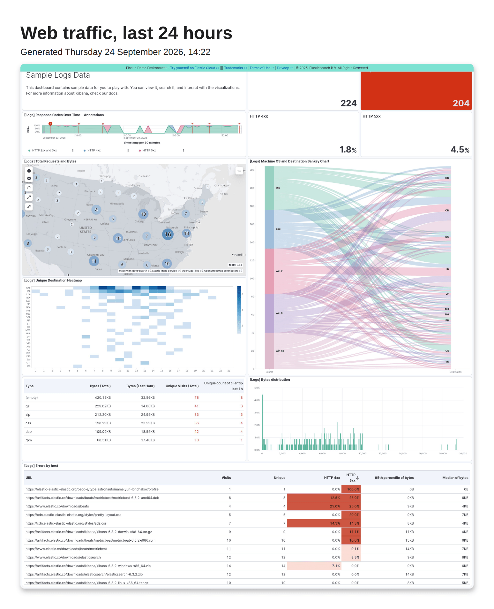

# Kibana Dashboard Report

Capture a Kibana dashboard on a schedule and send it by email as a PDF report.

:::tip Kibana Dashboard Snapshot template
The **Kibana Dashboard Snapshot** template builds this job for the public Kibana demo at `demo.elastic.co`. Pick it
under **Jobs → Create Job** and change the URL to your own dashboard.
:::

## Goal

Every morning at 9:00, send the team a PDF of the web traffic dashboard for the last 24 hours.

## Steps

### 1. Create the job

1. Open **Jobs** in the sidebar.
2. Click **Create Job**, then **Create New**.

### 2. General

- **Name**: `Web traffic, every morning`
- **Frequency**: every **day** at **9:00**. Switch on **Advanced** to type a cron expression instead, for example
  `0 9 * * *`.
- **Run Expire Time** keeps the runs and their reports for six months. Shorten it if disk space is tight.



### 3. Capture

1. **Connector**: **Kibana**.
2. **URL**: the address of the dashboard, as the browser shows it:
   ```
   https://kibana.example.com/app/dashboards#/view/your-dashboard-id
   ```
3. **Authentication**: the method your Kibana needs, for example **ReadonlyREST**, with its credentials. The public
   demo needs none.
4. **Snapshot template**: **Full page** takes the whole dashboard. Choose the tiles template to get one image per
   visualisation.
5. **Time select**: from **1 day ago** to **Now**. Anaphora sets this range on the dashboard at each run.
6. Click **Test capture** to see the snapshot before you save.



### 4. Compose

Drag the captured snapshot into the page, and add a text block above it for the title. A text block can show values
of the run, for example the date of the report:

```liquid
<h1>Web traffic, last 24 hours</h1>
<p>Generated {{ metaData.createdAt | date: "%A %d %B %Y, %H:%M" }}</p>
```



### 5. Deliver

1. Choose a delivery interface, for example your SMTP server. Set it up first under **Delivery Interfaces**.
2. Add the recipients.
3. Write the message. `{{ metaData.reportLink }}` is the link to the PDF.



### 6. Run and save

Click **Run** to build and send the report once, then **Save**. The job then runs every morning.

## Result

Every morning the team gets an email with a link to the PDF:



## Next steps

- [Kibana Alert](./kibana-alert): send the report only when the data meets a condition.
