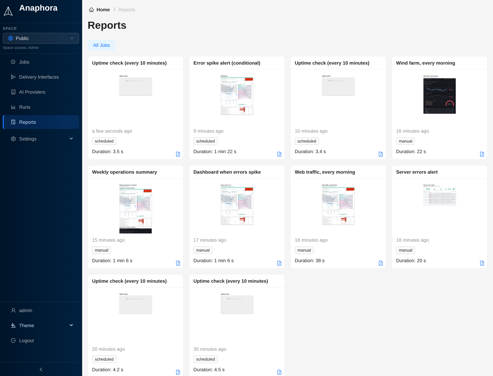

# Reports

The Reports section shows all generated report documents and their delivery history.

## Overview

Reports are the final output of your capture jobs. A report is a PDF document assembled from captured screenshots,
extracted data, and formatted content.

## Viewing reports

You can open reports from two places:

- **Runs**: open the report of one run from the **Report** column
- **Reports**: browse all generated reports. Use the **All Jobs** menu to show the reports of one job

## Report storage

Anaphora delivers reports to the configured destinations (email, Slack, S3, webhooks).
It also stores copies of the generated reports for reference.
In the job's **General** tab, **Housekeeping** > **Run Expire Time** sets how long Anaphora keeps them.

## Private report links

Report links are private. Every run has a secret token, and the links in a delivered email, Slack message or webhook
carry it. The report files (PDF, HTML, images) open for a link with the token, or for a signed-in member of the run's
space. Anyone else gets "not found".

Runs from before the upgrade to this version keep the links that Anaphora already sent, until the runs expire or are
deleted.
