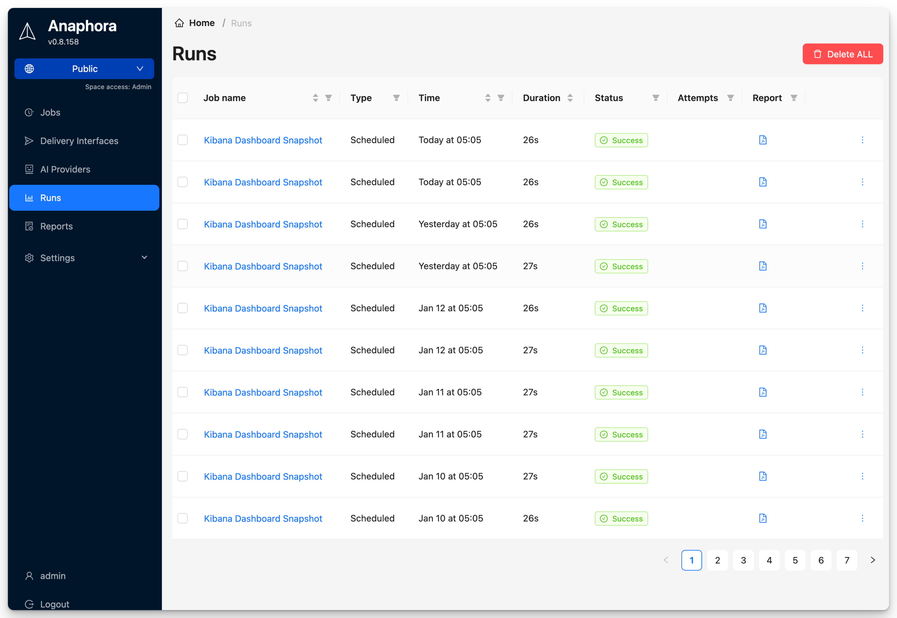

# Runs

The Runs section shows the execution history of your jobs, including successful captures, failures, and delivery status.

## Overview

Every time a job executes, a **run** record is created. This allows you to:

- Track job execution history
- Identify and debug failures
- Review captured content
- Verify delivery success

## Run Statuses

| Status | Description |
|--------|-------------|
| Success | Job completed and report delivered |
| Partial | Some actions succeeded, others failed |
| Failed | Job execution failed |
| Skipped | Conditions not met, no report sent |

## Viewing Run Details

Select any run to view:

- Execution timestamp
- Job configuration at time of run
- Captured screenshots and data
- Delivery status and logs
- Error messages (if any)

## Debugging Failed Runs

When a run fails, check:

1. **Run logs** - Detailed execution trace
2. **Screenshots** - Visual state at failure point
3. **Network errors** - Connection or timeout issues
4. **Selector changes** - Target page structure may have changed
