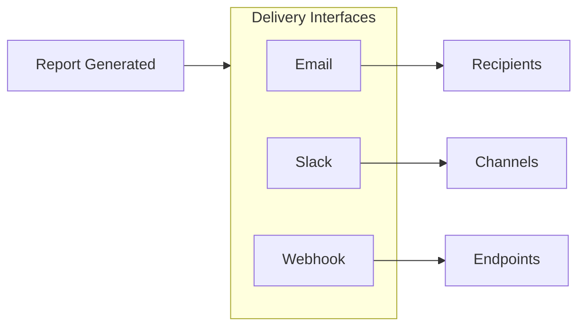

# Delivery Interfaces - Email, Slack & Webhook Configuration

Delivery Interfaces define how reports reach your recipients. Once a report is generated, Anaphora handles distribution through multiple channels simultaneously.

## Available Interfaces

| Interface | Description | Best For |
|-----------|-------------|----------|
| [SMTP](./delivery-interfaces/smtp) | Direct email via SMTP server | Corporate email systems |
| [Mailgun](./delivery-interfaces/mailgun) | Email via Mailgun API | High-volume delivery |
| [Slack](./delivery-interfaces/slack) | Slack workspace integration | Team notifications |
| [WebHook](./delivery-interfaces/webhook) | Custom HTTP endpoints | Integrations & automation |

## Output Formats

Reports can be delivered in multiple formats:

| Format | Description | Use Case |
|--------|-------------|----------|
| **PDF** | Portable document format | Formal reports, archiving, printing |
| **PNG/JPEG** | Image formats | Quick previews, Slack thumbnails |
| **HTML** | Web format | Interactive viewing, email body |
| **Raw data** | JSON payload | Webhook integrations, further processing |

## PDF Export

Generate professional PDF reports directly from Anaphora:

- **View in browser** - Preview reports before delivery
- **Download** - Manual PDF export from the Reports section
- **Email attachment** - Automatically attach PDFs to email delivery
- **Custom styling** - Branded headers, footers, and page layouts

## Configuration

1. Navigate to **Settings** > **Delivery Interfaces**
2. Click **Add Interface**
3. Select type and configure credentials
4. Test the connection
5. Save

## Using in Jobs

Once configured, interfaces appear in the job's **Delivery** tab:

- Select one or multiple delivery channels
- Configure per-channel settings (recipients, subject lines, etc.)
- Set delivery conditions (always, on success, on failure)

## Multiple Interfaces

You can configure multiple interfaces of the same type:

| Scenario | Configuration |
|----------|---------------|
| **Different teams** | Separate Slack channels per team |
| **Backup delivery** | Primary SMTP + fallback Mailgun |
| **Regional separation** | Different email servers per region |
| **Integration variety** | Multiple webhooks for different systems |

## Delivery Flow

## Next Steps

- [SMTP](./delivery-interfaces/smtp) - Configure direct email delivery
- [Mailgun](./delivery-interfaces/mailgun) - Set up Mailgun API integration
- [Slack](./delivery-interfaces/slack) - Connect Slack workspaces
- [WebHook](./delivery-interfaces/webhook) - Configure custom endpoints
