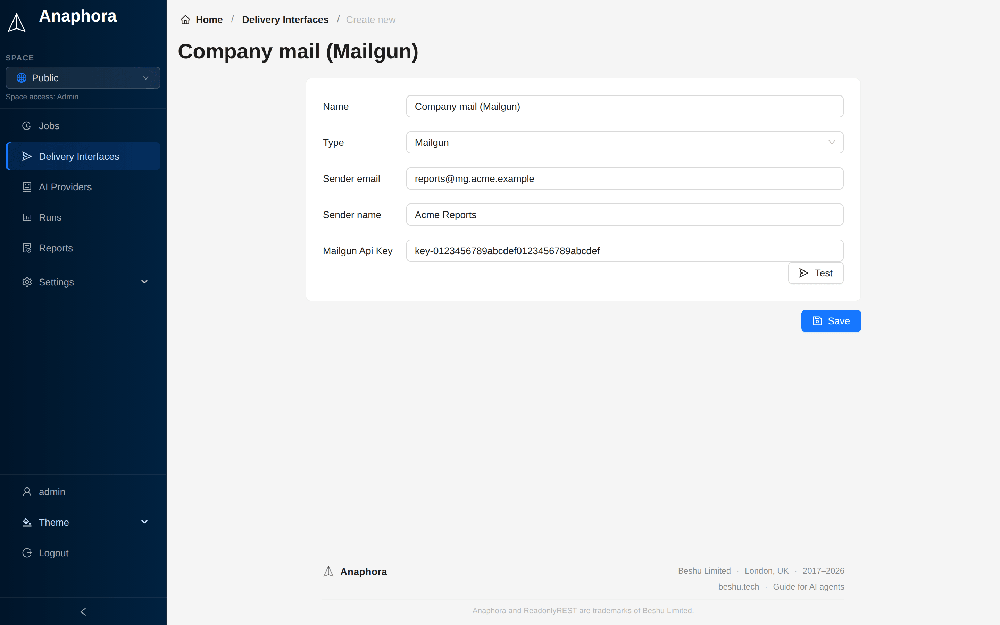

# Mailgun

Send reports via the Mailgun email API.

## Why Mailgun?

- No SMTP server to manage
- Better deliverability tracking
- Easy setup
- Higher sending limits

## Configuration

| Field           | Description                                                             | Required |
|-----------------|-------------------------------------------------------------------------|----------|
| Name            | Interface identifier                                                    | Yes      |
| Sender email    | Your Mailgun domain with any name, for example myname@my-mailgun-domain.com | Yes      |
| Sender name     | The name to show as the sender                                          | Yes      |
| Mailgun Api Key | Mailgun API key (at least 10 characters)                                | Yes      |

## Setup steps

### 1. Get API credentials

1. Log in to Mailgun
2. Navigate to **Settings** > **API Keys**
3. Copy your Private API Key
4. Note your Mailgun sender domain (to use in sender email)

## Domain verification

Make sure your Mailgun domain is verified for best deliverability:

- Add DNS records as instructed by Mailgun
- Verify SPF and DKIM are configured

## Testing

Click **Test**, enter a **Test email** address (and optionally a **Test subject** and **Test body**), then click
**Send test email**. Do this before you use the interface in jobs.
