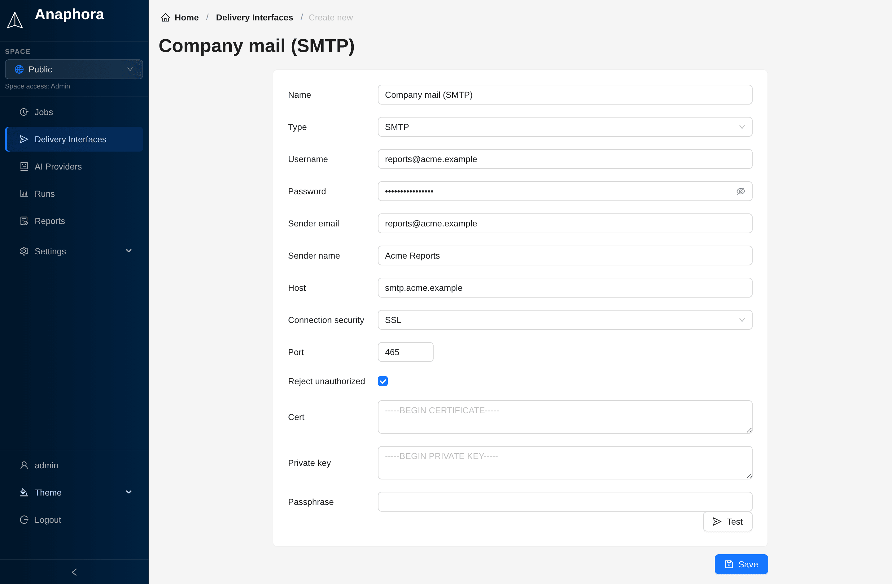

# SMTP

Send reports through your own SMTP server, with plain, STARTTLS or SSL connections.



## Configuration

| Field               | Description                                                                 | Required |
|---------------------|-----------------------------------------------------------------------------|----------|
| Name                | The name of the interface in Anaphora                                       | Yes      |
| Username            | SMTP login, when the server needs one                                       | No       |
| Password            | SMTP password                                                               | No       |
| Sender email        | The From address                                                            | Yes      |
| Sender name         | The From name                                                               | Yes      |
| Host                | SMTP server hostname                                                        | Yes      |
| Connection security | **Plain**, **STARTTLS** or **SSL**. Choosing one also sets the usual port.   | Yes      |
| Port                | SMTP port (25, 587, 465)                                                    | Yes      |
| Reject unauthorized | Refuse a server certificate that does not verify. On by default.            | No       |
| Cert, Private key, Passphrase | A client certificate in PEM, for servers that ask for one (SSL only) | No       |

## Common Configurations

### Gmail

```
Host: smtp.gmail.com
Port: 587
Connection security: STARTTLS
```

:::note
Gmail requires an App Password if 2FA is enabled.
:::

### Office 365

```
Host: smtp.office365.com
Port: 587
Connection security: STARTTLS
```

### Amazon SES

```
Host: email-smtp.us-east-1.amazonaws.com
Port: 587
Connection security: STARTTLS
```

## Testing

1. Fill in the interface.
2. Click **Test**.
3. Enter the **Test email** address. The subject and the body are optional.
4. Click **Send test email**, and make sure that the email arrives.

## Sending Behavior

Anaphora sends the emails of a run one at a time, over one connection. So a server that allows few connections accepts
every recipient. Every SMTP timeout is at most one minute. After a server failure, Anaphora marks the other recipients
as failed at once.

## Troubleshooting

| Issue                 | Solution                                |
|-----------------------|-----------------------------------------|
| Connection refused    | Check firewall, verify port             |
| Authentication failed | Verify credentials, check app passwords |
| TLS error             | Try another connection security mode    |
