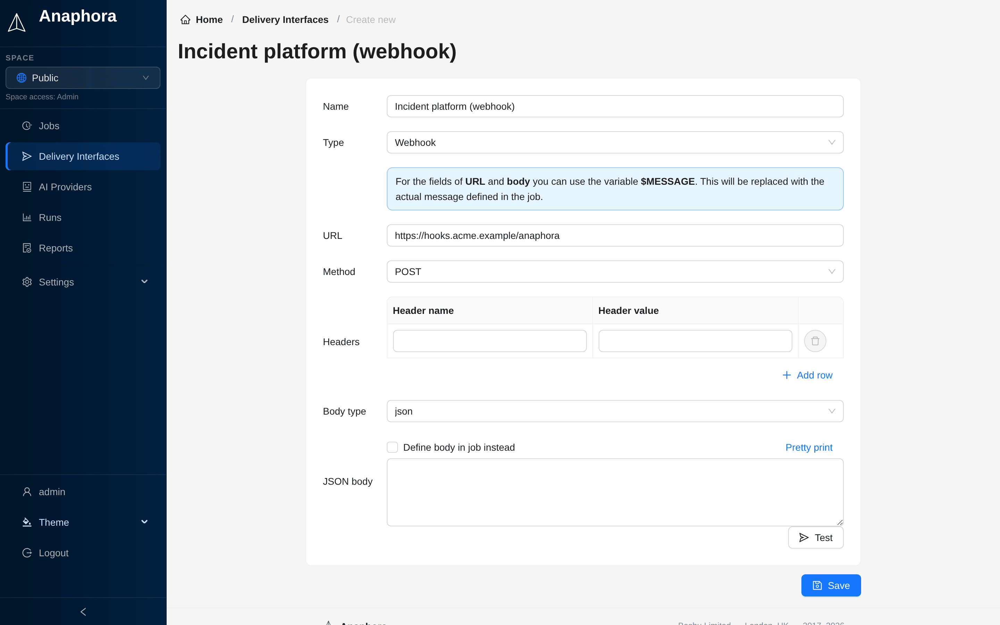

# Webhook

Send reports to custom HTTP endpoints for integration with any system.



## Use cases

- Custom notification systems
- Integration with ticketing tools
- Triggering automation workflows
- Sending to unsupported platforms

## Configuration

| Field     | Description                                         | Required |
|-----------|-----------------------------------------------------|----------|
| Name      | Interface identifier                                | Yes      |
| URL       | Endpoint URL. Can contain `$MESSAGE`                | Yes      |
| Method    | HTTP method (`GET` or `POST`, default `POST`)       | Yes      |
| Headers   | Custom headers (**Header name**, **Header value**)  | No       |
| Body type | `json` or `form`. Shown only for `POST`             | Yes      |
| JSON body | Custom payload template (body type `json`)          | No       |
| Form body | Key-value pairs (body type `form`)                  | No       |

## Payload format

### JSON template

Define a JSON structure that works with your endpoint in **JSON body**. Use the ```$MESSAGE``` variable as a placeholder
for the report content. Anaphora replaces this variable with the text that you define in the job's delivery settings.
Click **Pretty print** to format the JSON.

Example:

```json
{
  "title": "Anaphora Report",
  "content": "$MESSAGE"
}
```

### Form body

Send key-value pairs (**Form name**, **Form value**) as form data. Use the ```$MESSAGE``` variable for the report content.

Example:

```
report_title=Anaphora Report
report_content=$MESSAGE
```

### JSON in job delivery

Select **Define body in job instead**. Each job then defines the entire JSON body in its delivery settings.

## Custom headers

Add headers for authentication or routing:

```
Authorization: Bearer your-token
X-Custom-Header: value
```

Anaphora sets `Content-Type` from the body type.

## Testing

Click **Test**, enter an optional **Test message**, then click **Send to webhook**.

## Response handling

A delivery succeeds only when the webhook answers with a 2xx status. Any other answer fails the delivery, and the run
shows the status and the answer of the webhook. The **Test** button, the health monitor, the license alert and the AI
budget alert use the same check.

:::warning Test route removed
The route `/guest/api/test/webhook` no longer exists. If a webhook interface points at it, point it at a real receiver.
A webhook that answers "not found" fails the delivery.
:::
