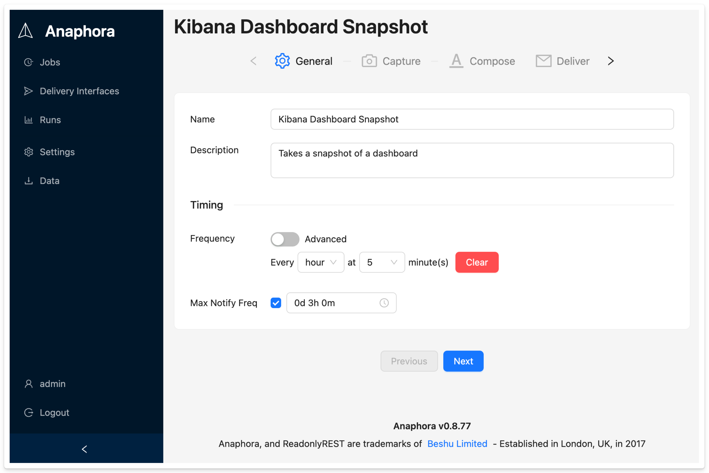

# Basic Capture

The Basic Capture mode provides a straightforward way to capture screenshots from Kibana dashboards, Canvas workpads, or Discover pages.

## Overview

The capture phase is when the job spins up a headless browser and navigates to web pages for pulling data or screenshots.



## Configuration

### Connector

Select the type of source you're capturing from:

- **Kibana**: Connect to Elastic Kibana dashboards
- **Generic URL**: Capture any web page

### URL

Enter the full URL of the page to capture. For Kibana, this is typically a dashboard, Canvas, or Discover URL.

**Example URLs**:
```
https://your-kibana.example.com/app/dashboards#/view/abc123
https://your-kibana.example.com/app/canvas#/workpad/xyz789
https://your-kibana.example.com/app/discover#/...
```

### Authentication

Configure how Anaphora authenticates with your Kibana instance:

| Option | Description |
|--------|-------------|
| None | No authentication required (public dashboards) |
| Basic | Username and password authentication |
| Custom | Custom authentication flow (configured in Settings) |

### Snapshot Capture

Choose what to capture:

- **Full page**: Screenshot of the entire page
- **Viewport**: Screenshot of the visible area only
- **Snapshot template**: Use a predefined capture template

### Time Selection

For Kibana dashboards, configure the time range:

- Set the **from** and **to** dates/times
- Use relative times like "1 day ago" to "Now"

This ensures your dashboard shows the correct time period when captured.

## Kibana-Specific Behavior

When you specify a Kibana URL, Anaphora automatically detects the page type and behaves accordingly:

| Kibana Page Type | Capture Behavior |
|------------------|------------------|
| **Dashboard** | Collects visualizations into a collection of screenshots for template composition |
| **Canvas** | Takes a screenshot of the canvas body |
| **Discover** | Extracts the "results" counter (matched document count) as an integer for later calculations |

## Testing Your Capture

Click the **Test capture** button to:

1. Run the capture immediately
2. Preview the results
3. Verify authentication works
4. Check the captured content quality

:::tip
Always test your capture configuration before scheduling the job. This helps identify authentication issues or incorrect URLs early.
:::

## Next Steps

- [Advanced Capture](./advanced-capture) - Create complex capture workflows with conditions
- [General Settings](./general-settings) - Configure job timing
