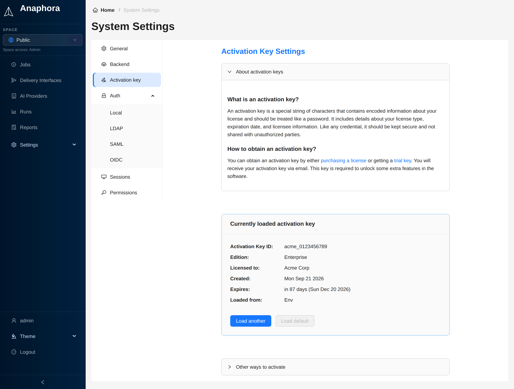

# Features & Editions

Choose the edition that fits your needs. All editions include the **full reporting engine** — higher tiers unlock team
features and integrations.

:::info 🚀 Ready to try PRO or Enterprise?
**[Get a free trial key →](https://portal.anaphora.it/trial)** — No credit card required. Instant activation.
:::

## 🆓 Free Edition

**Perfect for evaluation and personal projects**

:::tip What you get

- ✅ Up to **2 scheduled jobs**, **2 delivery interfaces** and **1 AI provider**
- ✅ Up to **3 capture actions** per job
- ✅ Kibana, Grafana, and generic web capture
- ✅ PDF report composer with custom layouts
- ✅ Email (SMTP) delivery
- ✅ Notification throttling and retry policies
- ✅ Local user authentication
- ✅ **Self-Monitoring API** — health endpoints for external systems
- ✅ **AI Analysis** — LLM-powered summaries and anomaly detection
  :::

**Best for:** Trying Anaphora, personal dashboards, small-scale reporting

:::note Free edition limits
In the Free edition, every account is a system user, and Spaces are not available.
When you reach a limit, the interface asks you to upgrade before you add another job, delivery interface or AI provider.
A job with more than three capture actions cannot be saved until you upgrade.
The server checks these limits for every write, also through the [API](../administration/agent-api.md) and for imports.
:::

---

## ⭐ PRO Edition

**For production teams who need unlimited jobs and AI**

:::tip Everything in Free, plus

- ✅ **Unlimited jobs** — no restrictions
- ✅ **Additional Delivery** - Mailgun, Slack, Webhook, and S3
- ✅ **Spaces** — organize jobs into isolated workspaces
- ✅ **Priority support** — faster response times
  :::

**Best for:** Production workloads, growing teams, AI-enhanced reports

---

## 🏢 Enterprise Edition

**For organizations requiring SSO and compliance**

:::tip Everything in PRO, plus

- ✅ **LDAP / Active Directory** — enterprise directory auth
- ✅ **SAML SSO** — Okta, Azure AD, OneLogin, etc.
- ✅ **OpenID Connect** — Google, Auth0, Keycloak, etc.
- ✅ **Branding** — Customization of login screen

:::

**Best for:** Corporate SSO requirements, compliance, large-scale deployments

---

## Feature Comparison

| Feature                 | 🆓 Free |    ⭐ PRO    | 🏢 Enterprise |
|-------------------------|:-------:|:-----------:|:-------------:|
| **Jobs**                |    2    | ∞ Unlimited |  ∞ Unlimited  |
| **Delivery Interfaces** |    2    | ∞ Unlimited |  ∞ Unlimited  |
| **AI Providers**        |    1    | ∞ Unlimited |  ∞ Unlimited  |
|                         |         |             |               |
| **Capture**             |         |             |               |
| Capture Actions         |    3    | ∞ Unlimited |  ∞ Unlimited  |
| Kibana Connector        |    ✅    |      ✅      |       ✅       |
| Grafana Connector       |    ✅    |      ✅      |       ✅       |
| Generic Web Capture     |    ✅    |      ✅      |       ✅       |
| PDF Composer            |    ✅    |      ✅      |       ✅       |
|                         |         |             |               |
| **Delivery**            |         |             |               |
| Email (SMTP)            |    ✅    |      ✅      |       ✅       |
| Mailgun                 |    ❌    |      ✅      |       ✅       |
| Slack                   |    ❌    |      ✅      |       ✅       |
| Webhook                 |    ❌    |      ✅      |       ✅       |
| S3 Archiving            |    ❌    |      ✅      |       ✅       |
|                         |         |             |               |
| **Team & Organization** |         |             |               |
| AI Analysis             |    ✅    |      ✅      |       ✅       |
| Job Templates           |    ✅    |      ✅      |       ✅       |
| Advanced Job Templates  |    ❌    |      ✅      |       ✅       |
| Spaces (Multi-tenancy)  |    ❌    |      ✅      |       ✅       |
| Branding                |    ❌    |      ❌      |       ✅       |
|                         |         |             |               |
| **Authentication**      |         |             |               |
| Local Users             |    ✅    |      ✅      |       ✅       |
| LDAP / Active Directory |    ❌    |      ❌      |       ✅       |
| SAML SSO                |    ❌    |      ❌      |       ✅       |
| OpenID Connect          |    ❌    |      ❌      |       ✅       |
|                         |         |             |               |
| **Operations**          |         |             |               |
| Self-Monitoring API     |    ✅    |      ✅      |       ✅       |
| Priority Support        |    ❌    |      ✅      |       ✅       |

## Activation Keys

Anaphora runs in **Free mode by default**. Unlock PRO or Enterprise with an activation key.

### How to Activate

**Option 1: Environment Variable**

```bash
docker run -p 3000:3000 \
  -e PUBLIC_URL=http://localhost:3000 \
  -e ACTIVATION_KEY=your-activation-key \
  -d beshultd/anaphora
```

**Option 2: Admin UI**

1. Go to **Settings** → **System** → **Activation Key**
2. Click on Load another
3. Enter your activation key
4. Click **Activate**



### Key Benefits

- 🔒 **Offline Validation** — no internet required
- ♾️ **Perpetual Licenses** — keys don't expire
- 🔄 **Transferable** — move between deployments

## Get Your Trial Key

:::tip 🎁 Try PRO or Enterprise Free
**[Request a trial activation key →](https://portal.anaphora.it/trial)**

- Instant delivery — no waiting
- Full access to all features
- No credit card required
  :::

## Need Help?

:::note 💬 Join the Community
**[Visit the Anaphora Forum →](https://forum.anaphora.it)**

Ask questions, share your workflows, and connect with other users and the Anaphora team.
:::

## Next Steps

- [Installation](./installation) — Get Anaphora running
- [Configuration](./configuration) — Set up your environment
- [Basic Examples](../basic-examples/) — Create your first report job
