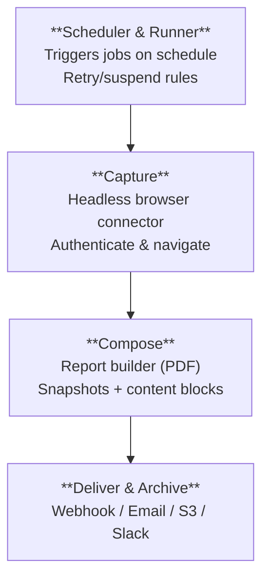
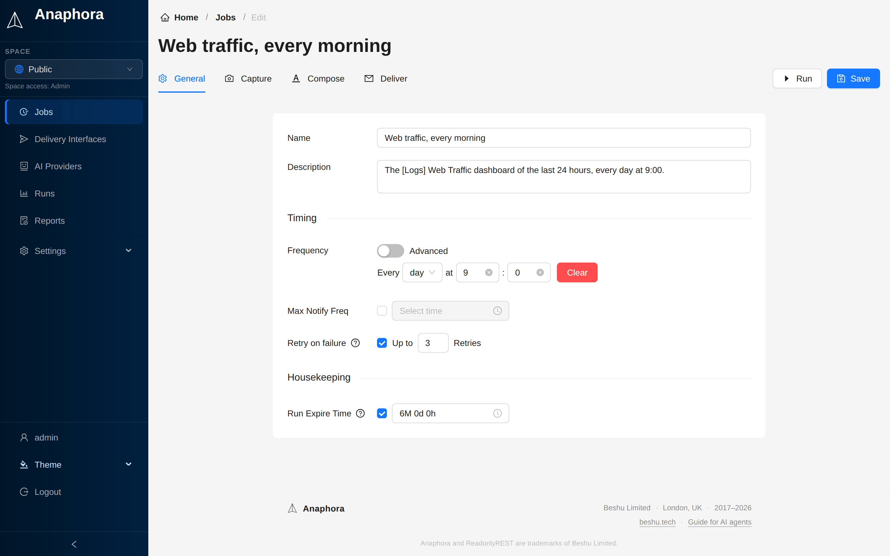
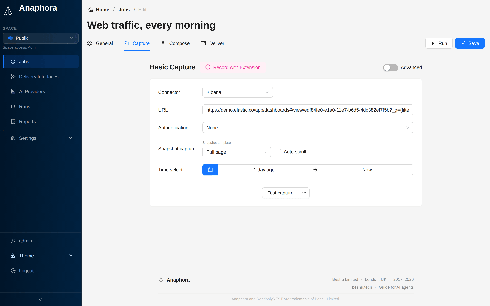
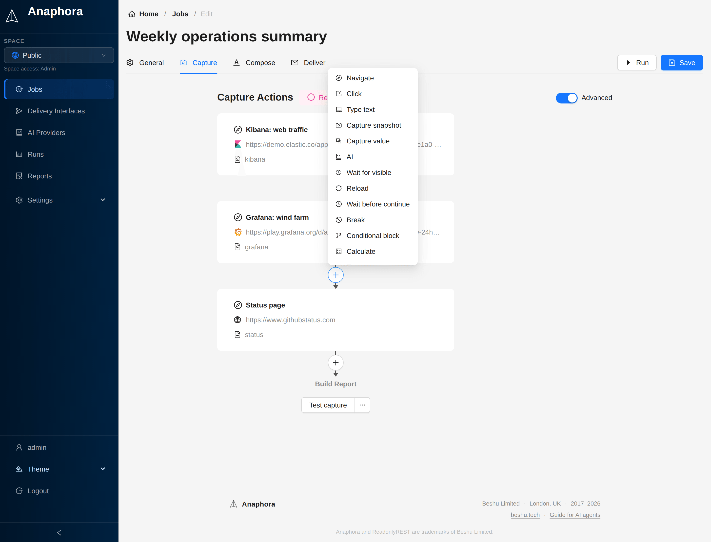

# Getting started with Anaphora

This guide tells you how to install and configure Anaphora for automated Kibana and Grafana reporting.

## What is Anaphora?

Anaphora is a self-hostable reporting and alerting automation system. It turns authenticated dashboards and web
applications into:

- Snapshots: page or panel captures from Kibana, Grafana, or any web UI
- Reports: PDFs assembled from snapshots with text, images, and custom layouts
- Deliveries: email, webhook, Slack, or S3 archiving
- Alerts: high-frequency jobs that notify only on relevant findings (with throttling)

### Main principle

Anaphora can automate any page that a person can reach in a browser.

To do this, Anaphora uses a headless Chrome-based connector. The connector does what a person does:
- Navigate to URLs
- Authenticate (including complex SSO flows)
- Click, type, and submit forms
- Reach the necessary view states
- Capture snapshots deterministically

## System architecture

Anaphora processes each job run through four pipeline stages:

## Core concepts

### Job
The main configuration unit. A job runs periodically, and captures, composes, and delivers reports. You configure it in
four tabs: General, Capture, Compose and Deliver.

### Run
One execution of a job. Anaphora logs each run with timestamps, success or failure status, error details, and the
artifacts it produced.

### Snapshot
A capture of a web view. It is the whole page, or one visualization (for Kibana dashboards).

### Report
A rendered PDF assembled from snapshots, text blocks, layout elements, and branding.

### Delivery interface
A reusable destination configuration (webhook, SMTP, Mailgun, S3). Many jobs can share one delivery interface.

### Space
A "share-nothing" container that isolates jobs, delivery interfaces, AI providers, and artifacts for multi-tenant
deployments.

## Supported connectors

| Connector | Status | Description |
|-----------|--------|-------------|
| Kibana | Available | Dashboards, Canvas, Discover with auto-detection |
| Grafana | Available | Dashboards and panels via API |
| Generic Web | Available | Any authenticated web application |
| Metabase | Coming soon | Metabase dashboards and questions |

## Quick start

1. [Install Anaphora](./getting-started/installation) with Docker or your preferred method
2. [Configure](./getting-started/configuration) your connections and settings
3. Follow the [Basic Examples](./basic-examples/) to create your first job

## Use cases

### Scheduled reports
- Daily Kibana dashboard snapshots for stakeholders
- Weekly metric summaries from Grafana
- Monthly trend reports that combine multiple data sources
- S3 archiving for historical compliance records

### Alerts
- High-frequency jobs (every 5-10 minutes) with notification throttling
- Notifications only when a value exceeds its threshold
- Anomaly detection by AI analysis, with summaries of the context

### Multi-source reports
- Captures from multiple dashboards in one report
- Advanced capture workflows for complex navigation paths
- Multi-step browser automation for authenticated applications

*Advanced mode has a full set of browser automation actions for complex workflows.*

### Compliance and auditing
- Automated evidence capture for compliance requirements
- Historical archive in S3 ("what did this dashboard look like on date X?")
- Audit trails with timestamps and delivery confirmations

## Security features

- Encryption at rest for the internal database
- Enterprise authentication with LDAP, SAML and OpenID Connect
- Role-based access control with Space isolation
- Session management, with admin visibility and forced logout
- Self-monitoring, with a health API for external monitoring systems

## Trial and help

:::tip Try PRO or Enterprise features
[Get a free trial key](https://portal.anaphora.it/trial). Activation is instant, and you do not need a credit card.
:::

:::note Questions? Join the community
[Visit the Anaphora Forum](https://forum.anaphora.it) to get help from the team and other users.
:::

## Next steps

- [Installation](./getting-started/installation): get Anaphora running
- [Features & Editions](./getting-started/features): compare Free, PRO, and Enterprise
- [Configuration](./getting-started/configuration): set up connections and preferences
- [Basic Examples](./basic-examples/): create your first report job
- [Jobs](./jobs/): job configuration in detail
