# The AI step

The **AI** action of a capture flow asks an AI provider about what the flow captured. One call can fill several
variables, each with its type. When it needs to, the AI can also look at the earlier runs of the job, do exact math,
read the captured pages, and keep a notebook from one run to the next. The step stays a normal capture action: a
**Conditional block**, a **Break** and the delivery act on the variables it fills, as on any other variable. The AI
fills variables and its notebook. It never sends, clicks or stops anything.

:::note Before you start
The AI step needs an AI provider in the space: see [AI providers](../administration/ai-providers.md). The calls of the
step, of its trials and of the assistant all count on the token budget of that provider.
:::

## Add an AI step

1. Open the job, then the **Capture** tab, and switch on **Advanced**.
2. Click the **+** between two actions, and choose **AI**. Put the step after the actions that capture what the AI
   must read.

The step opens in its own page. On the left, **All actions** goes back to the flow, and the list under it opens another
action. A new step starts with three short screens. A step that exists opens in the editor.

## The first time: Describe, Review, Try

1. **Describe.** Under **What should this step do?**, say in your words what the step looks at, what it decides and
   what it writes. Or click a starting point: **Summarise the pages**, **Decide whether to page**, **Pull a number out
   of a page** or **Write a report section**. The line under them names the provider that the assistant uses, and about
   how many tokens it takes. Click **Continue**: the assistant writes the step from your words.

   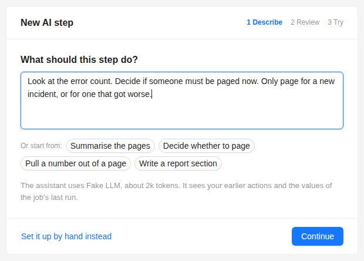

2. **Review.** **Here is the plan** lists, with check marks, what the step fills in, what it sees, what it does, what
   it remembers and when it stops. **In its words** is the summary of the assistant.
   - **Show the instructions it wrote, and why each choice** shows the instructions and one card per change, each with
     **Undo**.
   - When the flow lacks something the plan needs, **One thing to check** says what. For example, no snapshot comes
     before the step: **Add it** puts a **Navigate** with a snapshot before the step, and **I have one** sets the card
     aside.
   - To change the plan, write in **Change something, in your words** and click **Send**.
   - **Discard** removes the new step.

   Then click **Try it on the last run**. When the job has no run yet, the button is **Try it on the Test capture**.

   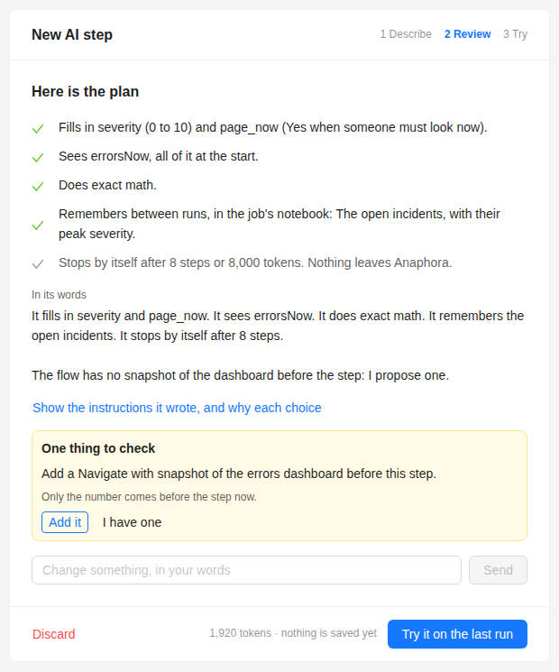

3. **Try.** The step runs once on those values. The screen shows the values it filled in, **Why, in its words**, the
   tokens and the cost of a week at the schedule of the job. **See every step** and **What the model got** open the
   details (see [Try it](#try-it)). To change something, write in **Not what you wanted? Say what to change**, or click
   **Try again**. **Done** opens the editor in the simple view. **Adjust by hand** opens it with **Advanced** on.

   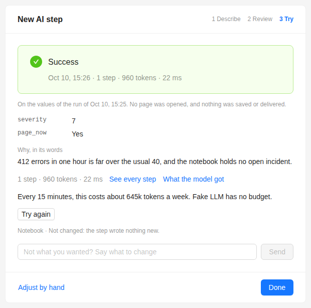

**Set it up by hand instead**, on the first screen, skips the assistant and opens the editor with the defaults. When the
space has no AI provider, the first screen says so and links to **AI Providers**.

Nothing is saved until you save the job. **Done** does not save it.

## The editor

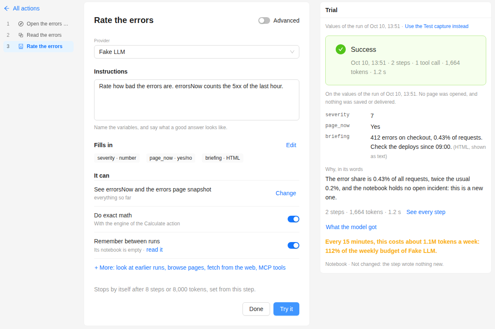

The step is in the middle. The panel on the right holds the assistant and the last trial. On a narrow screen, the panel
goes under the step. Click the title to rename the step.

### The simple view

- **Provider**: the AI provider of the step.
- **Instructions**: what the AI must do, in your words. Name the variables, and say what a good answer looks like.
  **Improve with the assistant** asks the assistant to make them clearer.
- **Fills in**: the variables that the step fills, for example `severity · number`. **Edit** opens the table: the
  **Name**, **Type** and **What it means** of each variable, **Add variable**, and a bin to remove one.
- **It can**: one line per ability that is on, each with a switch. **+ More** lists the others.
- A grey line, for example "Stops by itself after 8 steps or 8,000 tokens, set from this step." It shows the limits
  that apply. When you set a limit yourself, it says "(set by you)". See [Guardrails](#guardrails).
- **Done** goes back to the flow. **Try it** runs the step once: see [Try it](#try-it).

#### Fills in

With one variable, the step works as the AI action always did: the answer text goes into that variable. With two or
more variables, a **yes/no**, or a **What it means**, the AI fills them all in one answer and gives its reasons too. You
read the reasons in the trial and on the Runs page. They never go into a variable or into the report.

| Type       | What the AI gives                           |
|------------|---------------------------------------------|
| **text**   | Text                                        |
| **number** | A number                                    |
| **yes/no** | Yes or no, stored as `1` (yes) or `0` (no) |
| **HTML**   | An HTML fragment for the report             |

A name follows the rules of any variable name, and is unique in the job. The name `reasoning` is not available.

**What it means** goes to the AI with the name. Say the range and what each value means, for example
`0 to 10. 7 and above: page someone now.`

:::tip A yes/no in a Conditional block
A **yes/no** variable holds `1` for yes and `0` for no. To act on it, compare it with `1`. For example, a
**Conditional block** with **Variable** `page_now`, **Condition operation** **not equals** and **Condition value** `1`,
with a **Break** inside, stops the run when the answer is no. In the report, write ``.
:::

#### It can

| Line                      | What it does                                                                                                                                                                         | What it costs                                                    |
|---------------------------|--------------------------------------------------------------------------------------------------------------------------------------------------------------------------------------|------------------------------------------------------------------|
| **See …**                 | Names the snapshots and variables that the step sees, and how: "everything so far", "only the ticked rows", or "reads a snapshot only when needed". **Change** opens **Can see**. | What is sent at the start goes again with each model step        |
| **Look at earlier runs**  | Reads the values of earlier runs of this job. The line names the variables and the number of runs.                                                                                 | Each use takes one more model step                               |
| **Do exact math**         | Calculates an expression with the engine of the **Calculate** action, so the AI does not guess the result.                                                                         | Each use takes one more model step                               |
| **Remember between runs** | Keeps a notebook for the job. The line gives its size; **read it** opens **Remembers**.                                                                                            | The notebook goes with each model step                           |
| **+ More**                | The abilities that are off. **Browse pages**, **Fetch from the web** and **MCP tools** show too, but they are not available yet.                                                   |                                                                  |

Each model step sends the whole conversation again. That is why a step with tools costs more than one call.

### Advanced

Switch on **Advanced** to see every setting. The line under the title says "Advanced on · Every section, with all its
settings", and **Back to the simple view** switches back. **Fills in** shows its table, and four sections open under
it. Each section says in one line what it is set to, also when it is closed.

#### Can see

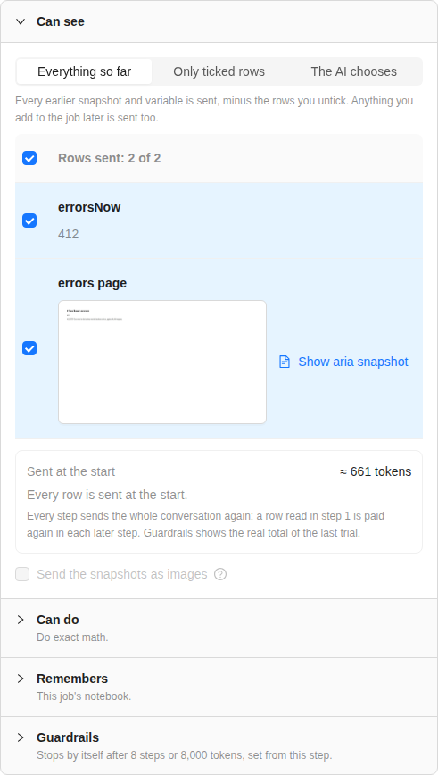

What the AI gets of the earlier snapshots and variables. Three modes:

- **Everything so far**: every earlier snapshot and variable, minus the rows you untick. Anything you add to the job
  later is sent too. This is the default.
- **Only ticked rows**: only the rows you tick. Anything you add later stays out until you tick it.
- **The AI chooses**: the AI gets the names and sizes of the ticked rows, and reads the ones it needs. Anything you add
  later is offered too. In this mode the AI reads the text of the pages, never images. Use it when the step sees large
  snapshots that it does not always need.

Each row shows its value from the last Test capture. A snapshot row has **Show aria snapshot**: the page text that
the AI reads.

The box under the rows gives the size in tokens: **Sent at the start** and, in **The AI chooses** mode, **If the AI reads
every row once**. A row that the AI reads in step 1 is paid again in each later step. **Guardrails** shows the real
total of the last trial.

**Send the snapshots as images** also sends the snapshots as pictures. Each image costs tokens, on every run. The box is
off when the model does not read images, and its tooltip says why. For example, the **Test** of the provider found that
the model does not read images: see [What this model can do](../administration/ai-providers.md#what-this-model-can-do).

#### Can do

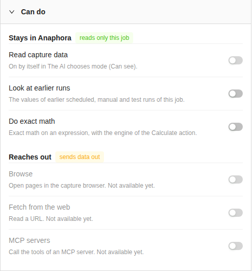

The tools of the step, in two groups.

**Stays in Anaphora** (reads only this job):

- **Read capture data**: reads one row of this run. It is on by itself in **The AI chooses** mode.
- **Look at earlier runs**: the values of earlier scheduled, manual and test runs of this job. Choose the **Variables it
  reads**, and how many runs, from 1 to 50. By default, it reads the earlier variables and the variables of the step.
- **Do exact math**: exact math on an expression, with the engine of the **Calculate** action.

**Reaches out** (sends data out): **Browse**, **Fetch from the web** and **MCP servers**. These are not available yet.

#### Remembers

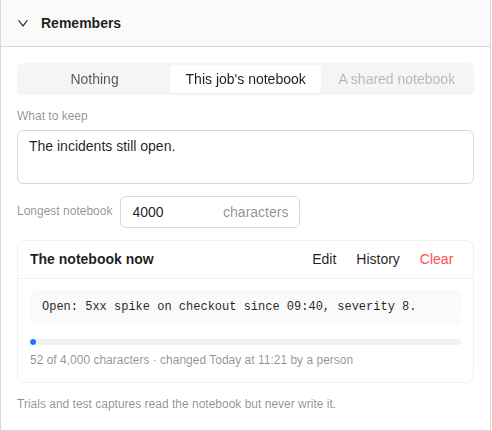

- **Nothing**: each run starts from nothing. This is the default.
- **This job's notebook**: one text for the job, shared by all its AI steps. In each run, the AI can read it and replace
  it.
- **A shared notebook**: not available yet.

**What to keep** tells the AI what to write in the notebook, for example "The incidents still open, with when they
started and the last severity." **Longest notebook** is the limit in characters, 4,000 by default. The AI cannot save a
longer text: Anaphora refuses it and tells the AI the limit.

When the job is saved, **The notebook now** shows the text, its size, and when it changed and by whom: a run or a
person.

- **Edit** changes the text. Its **Save** stores the notebook at once, not with the job.
- **History** lists the last 50 versions.
- **Clear** empties the notebook. **History** keeps the text.

A run saves the notebook when the step ends, and only when the step succeeds or stops with **Keep what is filled in and
go on**. Trials and Test captures read the notebook but never write it. A copy of the job, and a job made from a
template, start with an empty notebook.

#### Guardrails

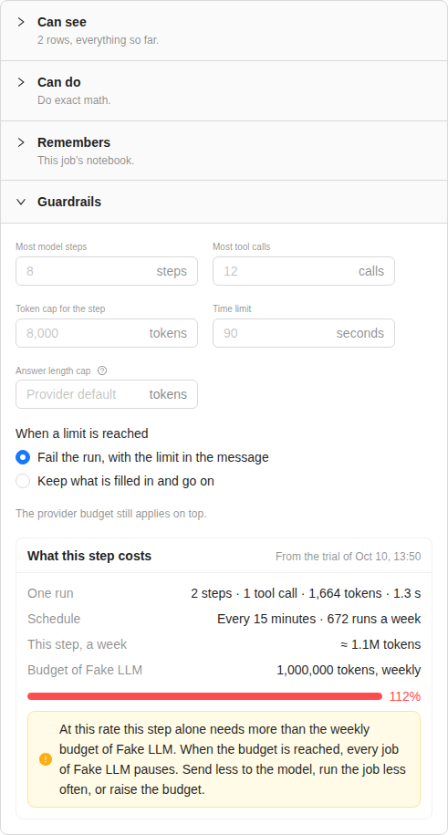

Hard limits on one run of the step, on top of the provider budget. An empty field shows in grey the value that applies,
set from the step. Type a number to set your own.

| Field                      | Limit                                                     | When empty                                                                        |
|----------------------------|-----------------------------------------------------------|-----------------------------------------------------------------------------------|
| **Most model steps**       | Model calls                                               | 1 when the step fills one variable and has no tool, else 8                       |
| **Most tool calls**        | Tool calls                                                | 12                                                                                |
| **Token cap for the step** | Tokens of all the model calls together, input and output | 3 times the size of what the model gets, at least 8,000, rounded up to a thousand |
| **Time limit**             | Seconds for the whole step                                | 60 with no tool, 90 with a tool                                                   |
| **Answer length cap**      | Tokens of one answer                                      | The default of the provider                                                       |

**When a limit is reached**:

- **Fail the run, with the limit in the message**: the default. The message names the limit and the step, for example
  "Stopped after step 5: 50,980 tokens, over the cap of 40,000".
- **Keep what is filled in and go on**: the run keeps the variables that the AI filled so far, and goes on.

**What this step costs** uses the last trial: **One run** (steps, tool calls, tokens, time), the **Schedule** of the job
in runs a week, **This step, a week**, and the budget of the provider, with a bar. When a week of this step does not fit
in the budget, a warning says so: when the budget is reached, every job of that provider pauses. Send less to the model,
run the job less often, or raise the budget. **Ask the assistant for a cheaper setup** asks the assistant for help.

## Try it

**Try it** runs the step once, as a run does, and keeps nothing. It opens no page, it does not change the job, the
notebook or the variables, and it delivers nothing. Its tokens count on the provider budget.

Try it uses the values of the last run of the job. When the job has no run yet, it uses your last **Test capture**. The
line at the top of the **Trial** panel says which, for example "Values of the run of Oct 10, 13:51". **Use the Test
capture instead** and **Use the run instead** switch between the two.

Try it needs a saved job, and a run or a Test capture. Until then, the button is off and the panel says what to do:
"Save the job first", or "Run a Test capture first".

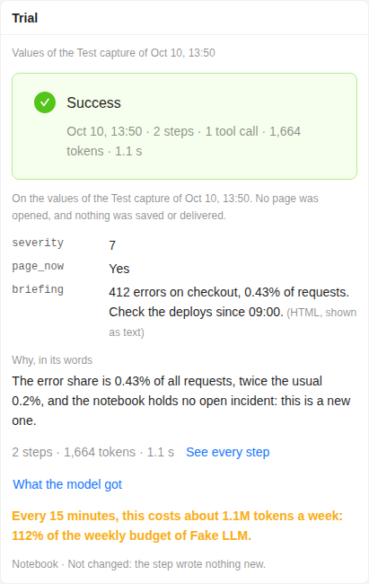

The **Trial** panel shows:

- the status: **Success**, a stop such as **Stopped at the token cap**, or **Error**, with the steps, tool calls,
  tokens and time;
- the value of each variable;
- **Why, in its words**: the reasons of the AI. After a stop, **The AI's last words before the stop**;
- the cost of a week at the schedule of the job, and its share of the provider budget;
- the notebook: what the run writes, or "Not changed";
- after a second trial, **Compare** shows the previous trial next to this one.

**See every step** opens **Every step of the trial**. Each model step shows its tokens and time, the model request with
the tokens of each part (instructions, outputs, tools, notebook, each row), the model response, and each tool call with
its input and output. **Expand all**, **Copy trace** and **Raw JSON** are at the top.

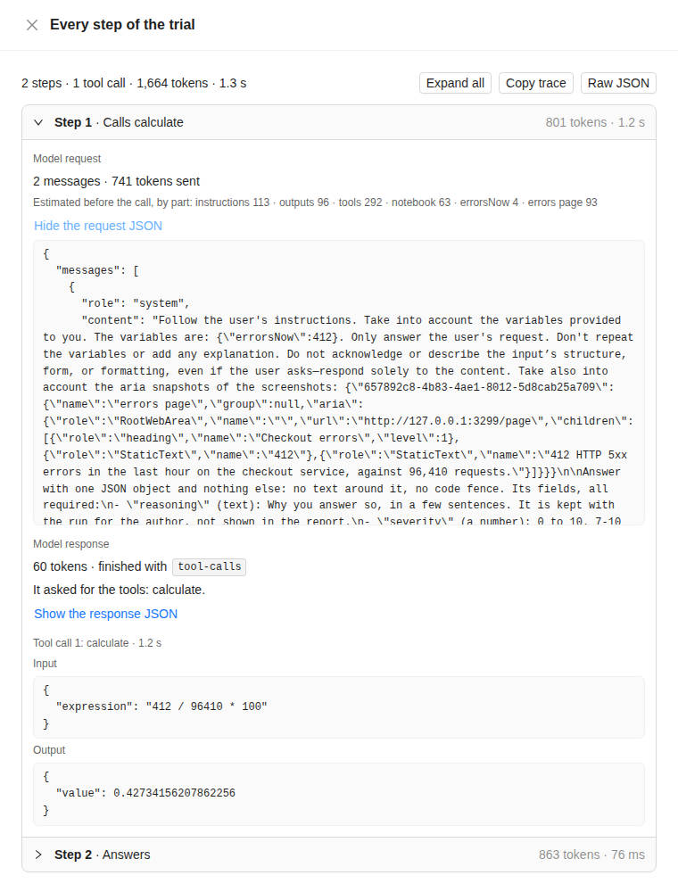

**What the model got** opens **What the model gets**: the system message, the user message, the JSON schema of the
answer (from **Fills in**), the tools it may call (from **Can do**), the tokens of each part, and **Not sent, and why**.
**Copy as text** and **View the raw request JSON** are at the end. Anaphora builds it with the same code as a run, and
calls no model: it spends no token. Before the first trial, the panel links to it too.

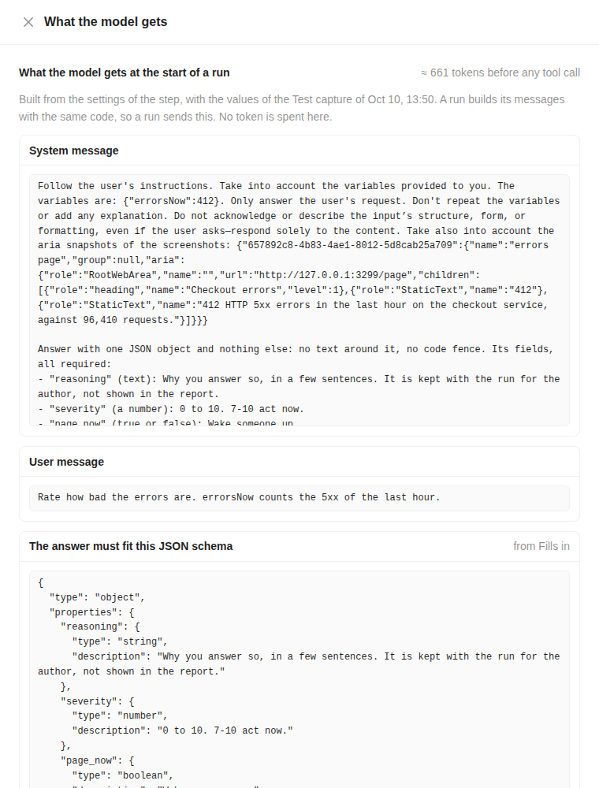

## The assistant

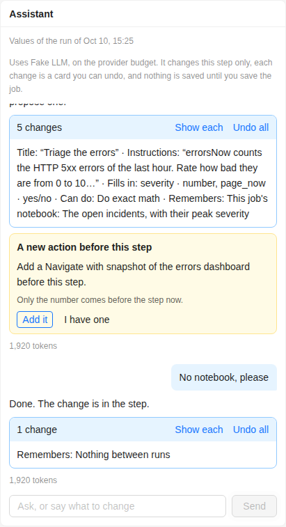

The **Assistant** panel is above the trial. It works on the same values as **Try it**. Write a question or a change in
**Ask, or say what to change**, and click **Send**.

The assistant may change this step, and only this step: the title, the **Instructions**, **Fills in**, **Can see**, the
tools that stay in Anaphora, **Remembers** and **Guardrails**. Each change is a card with its reason, and goes into the
step at once. **Undo** takes one back. A group of changes has **Show each** and **Undo all**.

Other things it only proposes, as a card for you to decide:

- **A new action before this step**: **Add it** puts a **Navigate** with a snapshot before the step, and **I have one**
  sets the card aside.
- **A tool that reaches out of Anaphora**: not available yet. **Set aside** closes the card.
- **Something to check** in another part of the flow: **Set aside** closes the card.

The assistant can try the step too, up to three times in one answer. It never saves the job.

Its tokens count on the provider budget, like a trial. The panel shows the tokens of each answer. One answer stops at 12
model calls, 3 trials, 60,000 tokens or 120 seconds.

### Explain this trial

At the end of **Every step of the trial**, **Explain this trial** asks the assistant why the step did what it did. The
answer comes under **Explained by the assistant**, with suggestions. **Apply** puts a suggestion into the step, and
**Undo** takes it back. **Ask again** asks once more. On the Runs page, the same button is **Explain this run**.

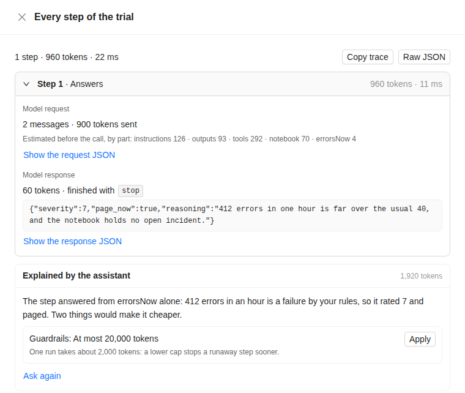

## Runs

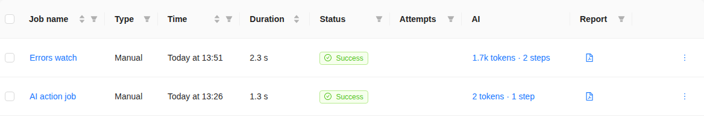

The **AI** column of the **Runs** page says what the AI steps of each run cost, for example "1.7k tokens · 2 steps".
When a limit stops a step, the column names the limit in yellow, for example "Token cap · 5 steps". When a step fails,
it shows "AI error" in red. A run with no AI step shows "no AI".

Click the cell to open the **AI trace** of the run. It has the same content as a trial: the status, **Why, in its
words**, the variables, the notebook, and every step. It also has **Compare** with the previous run of the job, **Explain
this run**, and **Open the step**, which opens the step in the editor.

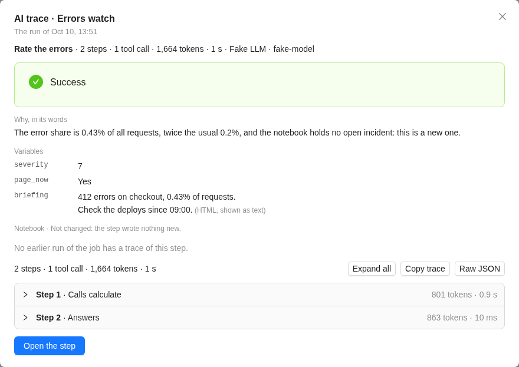

A **Test capture** runs the AI steps too. Its result has an **AI** tab with the same trace for each AI step.

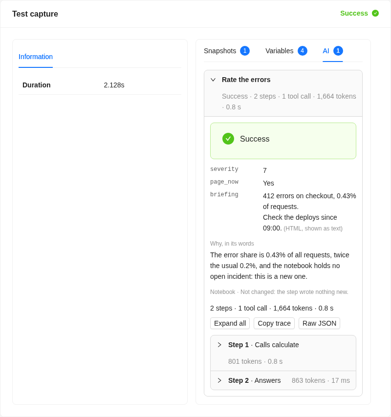

### When a step stops at a limit

1. Open the trace from the **AI** column. The status names the limit, and **The AI's last words before the stop** say
   where the AI was.
2. Click **Open the step**, then open **Guardrails**.
3. Do one of these:
   - Raise the limit that stopped the step.
   - Send less: **Only ticked rows**, or **The AI chooses** for large snapshots. Switch off a tool that the step does
     not need.
   - Choose **Keep what is filled in and go on**, when a part of the answer is enough.
   - Click **Explain this run**, and let the assistant suggest a change.
4. Click **Try it** to check the change, then save the job.

## Costs and limits

- An AI step costs tokens: what each model call sends, and its answer. Each model step sends the whole conversation
  again, so a step with tools costs more than a single call. Costs show in tokens, not in money.
- The provider budget applies on top of the guardrails. When a run reaches it, the job pauses, and every further call
  on that provider is refused until the window rolls over. See [Token budgets](../administration/ai-providers.md#token-budgets).
- Trials, Test captures and the assistant count on the same budget. They never pause a job: the budget refuses their
  next call.
- The guardrails that you leave empty come from the step: see [Guardrails](#guardrails). The grey line under **It can**
  shows them.
- A step set up as before, with one variable and no tool, sends what it always sent.

## For AI agents and scripts

An AI agent or a script can set up, try and read AI steps through the JSON API of your instance, described at its
`/llms.txt`: see [API for AI agents](../administration/agent-api.md).
