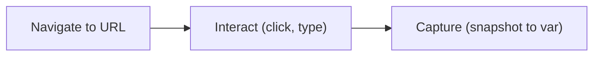

# Capture configuration

The Capture tab defines what data to collect and how. Anaphora's headless Chrome-based connector can navigate,
authenticate, and capture any web application.

## Capture modes

### Basic mode

Simple single-URL capture:

1. Select a **Connector** (**Web**, **Kibana**, **Grafana**)
2. Enter the URL
3. Set **Authentication** (if needed)
4. Select a **Snapshot template**

Best for quick dashboard snapshots and simple reports.

### Advanced mode

Multi-step browser automation:

1. Chain multiple navigation and capture actions
2. Extract data into variables
3. Evaluate conditions
4. Build complex workflows

Turn on the **Advanced** switch to change modes.

## Connectors

### Kibana connector

The Kibana connector uses Anaphora's built-in support for Kibana pages.

Supported page types:

- Dashboards
- Canvas workpads
- Discover views

To authenticate, log in to Kibana with the ReadonlyREST login form. Select **ReadonlyREST**, or **ReadonlyREST Enterprise** to also
select a **Tenancy**.

To configure the time range, either set it in the Kibana UI before you copy the URL, or set it in Anaphora with the
**Time select** field, which uses a syntax similar to Kibana's time picker. **Time select** applies to dashboards and Discover views.
For a Canvas workpad, set the **Page** number.

Capture options:
| Snapshot template  | Description                        |
|--------------------|------------------------------------|
| **Full page**      | One snapshot of the full dashboard |
| **Visualizations** | Separate snapshot for each panel   |

For a Discover view, the templates are **Logs** and **Histogram**. Select **Deliver report only when condition is met**
to send the report only when the hit count meets a condition (**Hits are** greater than, less than, or equal to a value).

:::tip Per-visualization capture
When you capture each visualization separately, you get more control in the **Compose** tab. You can arrange panels in
custom layouts, exclude some visualizations, or combine them with other content.
:::

### Grafana connector

The Grafana connector uses Anaphora's built-in support for Grafana pages.

To authenticate, select **Grafana** and log in with a Grafana user. This works for Grafana Cloud and self-hosted
Grafana instances.

Capture options:

- **Full page**: full dashboard capture
- **Visualizations**: panel-level capture (similar to Kibana)

### Generic web connector

Select the **Web** connector for any web page. If a human can reach it, Anaphora can capture it.

Use cases:

- Internal tools and dashboards
- SaaS applications
- Custom web applications

Authentication:

- Natively supports HTTP Basic authentication (select **Basic**)
- Use Advanced mode to script login flows

## Advanced capture workflows

Advanced mode runs multi-step browser automation for complex scenarios.

### Workflow structure



### Browser actions

| Action                   | Description                             | Example                    |
|--------------------------|-----------------------------------------|----------------------------|
| **Navigate**             | Go to a URL                             | Open dashboard             |
| **Click**                | Click an element                        | Expand menu, select filter |
| **Type text**            | Enter text                              | Search box, form field     |
| **Enter**                | Press Enter in an element               | Submit a search or form    |
| **Wait for visible**     | Wait for element                        | Dashboard loading complete |
| **Wait before continue** | Pause execution for a number of seconds | Allow animations to finish |
| **Reload**               | Refresh page                            | Clear cached state         |

### Data extraction actions

| Action               | Description                    | Example                  |
|----------------------|--------------------------------|--------------------------|
| **Capture value**    | Extract text into variable     | Error count, status text |
| **Capture snapshot** | Screenshot element to variable | Chart, panel, full page  |
| **Calculate**        | Arithmetic on variables        | `errors / total * 100`   |
| **AI**               | Process captured data with AI  | Summarize a dashboard    |

:::note Equation limits
An equation in a **Calculate** action runs in a separate process, with 256 MB of memory and 5 seconds of time. It
cannot create a matrix with more than one million cells. When a limit is reached, only that process stops, and the
action fails. The job editor checks equations when you save the job.
:::

### Control flow actions

| Action                | Description                                                        | Example                          |
|-----------------------|--------------------------------------------------------------------|----------------------------------|
| **Conditional block** | Run nested actions when a variable meets a condition (or does not) | Only notify if errors > 0        |
| **Break**             | Stop without sending                                               | Skip report if threshold not met |

### Example: multi-source report

Capture from multiple dashboards in one job:

```
1. Navigate → Kibana Dashboard A
2. Capture snapshot → dashboard_a
3. Navigate → Grafana Dashboard B
4. Capture snapshot → dashboard_b
5. Navigate → Internal Tool
6. Click → "Generate Report" button
7. Capture snapshot → internal_report
```

Result: three snapshots are available in the **Compose** tab as `dashboard_a`, `dashboard_b`, and `internal_report`.

### Example: conditional alert

Send a notification only when the error count exceeds a threshold:

```
1. Navigate → Error Dashboard
2. Capture value → error_count (from error counter element)
3. Conditional block:
   - If error_count < 100:
     - Break (no notification sent)
4. Capture snapshot → error_dashboard
```

## Authentication best practices

### Service accounts

For production jobs:

- Create dedicated service accounts with read-only access
- Store credentials securely in Anaphora's encrypted database

### Kibana with ReadonlyREST

Anaphora has built-in support for ReadonlyREST authentication:

- Username/password login (**ReadonlyREST**)
- Username/password login with tenancy selection for multi-tenant Kibana (**ReadonlyREST Enterprise**)

## Reliability tips

### Stable captures

For reliable automation:

- Use stable dashboard URLs (avoid temporary/session-based URLs)
- Prefer consistent layouts. Dynamic dashboards can produce different results
- Add wait actions when necessary to make sure content is fully loaded
- Use element-specific captures instead of full-page captures when possible

### Handling failures

- Set **Retry on failure** in the General tab
- Test captures manually before scheduling

Anaphora stops a capture in these cases:

| Case                                                       | Result                                                        |
|------------------------------------------------------------|---------------------------------------------------------------|
| The capture runs longer than 30 minutes                    | The run fails and is retried                                  |
| A Kibana page does not show Kibana after 5 minutes (for example a login or error page) | The run fails. A missing panel or a spinner that does not stop only logs a warning. |
| The job has no valid URL                                   | The run fails with "Found no valid URL to navigate to"        |

## Testing

Click **Test capture** to:

1. Run the capture workflow immediately
2. Preview all captured snapshots
3. Verify authentication works
4. Check variable values
5. Debug any issues

Select **Debug test capture** in the button menu to also record a video of the capture.

:::tip Debug workflow
Use Test often while you build Advanced workflows. The result of each action is visible, so you can see where a problem
occurs.
:::

## Next steps

- [Composer](./composer): arrange captured content into reports
- [Delivery](./delivery): configure where reports are sent
