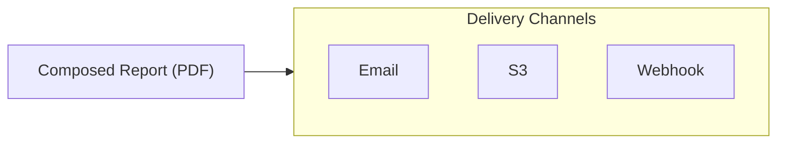

# Delivery Configuration

The Delivery tab configures where and how reports are sent. Anaphora supports multi-channel delivery via email,
webhooks, and S3 archiving.

## Overview

After composition, the report is delivered via your configured interfaces:



## Delivery Interfaces

Delivery Interfaces are reusable destination configurations. Configure them once in Settings, then select them in any
job.

### Available Types

| Interface   | Best For             | Features                       |
|-------------|----------------------|--------------------------------|
| **SMTP**    | Corporate email      | SSL/TLS, attachments           |
| **Mailgun** | Transactional email  | High volume, tracking          |
| **Webhook** | Integrations         | Custom payloads, any endpoint  |
| **S3**      | Archival, compliance | Historical records, versioning |

### Reusability

You can configure multiple interfaces of each type:

- Different SMTP servers for different teams
- Separate S3 buckets for different retention periods
- Various webhooks for different integrations

## S3 Archiving

S3 is particularly valuable for historical archives and compliance workflows.

### Use Cases

| Scenario                     | Benefit                                        |
|------------------------------|------------------------------------------------|
| **Historical reference**     | "What did this dashboard look like on date X?" |
| **Compliance evidence**      | Immutable records for audit requirements       |
| **Long-term retention**      | Store reports beyond housekeeping limits       |
| **Cross-system integration** | Other tools can access archived reports        |

## Email Delivery

Anaphora supports sending reports via SMTP or Mailgun.

### Email Options

| Field            | Description                                    |
|------------------|------------------------------------------------|
| Attachments      | Whether to attach the PDF report to the email. |
| Message template | Customizable email body with variables.        |
| Recipients       | List of email addresses to send the report to. |

:::tip Recipients
Recipient email addresses can be either marked as single user or as group address. Emails sent to single user addresses
will include a snooze and unsubscribe link in the footer. Group addresses will not include these links.
:::

## Webhook Delivery

Webhooks enable custom integrations with any HTTP endpoint.

### Webhook Configuration

| Field              | Description                                                                                   |
|--------------------|-----------------------------------------------------------------------------------------------|
| Message template   | Customizable message body with variables.                                                     |
| JSON body template | Define the JSON payload with variables. Only available when enabled in the Webhook interface. |

### Webhook Use Cases

| Integration           | Description                            |
|-----------------------|----------------------------------------|
| **Ticketing systems** | Create tickets for alerts              |
| **Chat platforms**    | Create messages in collaboration tools |
| **Data pipelines**    | Feed report data to analytics          |
| **Custom dashboards** | Update external status pages           |

## Multi-Channel Delivery

Send the same report to multiple destinations:

### Configuration

1. Click **Add Delivery**
2. Select interface type
3. Configure destination
4. Repeat for additional channels

### Example: Alert with Archive

```
Delivery 1: Webhook e.g. Slack (immediate notification)
Delivery 2: Email (stakeholder distribution)
Delivery 3: S3 (permanent archive)
```

### Partial Success

With multi-channel delivery:

- Each channel is attempted independently
- Partial success (some channels succeed, others fail) is logged

## Testing Delivery

Every delivery config includes a **Test** button. Use it to verify configuration before saving the job.
All steps during the capture and delivery process are logged for troubleshooting.
Use debug mode to also receive a video of the capture process.

## Next Steps

- [Delivery Interfaces](../delivery-interfaces/) - Configure global interface settings
- [Basic Examples](../basic-examples/) - See complete job examples
