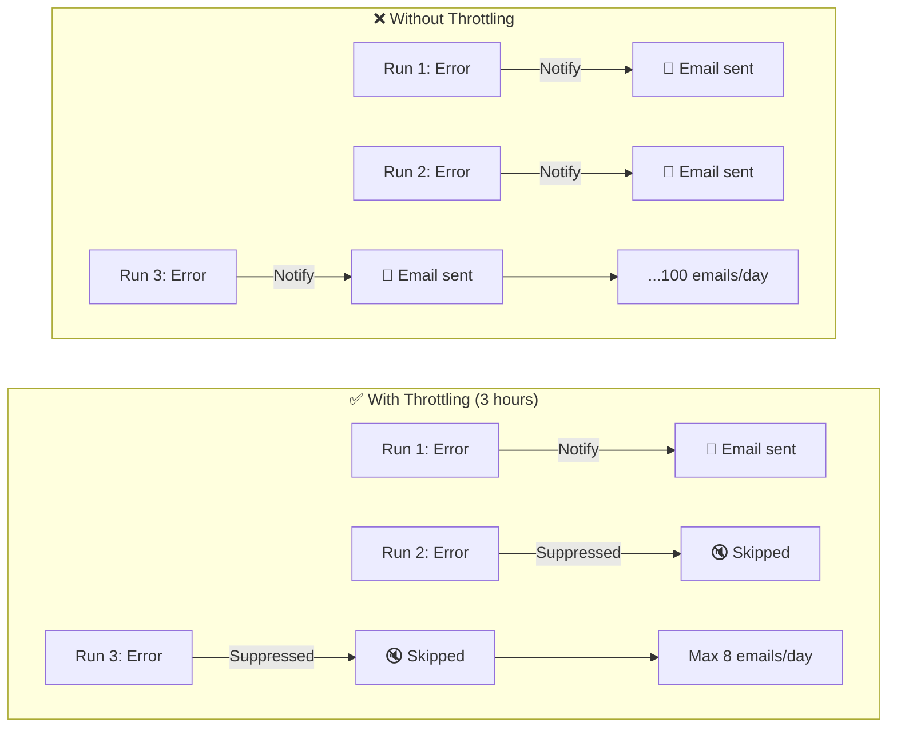

# General settings

The General tab defines how often a job runs, how noisy it is allowed to be, and how it behaves on failures.

## Configuration fields

| Field            | Description                                                       | Required |
|------------------|-------------------------------------------------------------------|----------|
| Name             | Job identifier shown in lists and reports                         | Yes      |
| Description      | Notes about the job's purpose                                     | No       |
| Frequency        | How often to run (simple or CRON)                                 | Yes      |
| Max Notify Freq  | Minimum time between notifications                                | No       |
| Retry on failure | Number of retries after a failed run (default: 3)                 | No       |
| Run Expire Time  | Age at which old runs and reports are deleted (default: 6 months) | No       |

## Scheduling

### Simple frequency

Set how often the job runs, in natural intervals.

### Advanced (CRON)

Turn on the **Advanced** switch to type a CRON expression in the **Cron** field:

| CRON expression | Description              |
|-----------------|--------------------------|
| `0 9 * * *`     | Every day at 9:00 AM     |
| `0 */2 * * *`   | Every 2 hours            |
| `0 9 * * 1-5`   | Weekdays at 9:00 AM      |
| `0 0 1 * *`     | First day of every month |
| `*/10 * * * *`  | Every 10 minutes         |
| `0 9,17 * * *`  | At 9:00 AM and 5:00 PM   |

Anaphora refuses to save a CRON expression that the scheduler cannot run, for example `0 */25 * * *`. A stored job with
such an expression shows **Never runs** on the Jobs list.

If Anaphora is down when a job should run, it does not run the job late. The job runs at its next scheduled time. At
startup, the log names the runs that were missed.

## Notification throttling

**Max Notify Freq** sets the minimum time between two delivered reports, whatever the job frequency. A run inside this
time still runs, but sends nothing. Use it for high-frequency alerting jobs.

Select the checkbox to turn on throttling. The default is 3 hours. If the job runs more often than once a day and
throttling is off, the General tab shows a **Throttle Frequency** button that sets the default.

### Why throttling matters



### Example configuration

| Job frequency    | Throttling | Result                   |
|------------------|------------|--------------------------|
| Every 5 minutes  | 3 hours    | Max 8 notifications/day  |
| Every 10 minutes | 1 hour     | Max 24 notifications/day |
| Every hour       | 6 hours    | Max 4 notifications/day  |
| Daily            | None       | 1 notification/day       |

:::tip Alerting pattern
High-frequency sampling with throttling gives an alerting-style workflow:

- Job runs every 5 minutes to detect issues quickly
- Throttling prevents notification fatigue
- Recipients get timely alerts without spam
  :::

## Retry policy

Select the **Retry on failure** checkbox to retry a failed run automatically. Then set the number of retries, from 1
to 10. New jobs use 3 retries.

Anaphora retries in increasing intervals: 5 minutes, 15 minutes, 30 minutes, 1 hour, 2 hours, 4 hours, 12 hours,
1 day, 2 days, and 3 days after the initial failure.

- A run is retried when its capture fails, or when its report reached no destination. A report that reached some
  destinations is not sent again.
- A capture that runs longer than 30 minutes is stopped, stored as failed, and retried.
- Retries are listed under the run that failed first, in its **Attempts**.
- If you start a manual run after a scheduled run failed, the pending retries of the scheduled run still happen.

## Housekeeping (data retention)

Select the **Run Expire Time** checkbox to delete old runs and their reports automatically after the time you set
(months, days, and hours). New jobs use 6 months. Clear the checkbox to keep runs forever (**Never expire**).
An hourly clean-up deletes the expired runs and their report files.

:::warning Storage impact
High-frequency jobs make more data. Without housekeeping:

- 10-minute job = 144 runs/day = 4,320 runs/month
- Each run may include snapshots and reports
- Without retention limits, storage can grow fast
:::

## Best practices

### For scheduled reports

```yaml
Frequency: Daily at 9 AM (0 9 * * *)
Throttling: None (reports always deliver)
Retry: 3 attempts
Housekeeping: 90 days
```

### For alerting jobs

```yaml
Frequency: Every 5-10 minutes
Throttling: 1-3 hours (balance speed vs. noise)
Retry: Job runs often enough; retries usually not needed
Housekeeping: 14 days (less storage needed)
```

### For compliance/archival

```yaml
Frequency: Weekly or monthly
Throttling: None
Retry: 5 attempts (make sure it succeeds)
Housekeeping: Never
```

## Next steps

- [Capture](./capture): configure what to capture
- [Composer](./composer): design your report layout
- [Delivery](./delivery): set up delivery destinations
