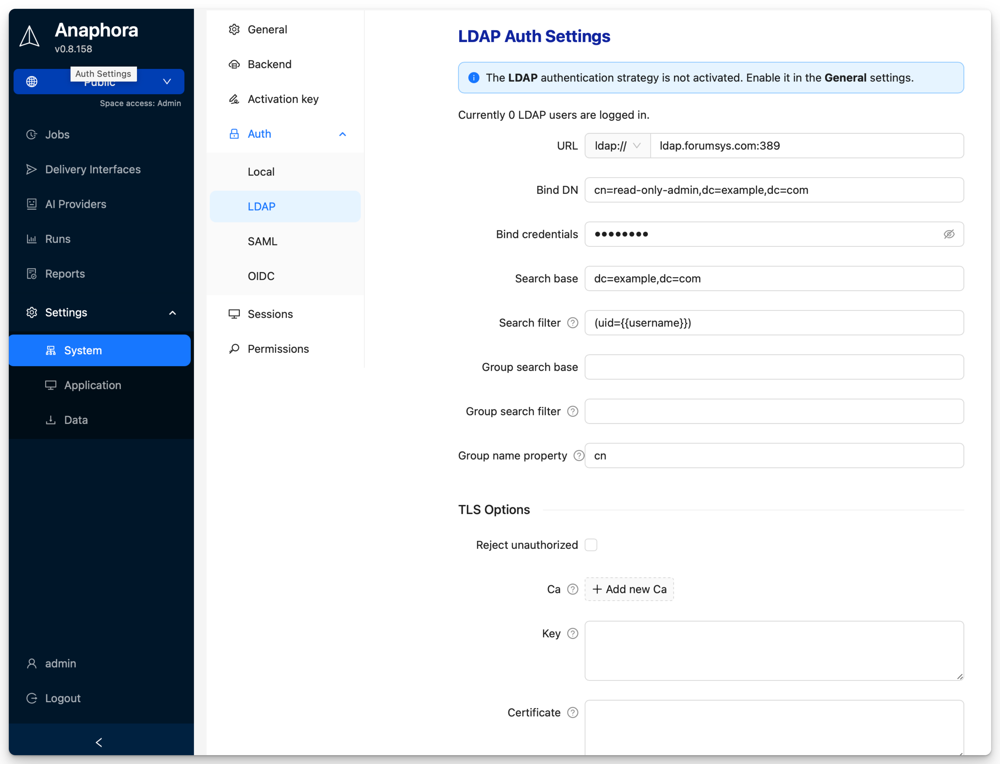

# LDAP / Active Directory

Connect to your enterprise directory for centralized user management. Supports Microsoft Active Directory, OpenLDAP, and
other LDAP-compliant directories.

## Overview

LDAP integration provides:

- **Centralized user management** — Users managed in corporate directory
- **Group-based roles** — Map AD groups to Anaphora roles
- **No password storage** — Passwords validated against directory
- **Automatic provisioning** — Users created on first login

## Configuration

Navigate to **Settings** > **System Settings** > **Auth** > **LDAP** to configure.

| Field               | Description                    | Example                                | Required |
|---------------------|--------------------------------|----------------------------------------|----------|
| URL                 | LDAP server address            | `ldap://ldap.forumsys.com:389`         | Yes      |
| Bind DN             | Service account for binding    | `cn=read-only-admin,dc=example,dc=com` | Yes      |
| Bind credentials    | Service account password       | (stored securely)                      | Yes      |
| Search base         | Base DN for user search        | `dc=example,dc=com`                    | Yes      |
| Search filter       | LDAP filter for user lookup    | `uid={{username}}`                     | Yes      |
| Group search base   | Base DN for group search       | `ou=groups,dc=example,dc=com`          | No	      |
| Group search filter | LDAP filter for groups         | `(member={{cn}})`                      | No       |
| Group name property | Attribute for group name       | `cn`                                   | No       |
| Reject unauthorized | Enforce TLS certificate checks | `false` (unchecked)                    | No       |
| CA                  | Certificate authority          | base64-encoded PEM                     | No       |
| Key                 | Client private key             | base64-encoded PEM                     | No       |
| Certificate         | Client certificate             | base64-encoded PEM                     | No       |

### Group to Role Mapping

Use the group search to retrieve LDAP groups and map them to Anaphora roles.
In the **group search filter**, use `` placeholders to reference attributes from the login user.
Use the **Group name property** to specify which attribute will be used as the mapped role name.

### SSL/TLS Configuration

For secure connections use LDAPS (port 636):

| Protocol | Port | Security                      |
|----------|------|-------------------------------|
| LDAP     | 389  | Unencrypted (not recommended) |
| LDAPS    | 636  | SSL/TLS encrypted             |
| StartTLS | 389  | Upgraded to TLS               |

Provide CA, Key, and Certificate fields for TLS client authentication if required by your LDAP server.

## Active Directory Specifics

### Service Account

Create a dedicated service account for Anaphora:

1. Create user in AD: `anaphora-svc`
2. Set password to never expire (or manage rotation)
3. Grant "Read all user information" permission
4. No need for admin privileges

### Debug Mode

Enable LDAP debug logging:

1. Go to **Settings** > **System Settings** > **General** > **General**
2. Set **Log Level** to `debug`
3. Reproduce the issue
4. Review logs for detailed LDAP communication

## Best Practices

- Use dedicated service account with minimal permissions
- Always use LDAPS for encrypted connections
- Test configuration changes in staging first
- Map groups to roles rather than individual user assignments
- Monitor service account for lockouts or password expiration

## Next Steps

- [SAML](./saml) - Add SAML SSO alongside LDAP
- [Spaces](../spaces) - Configure Space-based access control
