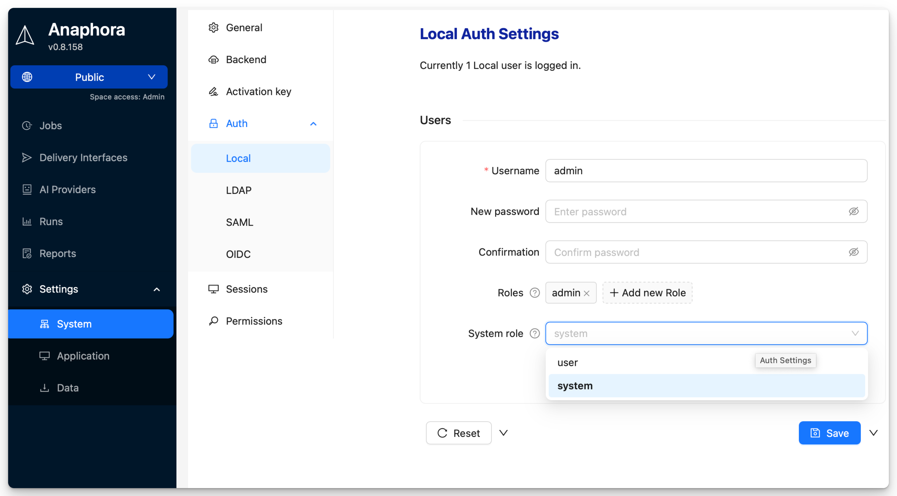

# Local Authentication

Default authentication using Anaphora's built-in user database. Ideal for small teams, testing environments, or
deployments without enterprise identity providers.

## Overview

Local authentication provides:

- **Built-in user database** — No external dependencies
- **User management UI** — Easy administration
- **Quick setup** — Works out of the box

## User Management

### Adding Users

1. Navigate to **Settings** > **System Settings** > **Auth** > **Local**
2. Click **Add New User**
3. Enter username, email, and password
4. Assign roles
5. Choose user type: Normal user or system user
6. Save

### User Properties

| Field       | Description                     | Required |
|-------------|---------------------------------|----------|
| Username    | Unique login identifier         | Yes      |
| Password    | Initial password                | Yes      |
| Roles       | Assigned permission groups      | No       |
| System Role | User or system user designation | Yes      |

### System Role

The **System Role** controls access to system-wide settings:

| Role       | Description                                                                    |
|------------|--------------------------------------------------------------------------------|
| **user**   | Normal user, cannot access system settings                                     |
| **system** | Can access and modify system settings. Has automatically access to all spaces. |

:::note
System settings include authentication configuration, space configuration, backup settings, and other global options.
Most users should have the `user` role.
:::

### Managing Local Users

All local users will be managed by the system user alone. Users cannot modify their own accounts.
System users can change the password or add roles to existing users. The system user can also delete the local users.

:::warning
Deleting a user removes their access immediately. Jobs created by the user will remain.
:::

## When to Use Local Auth

| Scenario                    | Recommendation               |
|-----------------------------|------------------------------|
| Small team (under 10 users) | Local auth is sufficient     |
| Testing/development         | Local auth for simplicity    |
| No corporate IdP available  | Local auth as primary method |
| System user                 | Local is required            |
| Enterprise environment      | Consider LDAP, SAML, or OIDC |
| Compliance requirements     | Use enterprise SSO           |

## Next Steps

- [LDAP](./ldap) - Connect to Active Directory
- [SAML](./saml) - Enable Single Sign-On
- [OIDC](./oidc) - Use OpenID Connect providers
