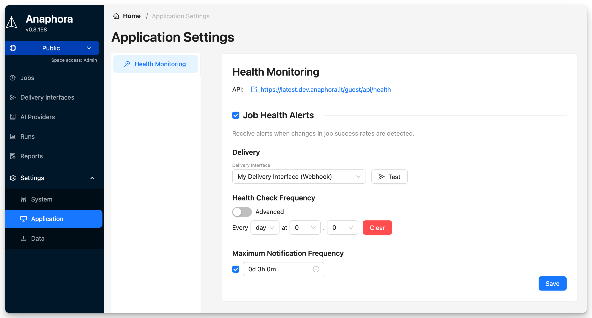

# Self Monitoring

Monitor Anaphora's health, job and delivery success.


## Health Monitoring

Access the monitoring settings at **Settings** > **Application** > **Health Monitoring**.

### Setup Health Alerts

Configure email alerts when the system detects changes in job health status.

1. Enable **Health Alerts**.
2. Select a delivery interface and recipient email.
3. Set **Health Check Frequency**: how often to check job health.
4. Set **Maximum Notification Frequency**: minimum time between alerts (Optional).
5. Click **Save**.

## Health API

Query Anaphora's health status programmatically:

```
GET /guest/api/health
```

### Response Format

```json
{
  "jobs": [
    {
      "id": "79cf54b6-df32-4b09-84f4-708ecc72b7bc",
      "name": "Kibana Dashboard Snapshot",
      "description": "Takes a snapshot of a dashboard",
      "cron": "5 4 * * *",
      "healthStatus": "green",
      "recentRuns": [
        {
          "runAt": "2026-01-15T04:05:00.041Z",
          "state": "success"
        },
        {
          "runAt": "2026-01-14T04:05:00.051Z",
          "state": "success"
        },
        {
          "runAt": "2026-01-13T04:05:00.034Z",
          "state": "success"
        },
        {
          "runAt": "2026-01-12T04:05:00.040Z",
          "state": "success"
        },
        {
          "runAt": "2026-01-11T04:05:00.034Z",
          "state": "success"
        }
      ]
    }
  ],
  "deliveryInterfaces": [
    {
      "id": "4d5fba03-561e-4503-bf4d-c41817133aca",
      "name": "My Delivery Interface",
      "type": "webhook",
      "healthStatus": "green",
      "summary24Hours": {
        "totalCount": 11,
        "errorCount": 0,
        "errors": []
      }
    }
  ]
}
```

### Health Status Values

| Status     | Meaning                    |
|------------|----------------------------|
| **green**  | All recent runs successful |
| **yellow** | Some recent failures       |
| **red**    | All recent runs failed     |
| **gray**   | No recent activity         |

## Next Steps

- [Backup](./backup) - Configure backups
