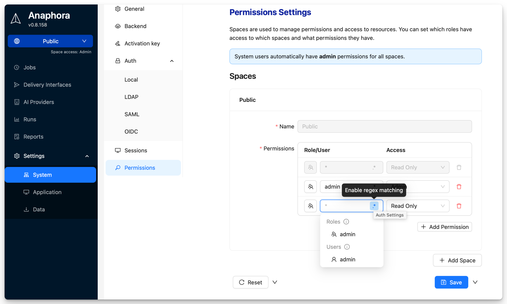
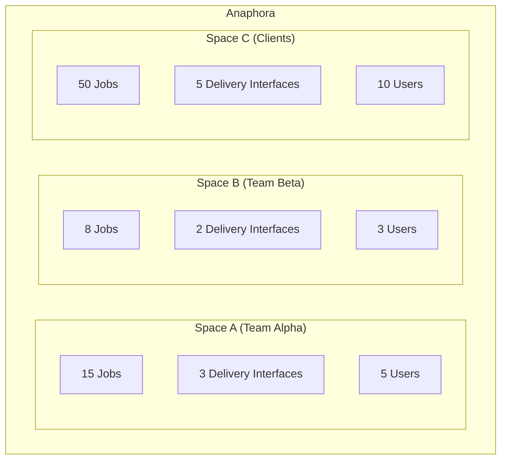

# Spaces

Spaces provide multi-tenant workspace isolation in Anaphora. They act as "share-nothing" containers that completely
separate resources between teams, projects, or tenants.



## Overview

A Space is an isolated container that includes:

- Jobs and schedules
- Generated reports and run history
- Delivery interface configurations
- AI provider configurations
- User assignments and permissions



:::info
Users can belong to multiple Spaces with different roles.
:::

### Copying Between Spaces

While resources cannot be shared, they can be copied:

1. In the jobs list, select the jobs to copy to another Space
2. Click **Copy to Space**
3. Choose target Space
4. If applicable, select to copy associated delivery interfaces

The same process applies to delivery interfaces.

## Creating Spaces

1. Navigate to **Settings** > **System Settings** >  **Permissions**
2. Click **Add Space**
3. Enter the name of the Space

### Assignment Process

1. Click **Add Permission**
2. Select user or role
3. Assign permission (Admin, ReadWrite, Readonly)

:::tip User Roles
Users can have roles assigned to them. These roles can then be assigned to Spaces for easier management. So it is not
necessary to assign each user individually.
:::

### Multi-Space Users

Users can belong to multiple Spaces, by direct assignment or via roles:

```
User: alice@company.com
├── Space: Engineering → Permission: Admin
└── Space: Marketing → Permission: Readonly
Role: DevOps Team
└── Space: DevOps → Permission: ReadWrite
```

## Switching Spaces

You can switch between Spaces using the Space selector in the sidebar.


All resources you create or manage will be scoped to the selected Space.

## Use Cases

### Team Separation

| Space       | Purpose                              |
|-------------|--------------------------------------|
| Engineering | Technical dashboards, system metrics |
| Marketing   | Campaign dashboards, analytics       |
| Executive   | Summary reports, KPIs                |
| DevOps      | Infrastructure monitoring, alerts    |

### Client Isolation (MSP)

For managed service providers:

| Space        | Client            |
|--------------|-------------------|
| Client-Acme  | Acme Corp reports |
| Client-Beta  | Beta Inc reports  |
| Client-Gamma | Gamma Ltd reports |

Each client's data is completely isolated.

### Environment Separation

| Space       | Environment                  |
|-------------|------------------------------|
| Production  | Live dashboards, real alerts |
| Staging     | Test jobs, validation        |
| Development | Experimental configurations  |

## Administration

Only system administrators can create and manage Spaces. Space admins can only manage resources within their assigned
Spaces.

See [Authentication](authentication/index.md) for details on user roles and permissions.

## Best Practices

### Permission Principle

Assign minimal required permissions:

- Most users: Space Readonly
- Job creators: Space ReadWrite
- Team leads: Space Admin
- IT/Operations: System Admin

## Next Steps

- [Self Monitoring](./self-monitoring) - Monitor system health
- [Backup](./backup) - Configure backup and recovery
