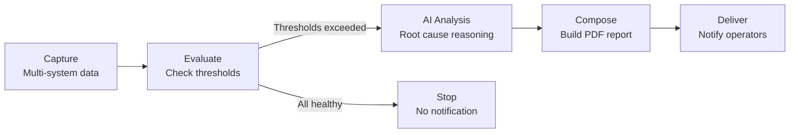

# Intelligent Alerting

Create alerts that monitor your systems and notify you only when specific conditions are met — with AI-powered analysis to help identify root causes.

## The Alerting Concept

In Anaphora, **an alert is a conditional report**. Instead of sending notifications blindly, Anaphora:

1. **Captures** data from one or more systems (dashboards, metrics, logs)
2. **Evaluates** conditions based on extracted values
3. **Analyzes** the situation using AI (optional)
4. **Delivers** a detailed PDF with context, not just a notification

The result: operators receive actionable intelligence, not just "something is wrong."

## Why PDF Alerts?

Traditional alerting tools send a message: *"Error rate exceeded 5%"*

Anaphora sends a **complete situation report**:
- Screenshots of affected dashboards at the moment of the issue
- Extracted metrics and values that triggered the alert
- AI-generated analysis suggesting possible root causes
- Historical context from multiple data sources

## Use Cases

| Scenario | What Anaphora Captures | AI Analysis |
|----------|------------------------|-------------|
| Error spike | Error dashboard + log samples | "Error pattern suggests database connection timeout" |
| Performance degradation | APM metrics + infrastructure stats | "CPU spike correlates with deployment at 14:32" |
| Security anomaly | Auth logs + network traffic | "Unusual login pattern from new geographic region" |
| Business threshold | Revenue dashboard + inventory | "Sales drop coincides with payment gateway errors" |

## Example: Multi-System Alert

Monitor your stack and get intelligent alerts when things go wrong.

### 1. Create the Alert Job

1. Navigate to **Jobs** > **Create New Job**
2. Name it: "Infrastructure Health Alert"
3. Set frequency: Every 5 minutes (`*/5 * * * *`)
4. Set throttling: 1 hour (avoid notification fatigue)

### 2. Configure Multi-System Capture

Toggle **Advanced** mode and build a workflow that checks multiple sources:

```
Navigate → Grafana infrastructure dashboard
Capture value → CPU usage element → $cpuUsage
Capture value → Error rate element → $errorRate
Capture snapshot → Dashboard overview

Navigate → Kibana error logs
Capture value → Error count (last 5 min) → $recentErrors
Capture snapshot → Error log view

Conditional block → $cpuUsage > 80 OR $errorRate > 5 OR $recentErrors > 100:
  ├── AI Analysis → "Analyze these metrics and screenshots..."
  └── (Continue to Compose/Deliver)
Break → (If all conditions are healthy, stop here)
```

### 3. Add AI Analysis

In the capture workflow, add an **AI Analysis** action:

```
Prompt: "Analyze the captured dashboards and metrics:
- CPU: {{$cpuUsage}}%
- Error rate: {{$errorRate}}%
- Recent errors: {{$recentErrors}}

Based on the visual data and these metrics, identify:
1. The most likely root cause
2. Which systems are affected
3. Recommended immediate actions"
```

The AI examines both the **screenshots** and the **extracted values** to provide contextual analysis.

### 4. Compose the Alert Report

Design a PDF that gives operators everything they need:

- **Header**: Alert timestamp and severity
- **AI Summary**: Root cause analysis and recommendations
- **Dashboard Screenshots**: Visual state at time of alert
- **Raw Metrics**: Extracted values that triggered the alert
- **Context**: Links to relevant dashboards for further investigation

### 5. Configure Delivery

Send alerts to the right people:
- **Email**: On-call team with PDF attachment
- **Slack**: Alert channel with summary and PDF link
- **Webhook**: Integrate with PagerDuty, Opsgenie, or custom systems

## How It Works



The **Break** action stops execution when conditions are healthy. No alert fatigue — only actionable notifications.

## Best Practices

- **Combine sources**: Capture from multiple systems for complete context
- **Use throttling**: Prevent notification storms during ongoing incidents
- **Include raw data**: AI analysis is helpful, but operators need the numbers too
- **Set clear thresholds**: Start conservative, tune based on real incidents
- **Test the workflow**: Use the Test button to verify conditions trigger correctly

## Next Steps

- [Grafana Dashboard Report](./grafana-dashboard-report) - Add Grafana to your monitoring
- [AI Analysis](../advanced-examples/ai-news-collation) - More AI-powered workflows
- [Notification Throttling](../jobs/general#notification-throttling) - Control alert frequency
