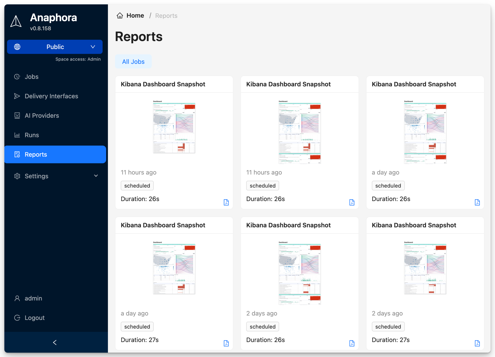

# Reports

The Reports section provides access to all generated report documents and their delivery history.

## Overview

Reports are the final output of your capture jobs. Each report contains:

- Captured screenshots
- Extracted data and variables
- Applied templates and formatting
- Delivery timestamps and status

## Report Types

| Type | Description |
|------|-------------|
| Screenshot Report | Visual capture of target content |
| Data Report | Extracted values and metrics |
| Composite Report | Combined screenshots and data |
| Template Report | Formatted using custom templates |

## Viewing Reports

Access reports through:

- **Run history** - View report from specific execution
- **Report browser** - Browse all generated reports
- **Search** - Find reports by date, job, or content

## Report Storage

Reports are stored according to your retention policy settings. Configure:

- **Retention period** - How long to keep reports
- **Storage location** - Local or cloud storage options
- **Archival rules** - Automatic archival of old reports
