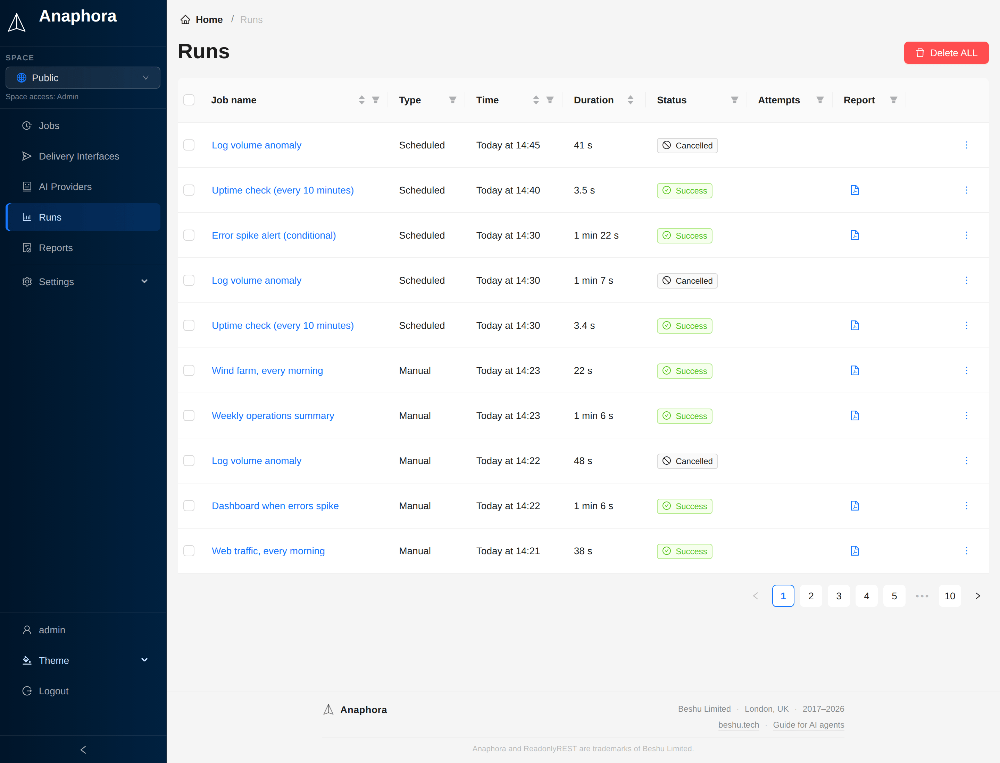

# Runs

The Runs section shows the execution history of your jobs, including successful captures, failures, and delivery status.

## Overview

Every time a job executes, a **run** record is created. This allows you to:

- Track job execution history
- Identify and debug failures
- Review captured content
- Verify delivery success

## Run Statuses

| Status             | Description                                                            |
|--------------------|------------------------------------------------------------------------|
| **Success**        | The job completed and the report was delivered                         |
| **Delivery issue** | The report was created, but it could not be delivered to all destinations |
| **Error**          | The job execution failed                                               |
| **Cancelled**      | A condition stopped the run (for example a **Break** action), so no report was sent |

Click an **Error** or **Delivery issue** tag to see the details.
