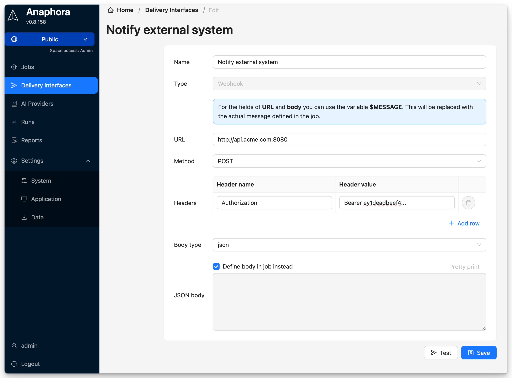

# WebHook

Send reports to custom HTTP endpoints for integration with any system.



## Use Cases

- Custom notification systems
- Integration with ticketing tools
- Triggering automation workflows
- Sending to unsupported platforms

## Configuration

| Field | Description | Required |
|-------|-------------|----------|
| Name | Interface identifier | Yes |
| URL | Endpoint URL | Yes |
| Method | HTTP method (POST/PUT) | Yes |
| Headers | Custom headers | No |
| Authentication | Basic/Bearer/None | No |

## Payload Format

Anaphora sends a JSON payload:

```json
{
  "job_name": "Daily Report",
  "job_id": "abc123",
  "timestamp": "2026-01-15T09:00:00Z",
  "status": "success",
  "report_url": "https://anaphora.example.com/reports/xyz",
  "variables": {
    "error_count": 42,
    "alert_triggered": true
  },
  "attachments": [
    {
      "type": "pdf",
      "url": "https://anaphora.example.com/files/report.pdf"
    }
  ]
}
```

## Custom Headers

Add headers for authentication or routing:

```
Authorization: Bearer your-token
X-Custom-Header: value
Content-Type: application/json
```

## Authentication Options

| Type | Configuration |
|------|---------------|
| None | No authentication |
| Basic | Username and password |
| Bearer | Token in Authorization header |
| Custom | Via custom headers |

## Testing

1. Use a tool like [webhook.site](https://webhook.site) for testing
2. Configure the test URL in Anaphora
3. Send a test payload
4. Verify the payload structure meets your needs

## Error Handling

Anaphora retries failed webhook deliveries:
- 3 retry attempts
- Exponential backoff
- Failures logged in job history
