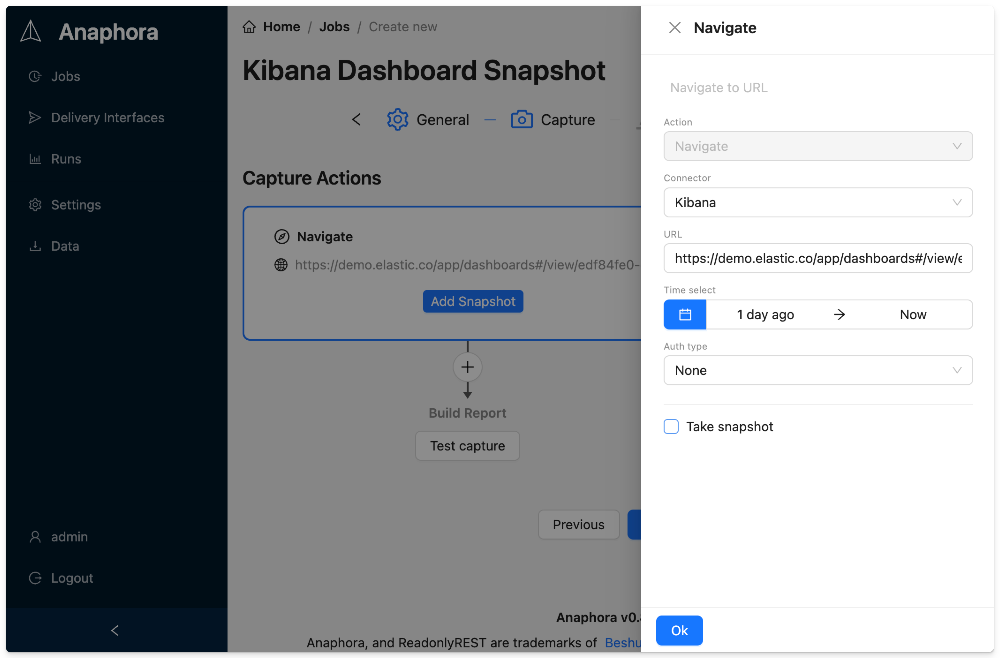

# Configuration Guide

Configure Anaphora for your environment and requirements.

## Initial Setup

On first launch, Anaphora will guide you through initial configuration:

1. Set admin credentials
2. Configure license (if applicable)
3. Set up your first connection to Kibana or Grafana

## Environment Variables

Anaphora can be configured via environment variables:

| Variable | Description | Default |
|----------|-------------|---------|
| `ANAPHORA_PORT` | HTTP port | `8080` |
| `ANAPHORA_DATA_DIR` | Data storage path | `/data` |
| `ANAPHORA_LICENSE_KEY` | License key | - |

## Connection Setup

Connections are configured within job capture settings, where you select the connector type and provide the target URL.

### Adding a Kibana Connection

1. Create a new Job or edit an existing one
2. Go to the **Capture** tab
3. Select **Kibana** as the connector type
4. Enter your Kibana dashboard URL
5. Configure authentication if required
6. Use **Test capture** to verify the connection

### Adding a Grafana Connection

1. Create a new Job or edit an existing one
2. Go to the **Capture** tab
3. Select **Grafana** as the connector type
4. Enter your Grafana dashboard URL
5. Configure authentication (API key or login credentials)
6. Use **Test capture** to verify the connection

## Next Steps

- [Basic Examples](../basic-examples/) - See Anaphora in action
