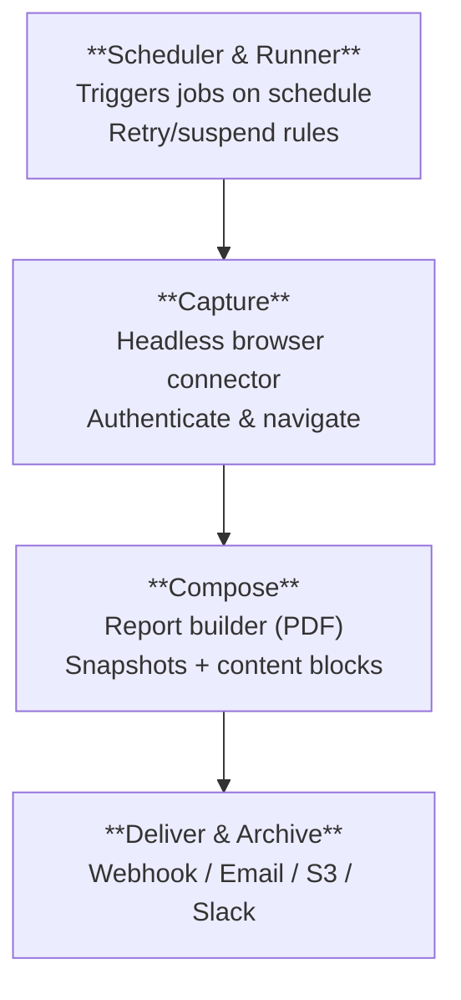
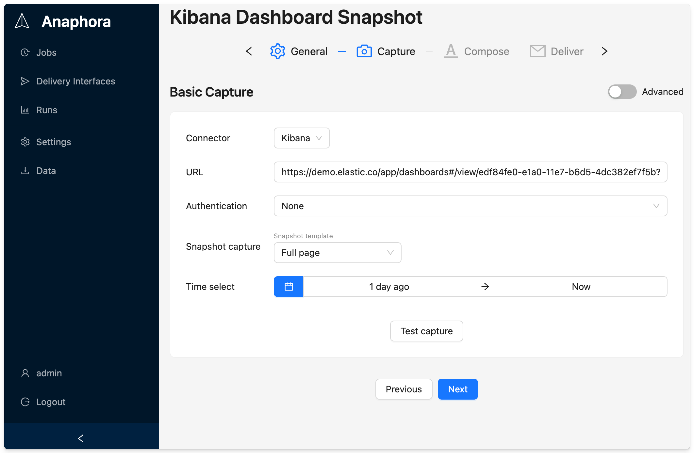
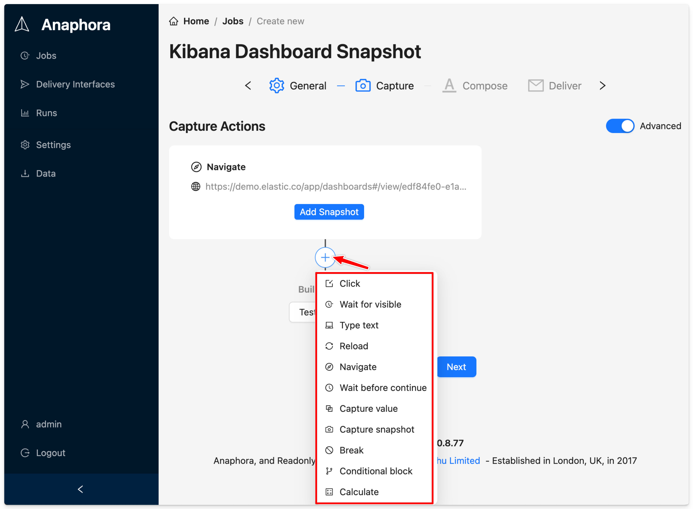

# Getting Started with Anaphora

Welcome to Anaphora! This guide will help you install and configure Anaphora for automated Kibana and Grafana reporting.

## What is Anaphora?

**Anaphora** is a self-hostable reporting and alerting automation system that turns authenticated dashboards and web applications into:

- **Snapshots** — Page or panel captures from Kibana, Grafana, or any web UI
- **Reports** — PDFs assembled from snapshots with text, images, and custom layouts
- **Deliveries** — Email, webhook, Slack, or S3 archiving
- **Alerts** — High-frequency jobs that notify only on relevant findings (with throttling)

### The Key Principle

> **If a human can reach it in a browser, Anaphora can automate it.**

The enabling technology is a **headless Chrome-based connector** that does what a human does:
- Navigate to URLs
- Authenticate (including complex SSO flows)
- Click, type, and submit forms
- Reach desired view states
- Capture snapshots deterministically

## System Architecture

Anaphora processes each job run through four pipeline stages:

## Core Concepts

### Job
The main configuration unit — a periodic execution that captures, composes, and delivers reports. Configured across four tabs: General, Capture, Composer, and Delivery.

### Run
One execution of a job. Logged with timestamps, success/failure status, error details, and produced artifacts.

### Snapshot
A captured representation of a web view — either whole page or per-visualization (for Kibana dashboards).

### Report
A rendered PDF assembled from snapshots, text blocks, layout elements, and branding.

### Delivery Interface
A reusable destination configuration (webhook, SMTP, Mailgun, S3) that can be shared across jobs.

### Space
A "share-nothing" container that isolates jobs, delivery interfaces, AI providers, and artifacts for multi-tenant deployments.

## Supported Connectors

| Connector | Status | Description |
|-----------|--------|-------------|
| **Kibana** | Available | Dashboards, Canvas, Discover with auto-detection |
| **Grafana** | Available | Dashboards and panels via API |
| **Generic Web** | Available | Any authenticated web application |
| **Metabase** | Coming Soon | Metabase dashboards and questions |

## Quick Start

1. [Install Anaphora](./getting-started/installation) using Docker or your preferred method
2. [Configure](./getting-started/configuration) your connections and settings
3. Follow the [Basic Examples](./basic-examples/) to create your first job

## Use Cases

### Scheduled Reports
- Daily Kibana dashboard snapshots for stakeholders
- Weekly metric summaries from Grafana
- Monthly trend reports combining multiple data sources
- S3 archiving for historical compliance records

### Intelligent Alerts
- High-frequency jobs (every 5-10 minutes) with notification throttling
- Conditional notifications only when thresholds are exceeded
- AI-analyzed anomaly detection with contextual summaries

### Multi-Source Reports
- Combine captures from multiple dashboards in one report
- Advanced capture workflows for complex navigation paths
- Multi-step browser automation for authenticated applications

*Advanced mode provides a full suite of browser automation actions for complex workflows.*

### Compliance & Auditing
- Automated evidence capture for compliance requirements
- Historical archive via S3 ("what did this dashboard look like on date X?")
- Audit trails with timestamps and delivery confirmations

## Security Features

- **Encryption at rest** for internal database
- **Enterprise authentication** via LDAP, SAML, OpenID Connect
- **Role-based access control** with Space isolation
- **Session management** with admin visibility and forced logout
- **Self-monitoring** with health API for external monitoring systems

## Get Started Now

:::tip 🚀 Try PRO or Enterprise Features
**[Get a free trial key →](https://portal.anaphora.it/trial)** — Instant activation, no credit card required.
:::

:::note 💬 Questions? Join the Community
**[Visit the Anaphora Forum →](https://forum.anaphora.it)** — Get help from the team and other users.
:::

## Next Steps

- [Installation](./getting-started/installation) - Get Anaphora running
- [Features & Editions](./getting-started/features) - Compare Free, PRO, and Enterprise
- [Configuration](./getting-started/configuration) - Set up connections and preferences
- [Basic Examples](./basic-examples/) - Create your first report job
- [Jobs](./jobs/) - Deep dive into job configuration
