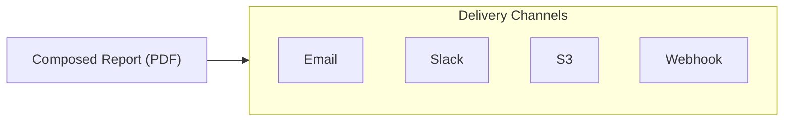

# Delivery Configuration

The Delivery tab configures where and how reports are sent. Anaphora supports multi-channel delivery with conditional routing.

## Overview

After composition, the report is delivered via your configured interfaces:



## Delivery Interfaces

Delivery Interfaces are reusable destination configurations. Configure them once in Settings, then select them in any job.

### Available Types

| Interface | Best For | Features |
|-----------|----------|----------|
| **SMTP** | Corporate email | SSL/TLS, attachments |
| **Mailgun** | High-volume email | API-based, reliable |
| **Slack** | Team notifications | Channels, threads, images |
| **Webhook** | Integrations | Custom payloads, any endpoint |
| **S3** | Archival, compliance | Historical records, versioning |

### Reusability

You can configure multiple interfaces of each type:

- Different SMTP servers for different teams
- Multiple Slack workspaces
- Separate S3 buckets for different retention periods
- Various webhooks for different integrations

## S3 Archiving

S3 is particularly valuable for historical archives and compliance workflows.

### Use Cases

| Scenario | Benefit |
|----------|---------|
| **Historical reference** | "What did this dashboard look like on date X?" |
| **Compliance evidence** | Immutable records for audit requirements |
| **Long-term retention** | Store reports beyond housekeeping limits |
| **Cross-system integration** | Other tools can access archived reports |

### Configuration

| Setting | Description |
|---------|-------------|
| Bucket | S3 bucket name |
| Region | AWS region |
| Path prefix | Folder structure for organization |
| Credentials | AWS access key or IAM role |

### Organization Strategy

Structure your S3 archive for easy retrieval:

```
s3://company-reports/
├── anaphora/
│   ├── daily-dashboards/
│   │   ├── 2025/
│   │   │   ├── 01/
│   │   │   │   ├── 2025-01-15-dashboard.pdf
│   │   │   │   └── 2025-01-16-dashboard.pdf
│   ├── compliance-reports/
│   │   └── ...
│   └── alerts/
│       └── ...
```

## Email Delivery

### SMTP Configuration

| Setting | Description |
|---------|-------------|
| Host | SMTP server address |
| Port | Usually 587 (TLS) or 465 (SSL) |
| Security | None, SSL, or StartTLS |
| Authentication | Username/password |

### Email Options

| Field | Description | Supports Variables |
|-------|-------------|-------------------|
| From | Sender address | No |
| To | Recipients (comma-separated) | Yes |
| CC/BCC | Additional recipients | Yes |
| Subject | Email subject line | Yes |
| Body | Message content | Yes |
| Attachment | Include PDF report | - |

### Example Subject Lines

```
Daily Dashboard Report - {{date}}
[ALERT] Error threshold exceeded - {{$error_count}} errors
Weekly Summary: {{job_name}}
```

## Slack Delivery

### Slack Configuration

| Setting | Description |
|---------|-------------|
| Workspace | Connected Slack workspace |
| Channel | Default destination channel |
| Thread | Reply to thread (optional) |

### Message Options

| Field | Description |
|-------|-------------|
| Channel | Override default channel |
| Message | Text message (supports Slack formatting) |
| Image | Embed report as image |
| PDF | Upload PDF as file |

### Slack Formatting

Use Slack's mrkdwn formatting:

```
*Daily Report* for {{date}}

Dashboard shows {{$metric_count}} active users.

See attached PDF for full details.
```

## Webhook Delivery

### Webhook Configuration

| Setting | Description |
|---------|-------------|
| URL | Endpoint to receive report |
| Method | POST (default) or PUT |
| Headers | Custom headers (auth, content-type) |
| Payload format | JSON, form-data, or raw |

### Payload Structure

Webhook payloads include:

```json
{
  "job_name": "Daily Dashboard Report",
  "job_id": "job-123abc",
  "run_id": "run-456def",
  "timestamp": "2025-01-15T09:30:00Z",
  "status": "success",
  "report_url": "https://anaphora.example.com/reports/...",
  "variables": {
    "$error_count": 42,
    "$status": "warning"
  }
}
```

### Webhook Use Cases

| Integration | Description |
|-------------|-------------|
| **Ticketing systems** | Create tickets for alerts |
| **Chat platforms** | Custom integrations beyond Slack |
| **Data pipelines** | Feed report data to analytics |
| **Custom dashboards** | Update external status pages |

## Multi-Channel Delivery

Send the same report to multiple destinations:

### Configuration

1. Click **Add Delivery**
2. Select interface type
3. Configure destination
4. Repeat for additional channels

### Example: Alert with Archive

```
Delivery 1: Slack (immediate notification)
Delivery 2: Email (stakeholder distribution)
Delivery 3: S3 (permanent archive)
```

## Conditional Delivery

Combine with Advanced Capture to route reports based on conditions.

### Routing by Severity

```
If $error_count > 100:
  → Deliver to #critical-alerts (Slack)
  → Deliver to oncall@company.com (Email)
Else if $error_count > 10:
  → Deliver to #team-alerts (Slack)
Else:
  → Archive only (S3)
```

### Routing by Content

```
If $region == "EMEA":
  → Deliver to emea-team@company.com
Else if $region == "APAC":
  → Deliver to apac-team@company.com
```

## Delivery Failure Handling

### Retry Behavior

If delivery fails:
1. Anaphora retries based on job retry policy
2. Failed deliveries are logged
3. Admin notification on persistent failures

### Partial Success

With multi-channel delivery:
- Each channel is attempted independently
- Partial success (some channels succeed, others fail) is logged
- Successful deliveries are not re-attempted on retry

## Testing Delivery

### Test Run

1. Click **Test** on the job
2. Run captures and compose
3. Deliver to configured channels
4. Verify receipt and formatting

### Delivery Log

Check delivery status in the Run log:
- Success/failure per channel
- Error messages for failures
- Timing information

## Best Practices

### Email

- Use distribution lists for team delivery
- Test subject lines with variables
- Consider time zones for delivery timing

### Slack

- Use dedicated channels for automated reports
- Include context in messages (what, when, why)
- Consider thread replies for high-frequency alerts

### S3

- Implement lifecycle policies in AWS for old files
- Use consistent naming conventions
- Enable versioning for compliance requirements

### Webhooks

- Implement retry/idempotency on receiving end
- Use authentication headers for security
- Log incoming webhooks for debugging

## Next Steps

- [Delivery Interfaces](../delivery-interfaces/) - Configure global interface settings
- [Basic Examples](../basic-examples/) - See complete job examples
