# General Settings

The General tab defines how often a job runs, how noisy it is allowed to be, and how it behaves on failures.

## Configuration Fields

| Field                | Description                               | Required |
|----------------------|-------------------------------------------|----------|
| Name                 | Job identifier shown in lists and reports | Yes      |
| Description          | Notes about the job's purpose             | No       |
| Frequency            | How often to run (simple or CRON)         | Yes      |
| Max Notify Frequency | Minimum time between notifications        | No       |
| Retry Policy         | Behavior on capture failures              | No       |
| Housekeeping         | Automatic cleanup of old runs/reports     | No       |

## Scheduling

### Simple Frequency

Set how often the job should run using natural intervals.

### Advanced (CRON)

Toggle **Advanced** to use CRON expressions for precise scheduling:

| CRON Expression | Description              |
|-----------------|--------------------------|
| `0 9 * * *`     | Every day at 9:00 AM     |
| `0 */2 * * *`   | Every 2 hours            |
| `0 9 * * 1-5`   | Weekdays at 9:00 AM      |
| `0 0 1 * *`     | First day of every month |
| `*/10 * * * *`  | Every 10 minutes         |
| `0 9,17 * * *`  | At 9:00 AM and 5:00 PM   |

## Notification Throttling

**Max Notify Frequency** controls the maximum notification rate regardless of how often the job runs. This is especially
important for high-frequency alerting jobs.

### Why Throttling Matters

```mermaid
flowchart TD
    subgraph without["❌ Without Throttling"]
        w1["Run 1: Error"]
        w1 -->|"Notify"| wn1["📧 Email sent"]
        w2["Run 2: Error"]
        w2 -->|"Notify"| wn2["📧 Email sent"]
        w3["Run 3: Error"]
        w3 -->|"Notify"| wn3["📧 Email sent"]
        wn3 --> wr["...100 emails/day"]
    end

    subgraph with["✅ With Throttling (3 hours)"]
        t1["Run 1: Error"]
        t1 -->|"Notify"| tn1["📧 Email sent"]
        t2["Run 2: Error"]
        t2 -->|"Suppressed"| ts2["🔇 Skipped"]
        t3["Run 3: Error"]
        t3 -->|"Suppressed"| ts3["🔇 Skipped"]
        ts3 --> tr["Max 8 emails/day"]
    end

    without ~~~ with
```



### Example Configuration

| Job Frequency    | Throttling | Result                   |
|------------------|------------|--------------------------|
| Every 5 minutes  | 3 hours    | Max 8 notifications/day  |
| Every 10 minutes | 1 hour     | Max 24 notifications/day |
| Every hour       | 6 hours    | Max 4 notifications/day  |
| Daily            | None       | 1 notification/day       |

:::tip Alerting Pattern
High-frequency sampling + throttling creates an alerting-style workflow:

- Job runs every 5 minutes to detect issues quickly
- Throttling prevents notification fatigue
- Recipients get timely alerts without spam
  :::

## Retry Policy

Enable retries to retry failed runs automatically after failures.
When enabled, set how many times the run should be retried before giving up.

## Housekeeping (Data Retention)

Enable run expire time to automatically delete old runs and reports after a specified period.
This helps manage storage usage over time.

:::warning Storage Impact
High-frequency jobs generate more data. Without housekeeping:

- 10-minute job = 144 runs/day = 4,320 runs/month
- Each run may include snapshots and reports
- Storage can grow rapidly without retention limits
  :::

## Best Practices

### For Scheduled Reports

```yaml
Frequency: Daily at 9 AM (0 9 * * *)
Throttling: None (reports always deliver)
Retry: 3 attempts
Housekeeping: 90 days
```

### For Alerting Jobs

```yaml
Frequency: Every 5-10 minutes
Throttling: 1-3 hours (balance speed vs. noise)
Retry: Job runs often enough; retries usually not needed
Housekeeping: 14 days (less storage needed)
```

### For Compliance/Archival

```yaml
Frequency: Weekly or monthly
Throttling: None
Retry: 5 attempts (ensure success)
Housekeeping: Never
```

## Next Steps

- [Capture](./capture) - Configure what to capture
- [Composer](./composer) - Design your report layout
- [Delivery](./delivery) - Set up delivery destinations
